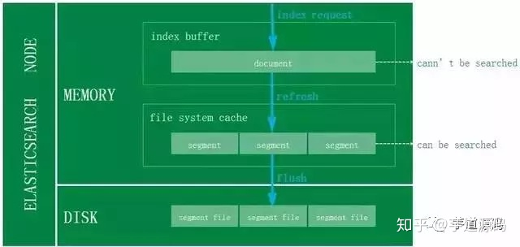

# Storage\_ElasticSearch

* [ElasticSearch](storage_elasticsearch.md#elasticsearch)
  * [Use cases](storage_elasticsearch.md#use-cases)
    * [Offload read requests \(not requiring realtime\) from MySQL](storage_elasticsearch.md#offload-read-requests-not-requiring-realtime-from-mysql)
      * [Resiliency](storage_elasticsearch.md#resiliency)
      * [Latency](storage_elasticsearch.md#latency)
  * [Comparison - Lucene vs Solr vs ElasticSearch](storage_elasticsearch.md#comparison---lucene-vs-solr-vs-elasticsearch)

## ElasticSearch

### Use cases

#### Offload read requests \(not requiring realtime\) from MySQL

* Why?

  \* 

* Approach: Option 1 vs Option 2 below
  * Option 2 is adopted because Option 1 needs to introduce additional components and does not improve much on latency

```text
┌───────────────┐                                                                  ┌──────────────┐
│               │         Option1: ES monitor MySQL's binlog and put binlog        │              │
│               │                          data inside ES                          │              │
│     MySQL     ├─────────────────────────────────────────────────────────────────▶│ElasticSearch │
│               │              Option2: Write data to ES using ES APIs             │              │
│               │                                                                  │              │
└───────────────┘                                                                  └──────────────┘
```

**Resiliency**

* What if there is an error using Option 2: Add another task inside SQL server. There will be a worker task regularly scanning through these tasks. Use this type of compensation mechanism to make ES and MySQL data eventual consistent. 

**Latency**

* There will be a delay when data comes into ES's index buffer but not into file system cache. So for requests requiring real time data, better rely on MySQL. 



* Reference:
  * [In Chinese: ES在京东订单中心的应用](https://zhuanlan.zhihu.com/p/84871325)

### Comparison - Lucene vs Solr vs ElasticSearch

* Reference \[In Chinese: [https://zhuanlan.zhihu.com/p/161645496](https://zhuanlan.zhihu.com/p/161645496)\]

