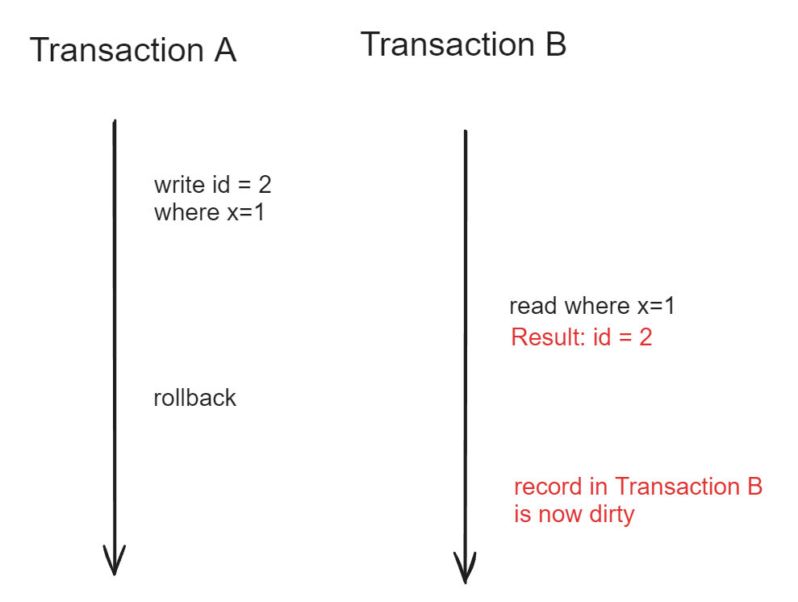
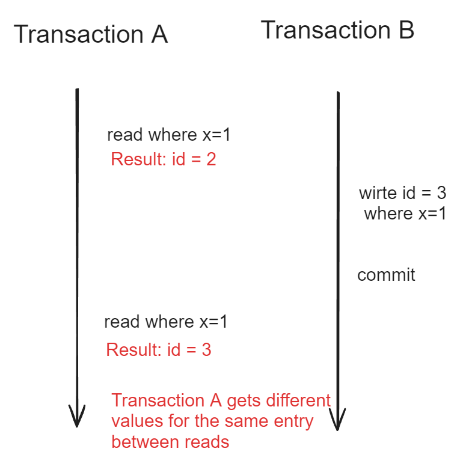
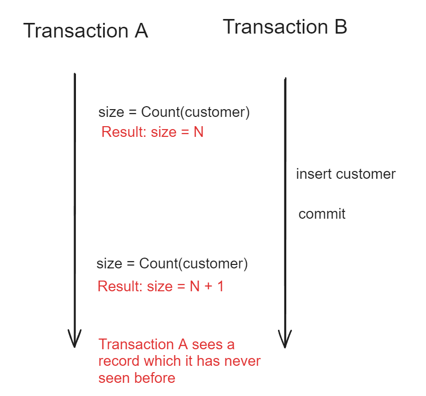
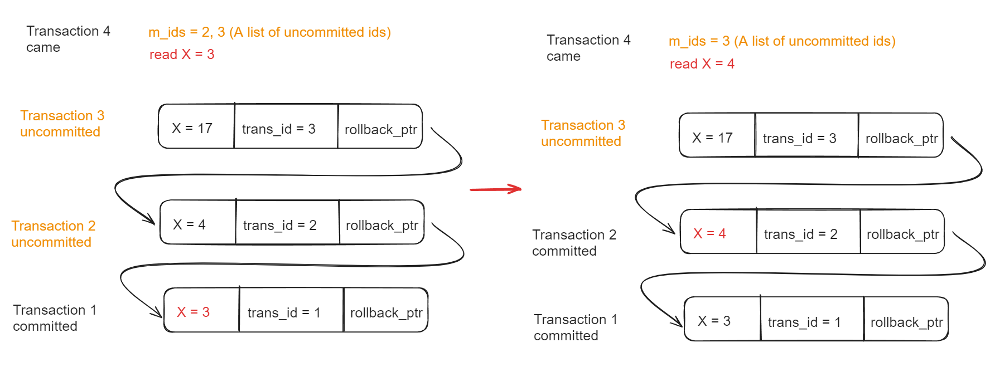
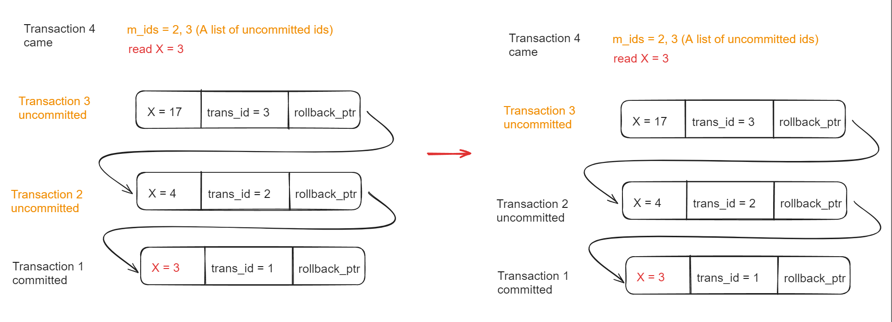

- [Motivation](#motivation)
- [Four isolation levels](#four-isolation-levels)
  - [Read uncomitted](#read-uncomitted)
  - [Read committed](#read-committed)
  - [Repeatable read](#repeatable-read)
  - [Serializable](#serializable)
- [Three read exceptions](#three-read-exceptions)
  - [Dirty read](#dirty-read)
  - [Non-repeatable read](#non-repeatable-read)
  - [Phantom read](#phantom-read)
- [Relationship between isolation levels and read exceptions](#relationship-between-isolation-levels-and-read-exceptions)
- [Version chain](#version-chain)
- [Read view](#read-view)
  - [Read committed](#read-committed-1)
  - [Repeatable read](#repeatable-read-1)
- [TODO](#todo)

# Motivation
* MVCC eliminates locking so that read operations doesn't need to be block by write operations. 
* For example, a thread executing UPDATE statement should not block SELECT statement by another thread. 

# Four isolation levels

## Read uncomitted

## Read committed

## Repeatable read

## Serializable
* Every read and write operation are serialized. 

# Three read exceptions
## Dirty read

## Non-repeatable read

## Phantom read
* Within MySQL, it uses next-key lock to implement MVCC, so it does not have the problem for phantom read. 

# Relationship between isolation levels and read exceptions

# Version chain

# Read view
* Only exist in Read committed and Repeatable read mode. 

## Read committed
* When a transaction (originally started but uncommitted when the target transaction starts, namely if transaction_id < curr_transaction_id) is committed, a new readview will be generated. 

## Repeatable read
* Once the readview is generated, it won't be updated. 

# TODO
* [MySQL index deep dive](https://medium.com/free-code-camp/database-indexing-at-a-glance-bb50809d48bd)
* [Internal data structure for MVCC](https://kousiknath.medium.com/how-mvcc-databases-work-internally-84a27a380283)
* index and schema design
  * 分析磁盘I/O时间 [https://blog.csdn.net/mysteryhaohao/article/details/51719871](https://blog.csdn.net/mysteryhaohao/article/details/51719871)
* Problems of mySQL: [https://time.geekbang.org/column/article/267741](https://time.geekbang.org/column/article/267741)
* Isolation level: [https://time.geekbang.org/column/article/12288](https://time.geekbang.org/column/article/12288)
