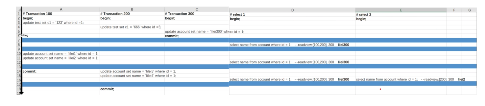

- [Motivation](#motivation)
- [Isolation level](#isolation-level)
  - [Read uncomitted](#read-uncomitted)
  - [Read committed](#read-committed)
  - [Repeatable read](#repeatable-read)
  - [Serializable](#serializable)
- [Version chain](#version-chain)
- [Read view](#read-view)
    - [Pros](#pros)
    - [Cons](#cons)
    - [Example](#example)
- [TODO](#todo)

# Motivation
* MVCC eliminates locking so that read operations doesn't need to be block by write operations. 
* For example, a thread executing UPDATE statement should not block SELECT statement by another thread. 

# Isolation level

## Read uncomitted

## Read committed

## Repeatable read

## Serializable
* Every read and write operation are serialized. 

# Version chain

# Read view
* Undo log uses transaction id for data versioning
* Read view consists of:
  * An array of all uncommitted transaction ids. 
  * Already created max transaction id. 

### Pros
* Append only is very very fast on disk — magnetic hard drive or Solid State Drive whatever it is.
* Due to append-only nature, database is never corrupt, because what is already written to disk is immutable.
* Probably no need to maintain WAL — Write Ahead Log. Because database is never going to be corrupt. No in-place update, always the database has some consistent view.
* Backup or taking snapshot is easy. Normally for backup operation, you need to take the database offline or freeze it or stop doing update operations for some time because during backing up, if some update operation occurs, it might impact the backup or it might not be a part of the snapshot at all. Also there might be some problems with locking during backup etc. With append only, there is no such overhead as it’s the file already contains immutable state of data. Just copy the file to a different machine and done. Even if there is a downtime, it is very very small.
* There is ideally no locking involved. So writers don’t block readers, readers don’t block the writer. Readers always see some consistent view of the database. So you can ideally run single serialised writer with multiple readers.
* After crash, there is no rebuild or reindex required. Just backup of the database file is enough.
* Replication is also as simple as backup.

### Cons
* High space usage is the biggest issue. Everything in the world comes at a cost. So the speed of such systems comes from such space overhead.
* B-Tree is a very highly compact data structure i.e; the internal or branch nodes contain array of hundreds or thousands of keys. So it boils down to similar number of children per branch node. So there are thousands to millions of leaf to root path that might get practically copied at high scale.

### Example

* Repeatable read
  * Read view will only be executed once in a transaction when the first statement executes. This is why #select 2 reads a different value when compared with #select 1. 
  * MySQL will go through the undo log from the latest to the older ones, and use the first log record bigger than its read view as true value. 

* Read committed
  * Read view will be generated each time when a statement is executed. 
  * The rest will stay same as repeatable read. 

# TODO

* [MySQL index deep dive](https://medium.com/free-code-camp/database-indexing-at-a-glance-bb50809d48bd)
* [Internal data structure for MVCC](https://kousiknath.medium.com/how-mvcc-databases-work-internally-84a27a380283)
* index and schema design
  * 分析磁盘I/O时间 [https://blog.csdn.net/mysteryhaohao/article/details/51719871](https://blog.csdn.net/mysteryhaohao/article/details/51719871)
* Problems of mySQL: [https://time.geekbang.org/column/article/267741](https://time.geekbang.org/column/article/267741)
* Isolation level: [https://time.geekbang.org/column/article/12288](https://time.geekbang.org/column/article/12288)
