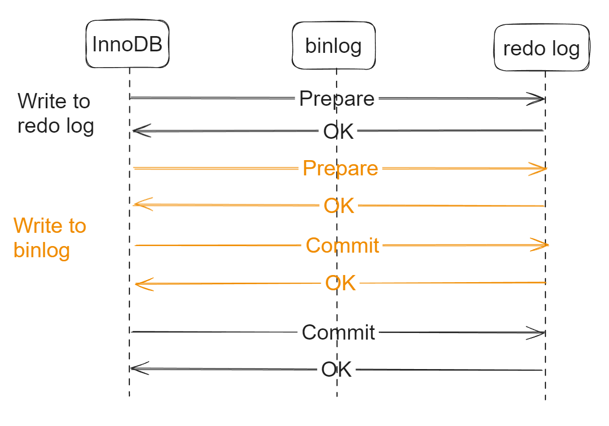

- [Use case](#use-case)
- [Flowchart](#flowchart)
- [Config option](#config-option)

# Use case
* Mainly used for data backup and master-slave replication. 

# Flowchart

# Config option
* sync_binlog
  * 0: Determined by OS. Once it is written to page cache, it is considered successful. 
  * N: For every N commits, it will be flushed to disk. 