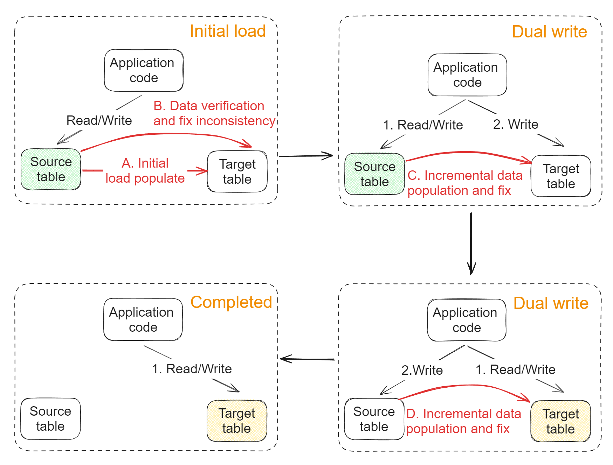

- [Flowchart](#flowchart)
- [Initial load phase](#initial-load-phase)
  - [mysqldump](#mysqldump)
    - [Best practices](#best-practices)
  - [XtraBackup](#xtrabackup)
- [Dual write phase](#dual-write-phase)
  - [Primary key](#primary-key)
    - [innodb\_autoinc\_lock\_mode parameter](#innodb_autoinc_lock_mode-parameter)
    - [Consistency](#consistency)
  - [Dual write flag in ORM/AOP](#dual-write-flag-in-ormaop)
    - [UpdateTime field based approach](#updatetime-field-based-approach)
      - [Flowchart](#flowchart-1)
      - [Soft delete on source table](#soft-delete-on-source-table)
    - [Binlog triggered](#binlog-triggered)


# Flowchart
* The motivation for introduce the third phase: In case something goes wrong on the target table, you could rollback to the original table. 



# Initial load phase
* There are two typically used DB backup tools: mysqldump and XtraBackup. 

## mysqldump
* Pros:
  * Free
  * Could backup the entire DB, including table structure and data

* Cons:
  * Backup time could be long 

### Best practices
* To increase speed when using mysqldump tool, there are a couple options:
  * Close the unique key check and external key check because source table already guarantees this. 
  * Close binlog
  * Adjust the disk flush time of redo log by setting innodb_flush_log_at_trx_commit = 0

## XtraBackup
* Pros:
  * Faster backup speed
  * Support incremental backup
  * Backup process won't interrupt executing transactions

* Cons:
  * Only applicable to InnoDB engine
  * Poor cross-platform compatibility. 

# Dual write phase
## Primary key 
### innodb_autoinc_lock_mode parameter
* "innodb_autoinc_lock_mode" parameter determines how InnoDB generates primary key. All three cases rely on table-wise lock. 
  * 0: The table lock will be released after insert statements are executed. 
  * 1: The table lock release times depend on SQL statements:
    * For INSERT INTO VALUE / INSERT INTO VALUES, the primary key lock will be released immediately after primary keys are generated, instead of after SQL statements are executed. 
    * For INSERT / SELECT, the primary key lock will be released after SQL statements are executed. 
  * 2: The table lock will be released immediately after primary keys are generated. 

### Consistency
* When writing to the first table of dual write, return the primary key and use it in subsequent table. 


## Dual write flag in ORM/AOP
* Typically there is a dual write flag inside the AOP/ORM.
* This flag controls the dual write mode. 


### UpdateTime field based approach
#### Flowchart

```java
for {
  // Execute the SQL query
  // SELECT * FROM xx WHERE update_time >= last_time
  rows := findUpdatedRows()

  for row in rows {
    // Use row primary key / id to find corresponding rows in target table
    tgtRow = findTgt(row.id)
    if row != tgtRow {
      // fix data
      fix()
    }
  }

  // Record the maximum timestamp of these records, use for next query. 
  last_time = maxUpdateTime(row)

  // Sleep for a while
  sleep(1s)
}
```

#### Soft delete on source table
* If using hard delete on source table, delete failures on target table won't be discovered. 


* If we need to use hard delete on source table, there needs to be a reverse check from target table to source table. 


### Binlog triggered


