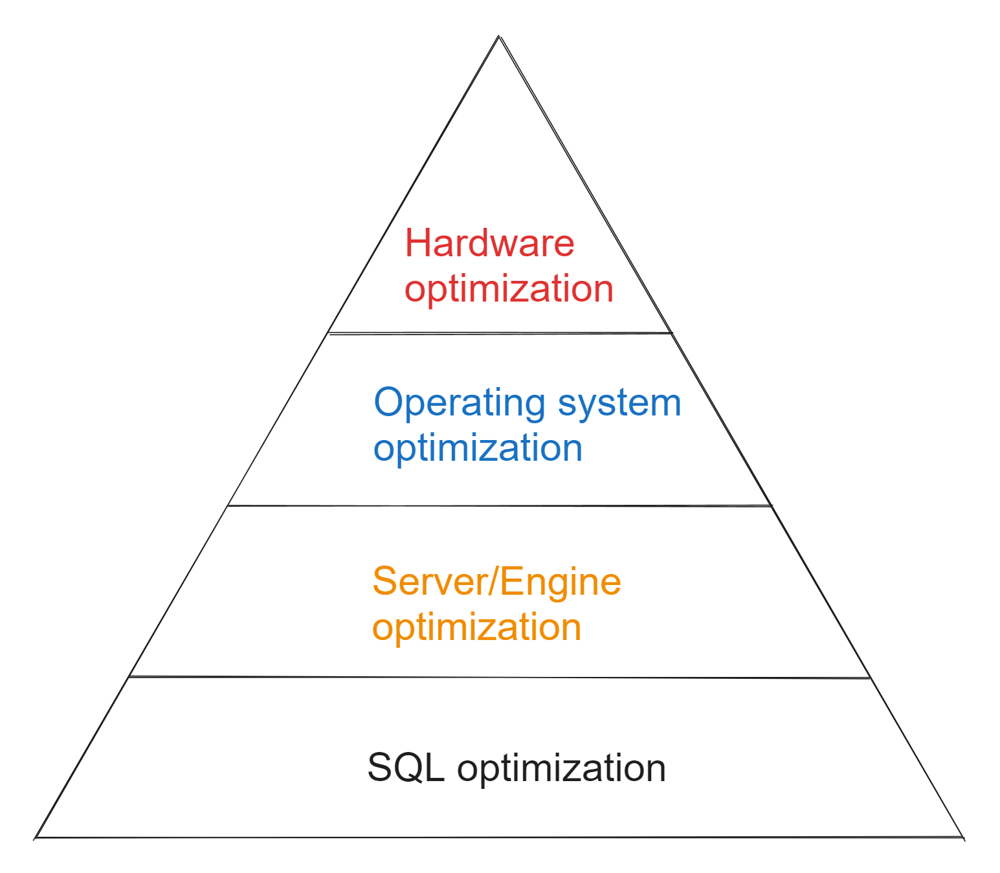
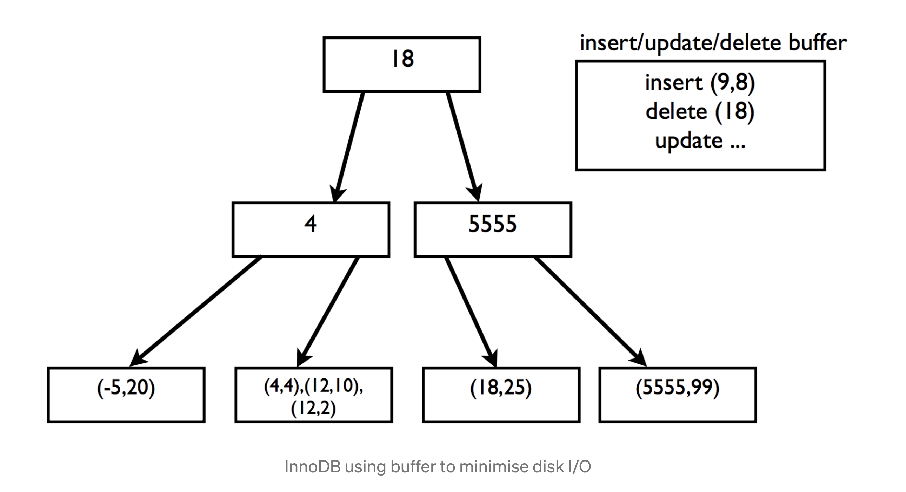
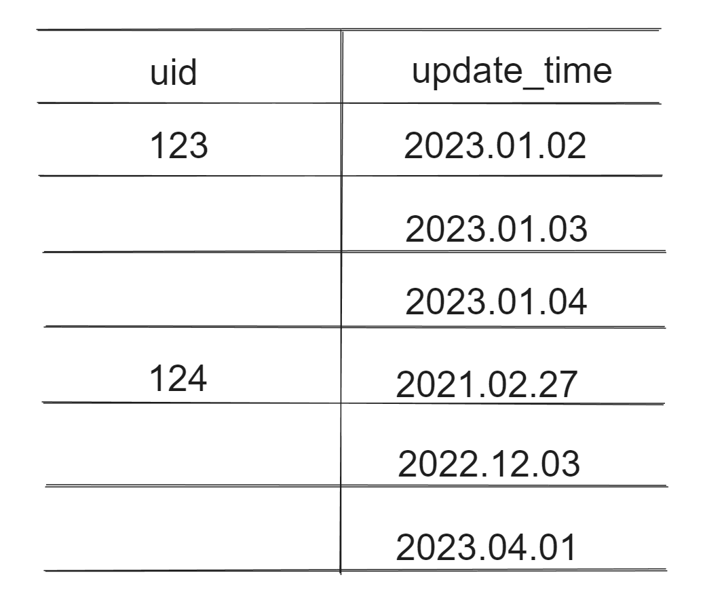
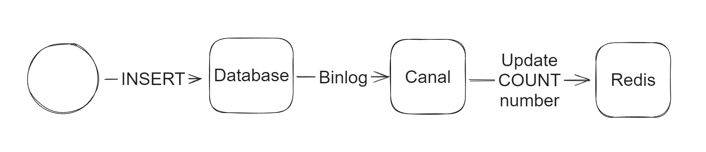

- [Optimization mindset](#optimization-mindset)
- [Server/Engine optimization](#serverengine-optimization)
  - [InnoDB buffer improvement](#innodb-buffer-improvement)
- [SQL optimization](#sql-optimization)
  - [Slow query](#slow-query)
  - [Choose index columns](#choose-index-columns)
  - [Always define a primary key for each table](#always-define-a-primary-key-for-each-table)
  - [Use auto-increment int column when possible](#use-auto-increment-int-column-when-possible)
  - [Optimize ORDER BY](#optimize-order-by)
  - [Optimize COUNT](#optimize-count)
    - [Use approximate numbers instead](#use-approximate-numbers-instead)
    - [Use NoSQL DB to store number of records](#use-nosql-db-to-store-number-of-records)
  - [FORCE INDEX, USE INDEX and IGNORE INDEX](#force-index-use-index-and-ignore-index)
  - [Replace WHERE with HAVING](#replace-where-with-having)
  - [Optimize LIMIT XXX OFFSET YYY](#optimize-limit-xxx-offset-yyy)
  - [Optimize IN](#optimize-in)
  - [Join](#join)
  - [IN operator](#in-operator)
  - [Unequal filter when possible](#unequal-filter-when-possible)
  - [Filtering based on Nullable match conditions](#filtering-based-on-nullable-match-conditions)
  - [Prefix based fuzzy matching](#prefix-based-fuzzy-matching)
  - [Functions on index](#functions-on-index)
  - [Computation expression on index](#computation-expression-on-index)
  - [Or condition](#or-condition)

# Optimization mindset
* Optimize from the following four levels:



# Server/Engine optimization
* Fine-tune database software such as 
  * Transaction isolation levels
  * InnoDB disk flush frequency

## InnoDB buffer improvement
*  InnoDB tries to minimise disk I/O operation by using a buffer. Following is the representation:



* InnoDB buffer inserts, deletes, and updates if the needed leaf node is not in memory. The buffer is flushed when it is full or the corresponding leaf nodes come into memory. This way InnoDB defers the disk I/O operation. But still, database write operation can be made much much faster by leveraging the available disk bandwidth which existing relational databases fail to do. Also relational database systems are very complex inside as they use locking, concurrency, ACID transaction semantics etc which makes read write operation more complex.

# SQL optimization
* Goal:
  * Reduce disk IO by avoiding full table scanning, use index when possible and use covered index. 
  * Reduce CPU/memory consumption by reducing sorting, grouping, and deduplication operations. 

## Slow query

* In most cases, please use EXPLAIN to understand the execution plan before optimizing. But there are some patterns practices which are known to have bad performance. 
* [https://coding.imooc.com/lesson/49.html\#mid=513](https://coding.imooc.com/lesson/49.html#mid=513)
* [https://study.163.com/course/courseLearn.htm?courseId=1209773843\#/learn/video?lessonId=1280437152&courseId=1209773843](https://study.163.com/course/courseLearn.htm?courseId=1209773843#/learn/video?lessonId=1280437152&courseId=1209773843)


## Choose index columns

* On columns not changing often
* On columns which have high cardinality
* On columns whose sizes are smaller. If the column's size is big, could consider build index on its prefix. 
* Create indexes on columns frequently on "Where" conditions to avoid full-table scanning. 
* Create indexes on "Order By" to avoid sorting again when display results. 

```SQL
-- create index on prefix of a column
CREAT INDEX on index_name ON table(col_name(n))
```

## Always define a primary key for each table
1. When PRIMARY KEY is defined, InnoDB uses primary key index as the clustered index. 
2. When PRIMARY KEY is not defined, InnoDB will use the first UNIQUE index where all the key columns are NOT NULL and InnoDB uses it as the clustered index.
3. When PRIMRARY KEY is not defined and there is no logical unique and non-null column or set of columns, InnoDB internally generates a hidden clustered index named GEN\_CLUST\_INDEX on a synthetic column containing ROWID values. The rows are ordered by the ID that InnoDB assigns to the rows in such a table. The ROWID is a 6-byte field that increases monotonically as new rows are inserted. Thus, the rows ordered by the row ID are physically in insertion order.

## Use auto-increment int column when possible
* Why prefer auto-increment over random \(e.g. UUID\)? 
  * In most cases, primary index uses B+ tree index. 
  * For B+ tree index, if a new record has an auto-increment primary key, then it could be directly appended in the leaf node layer. Otherwise, B+ tree node split and rebalance would need to be performed. 
* Why int versus other types \(string, composite primary key\)?
  * Smaller footprint: Primary key will be stored within each B tree index node, making indexes sparser. Things like composite index or string based primary key will result in less index data being stored in every node. 

## Optimize ORDER BY
* Add index on sorting columns
* The underlying reason is that indexes are ordered by themselves. 

```SQL
SELECT * FROM xxx WHERE uid = 123 ORDER BY update_time
```

* After adding indexes on columns such as uid and update_time, the query time will be optimized because indexes are sorted by themselves. 



## Optimize COUNT
* SELECT COUNT(*) is a popular query. However, MySQL InnoDB engine doesn't store the total number of rows. 

### Use approximate numbers instead
* Before executing actual SQl queries, use EXPLAIN command to estimate the number of records

```SQL
SELECT COUNT(*) FROM xxx WHERE uid = 123

---Use Explain query
EXPLAIN SELECT COUNT(*) FROM xxx WHERE uid = 123
```

### Use NoSQL DB to store number of records

* How to keep the consistency between DB and noSQL
  * If short-term inconsistency is acceptable for the business domain, then asynchronously update could be adopted. 
  * Use tools like Canal to watch MySQL binlog, and update the count on Redis. 



## FORCE INDEX, USE INDEX and IGNORE INDEX
* In practice, when SQL queries are using the wrong index, we could use this to force index usages. 
* This should only be used in worst case scenarios. 

## Replace WHERE with HAVING
* If not using aggregate functions as filter condition, we'd better write filter condition inside WHERE. 

## Optimize LIMIT XXX OFFSET YYY

* Use small LIMIT values XXX. Could replace with where id > max_id. 

```SQL
-- Original query
select * from myshop.ecs_order_info order by myshop.ecs_order_info.order_id limit 4000000, 100

-- Optimization option 1 if order_id is continuous, 
select * from myshop.ecs_order_info order where myshop.ecs_order_info.order_id between 4000000 and 4000100

-- Optimization option 2 if order_id is not continuous,
-- Compared the original query, the child query "select order_id ..." uses covering index and will be faster.
select * from myshop.ecs_order_info where 
(myshop.ecs_order_info.order_id >= (select order_id from myshop.ecs_order_info order by order_id limit 4000000,1) limit 100)
```

```SQL
-- Original query
select * from myshop.ecs_users u where u.last_login_time >= 1590076800 order by u.last_login_time, u.user_id limit 200000, 10

-- Optimization with join query
select * from myshop.ecs_users u (select user_id from myshop.ecs_users where u.last_login_time >= 1590076800) u1 where u1.user_id = u.user_id order by u.user_id
```

## Optimize IN
*  Use IN for low radix attributes if leftmost prefix index could not be used

```SQL
-- using dating website as an example
-- 1. Composite index: city, sex, age
select * from users_table where city == XX and sex == YY and age <= ZZ

-- 2. There will be cases where some users don't filter based on sex
select * from users_table where city == XX and age <= ZZ

-- 3. Could use IN to make WHERE clause satisfy leftmost prefix condition
select * from users_table where city == XX and Sex in ('male', 'female') and age <= ZZ
```

## Join
* When joining two tables, assume table A has num1 returned according to the JOIN condition, table B has num2 returned according to the JOIN condition. And Assume num1 &gt; num2. 
* Make sure:
  * Query against table B \(smaller\) will be executed first.
  * filters on table A \(bigger\) will be based on indexed column. 
* Avoid using more than three joins in any case. 
  * For join, handle that inside application code when the join is big. Business applications are easier to scale. 
* Two algorithms:
  * Block nested join
  * Nested loop join

## IN operator
* When there are too few or many operators inside IN, it might not go through index. 

## Unequal filter when possible
* Don't use "IS NOT NULL" or "IS NULL": Index \(binary tree\) could not be created on Null values. 
* Don't use != : Index could not be used. Could use &lt; and &gt; combined together.
  * Select name from abc where id != 20
  * Optimized version: Select name from abc where id &gt; 20 or id &lt; 20

## Filtering based on Nullable match conditions
* There are only two values for a null filter \(is null or is not null\). In most cases it will do a whole table scanning. 

## Prefix based fuzzy matching
* Use % in the beginning will cause the database for a whole table scanning. 

```SQL 
SELECT name from abc where name like %xyz
```

## Functions on index

* [https://coding.imooc.com/lesson/49.html\#mid=439](https://coding.imooc.com/lesson/49.html#mid=439)
* Don't use function or expression on index column

```SQL
-- Original query:
select ... from product
where to_days(out_date) - to_days(current_date) <= 30

-- Improved query:
select ... from product
where out_date <= date_add(current_date, interval 30 day)
```

## Computation expression on index

```SQL
SELECT comment_id, user_id, comment_text FROM product_comment WHERE comment_id+1 = 900001
```

## Or condition
* If only one condition inside OR has index. 

```SQL
SELECT comment_id, user_id, comment_text FROM product_comment WHERE comment_id = 900001 OR comment_text = '462eed7ac6e791292a79'
```
