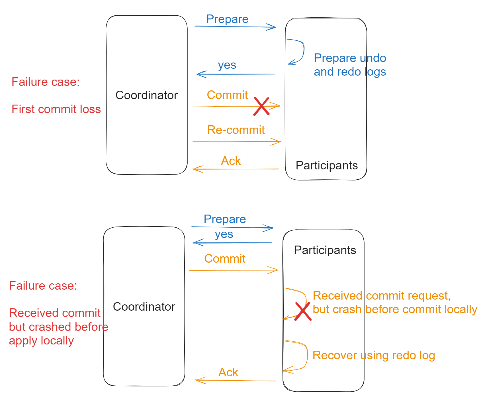
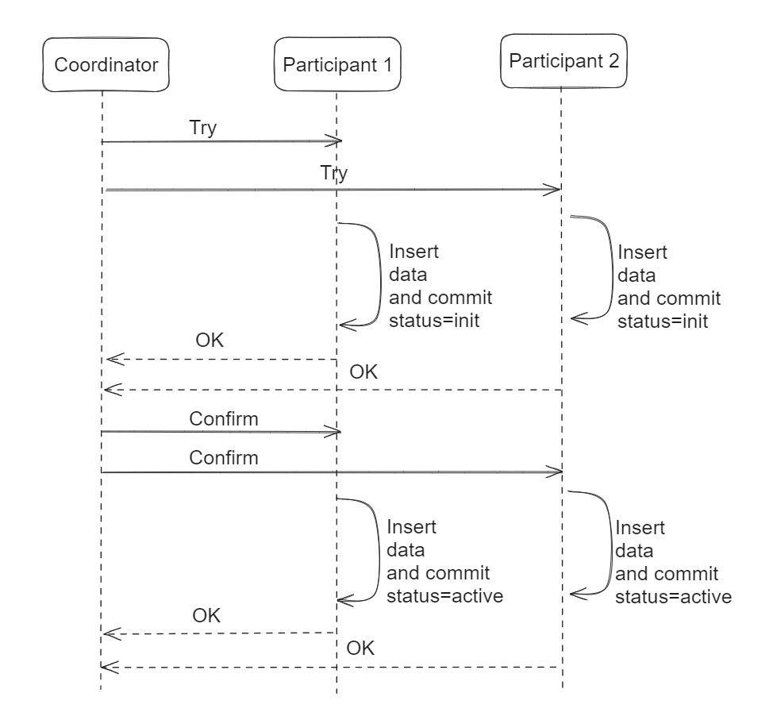

- [Comparison](#comparison)
- [Two phase commit](#two-phase-commit)
  - [Success case flowchart](#success-case-flowchart)
  - [Failure case flowchart](#failure-case-flowchart)
  - [Cons](#cons)
- [Three phase commit](#three-phase-commit)
- [TCC](#tcc)
  - [Definition](#definition)
  - [Success case flowchart](#success-case-flowchart-1)
  - [Failure case flowchart](#failure-case-flowchart-1)
- [Saga](#saga)

# Comparison
* https://docs.google.com/spreadsheets/d/1Sw0T4R6-Bb3orF0abwkmiZRBbCioevH1jvyjnw7aqhs/edit?usp=sharing

# Two phase commit

## Success case flowchart

## Failure case flowchart

## Cons
1. The nodes are in blocked status during the execution. 
2. The coordinator could be the single point of failure in the entire process. 
3. If any single failure happens among participants, all participants need to rollback transaction. And this could be high performance cost. 

# Three phase commit
* This introduces another phase before prepare/commit phase to guarantee that the "Cons 3" in two phase commit get resolved. 
* However, this seldomly gets used in practice because the benefits are limited. 

# TCC
## Definition
* Each of three phases corresponds to a local transaction. 
  * Try: Prepare transaction but not commit. Insert data.
  * Confirm: Corresponds to "commit phase" in two phase commit.
  * Cancel: Corresponds to "rollback phase" in two phase commit. 

## Success case flowchart

## Failure case flowchart
* Typically it won't fail in Try Phase. And it will fail only in Confirm phase. 

# Saga