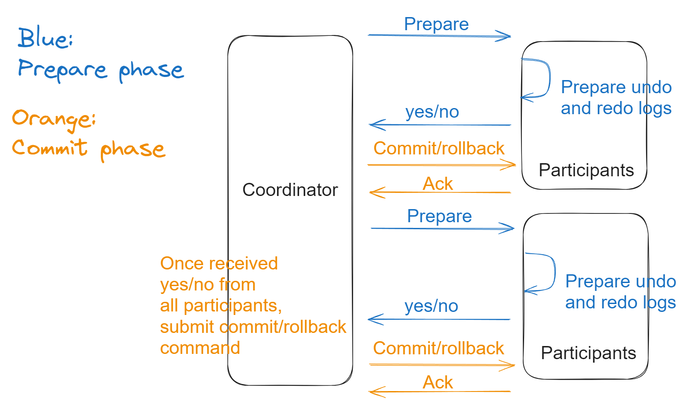

- [Comparison](#comparison)
- [Distributed transactions (write across shards)](#distributed-transactions-write-across-shards)
- [Two phase commit](#two-phase-commit)
- [Three phase commit](#three-phase-commit)
- [TCC](#tcc)
- [Saga](#saga)

# Comparison
* https://docs.google.com/spreadsheets/d/1Sw0T4R6-Bb3orF0abwkmiZRBbCioevH1jvyjnw7aqhs/edit?usp=sharing

# Distributed transactions (write across shards)

* Original transaction needs to be conducted within a distributed transaction.
  * e.g. ecommerce example (order table and inventory table)
* There are wwo ways in general to implement distributed transactions:
  * 2PC 
  * TCC
* For example, some software has built-in implementations such as:
  * MySQL XA
  * Spring JTA

# Two phase commit

# Three phase commit

# TCC

# Saga