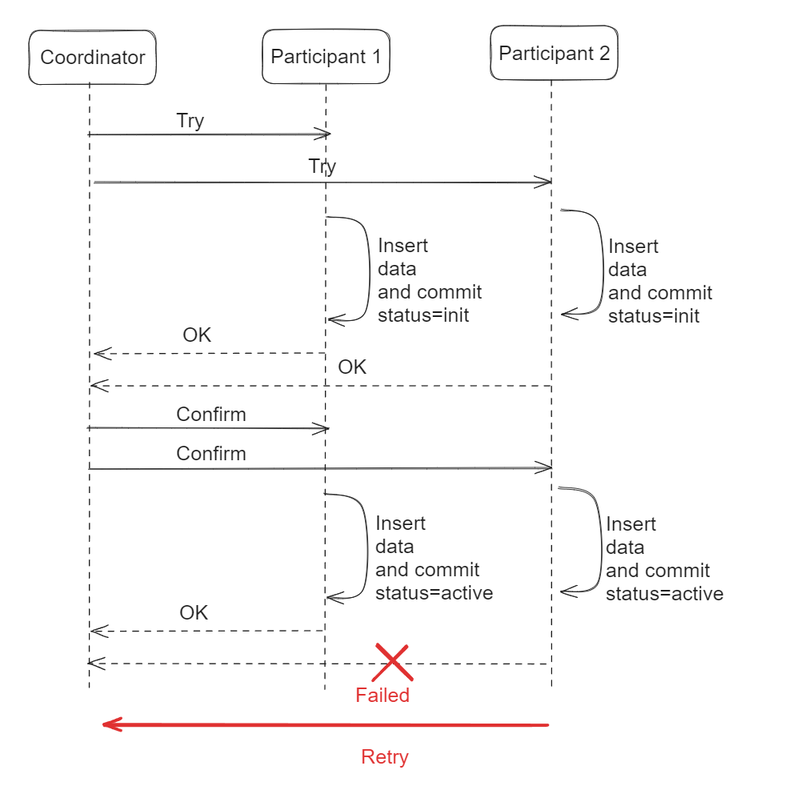
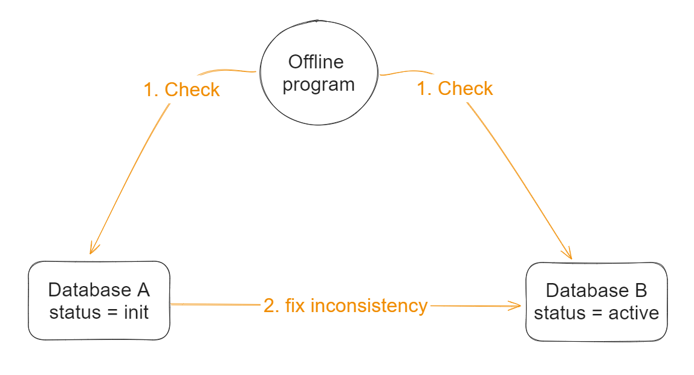
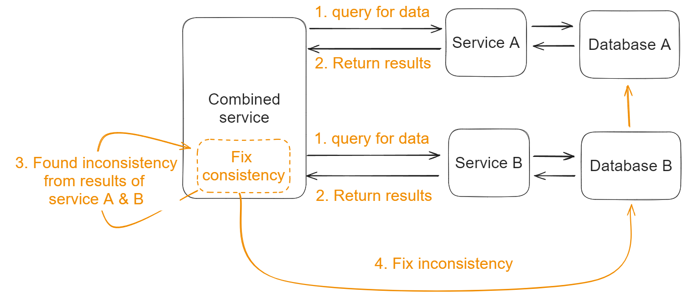
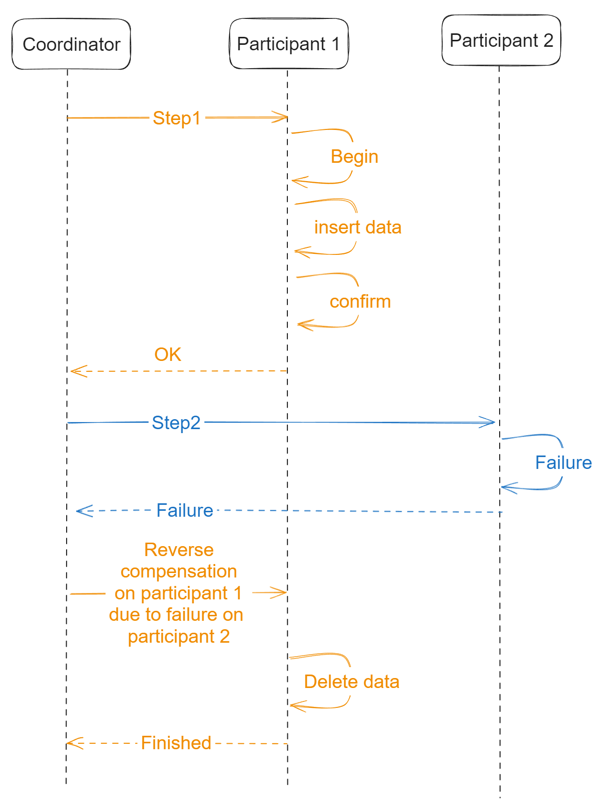
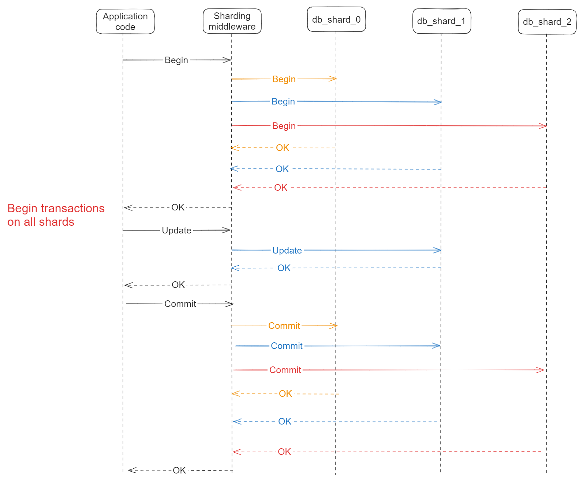
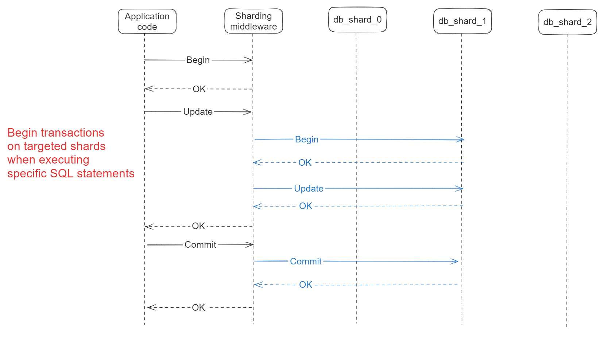

- [Comparison](#comparison)
- [Two phase commit](#two-phase-commit)
  - [Success case flowchart](#success-case-flowchart)
  - [Failure case flowchart](#failure-case-flowchart)
  - [Cons](#cons)
- [Three phase commit](#three-phase-commit)
- [TCC](#tcc)
  - [Definition](#definition)
  - [Success case flowchart](#success-case-flowchart-1)
  - [Failure case flowchart](#failure-case-flowchart-1)
  - [Fix consistency flow](#fix-consistency-flow)
    - [Asynchronously fix inconsistency](#asynchronously-fix-inconsistency)
    - [Fix inconsistency on discovery](#fix-inconsistency-on-discovery)
- [Saga](#saga)
  - [Flowchart](#flowchart)
  - [Compensation](#compensation)
- [AT transaction](#at-transaction)
- [Delayed transactions](#delayed-transactions)
  - [Flowchart](#flowchart-1)
  - [Fix consistency](#fix-consistency)

# Comparison
* https://docs.google.com/spreadsheets/d/1Sw0T4R6-Bb3orF0abwkmiZRBbCioevH1jvyjnw7aqhs/edit?usp=sharing

# Two phase commit

## Success case flowchart

## Failure case flowchart

## Cons
1. The nodes are in blocked status during the execution. 
2. The coordinator could be the single point of failure in the entire process. 
3. If any single failure happens among participants, all participants need to rollback transaction. And this could be high performance cost. 

# Three phase commit
* This introduces another phase before prepare/commit phase to guarantee that the "Cons 3" in two phase commit get resolved. 
* However, this seldomly gets used in practice because the benefits are limited. 

# TCC
## Definition
* Each of three phases corresponds to a local transaction. 
  * Try: Prepare transaction but not commit. Insert data.
  * Confirm: Corresponds to "commit phase" in two phase commit.
  * Cancel: Corresponds to "rollback phase" in two phase commit. 

## Success case flowchart

## Failure case flowchart
* Typically it won't fail in Try Phase. And it will fail only in Confirm phase. 

## Fix consistency flow
* TCC is an eventual consistency model.

### Asynchronously fix inconsistency

### Fix inconsistency on discovery

# Saga

## Flowchart

## Compensation
* Compensation is more accurate than rollback in saga context because
  * Rollback applies in uncommitted transaction
  * Compensation applies in committed transaction
* In saga, compensation is a better fit because it reverse committed local transactions. 

# AT transaction
* AT transaction applies when you operate on multiple databases concurrently. 

# Delayed transactions
## Flowchart
* When sharding middlware begins transactions on sharded DB, it has two options:
  1. At "Begin", start transactions on all DB shards.
  2. When executing a certain SQL statement, decide which shards to start transactions

## Fix consistency
1. Retry on failure
2. Human intervention
3. Asynchronously fix inconsistency