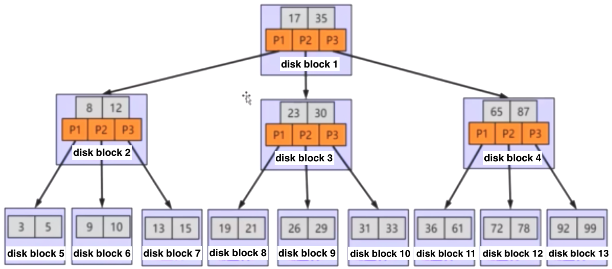
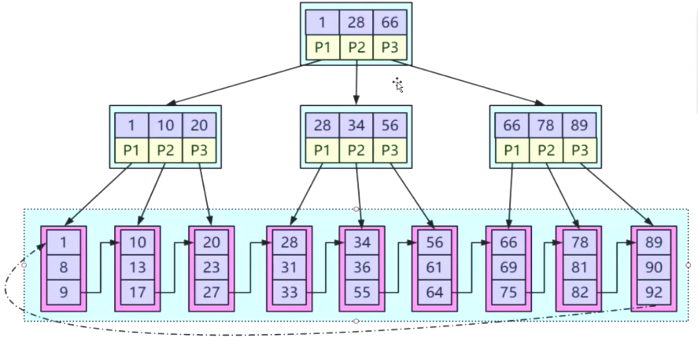
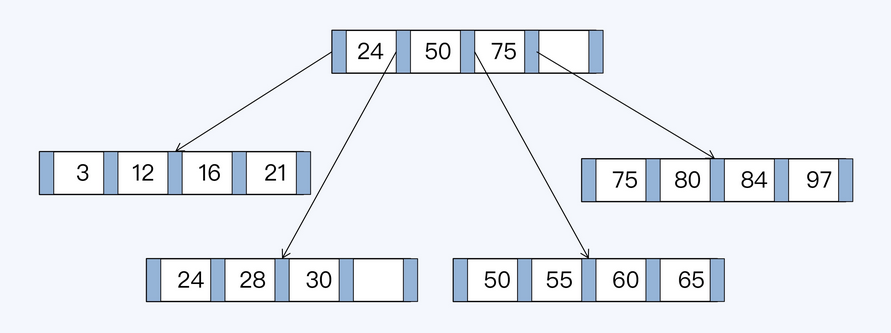
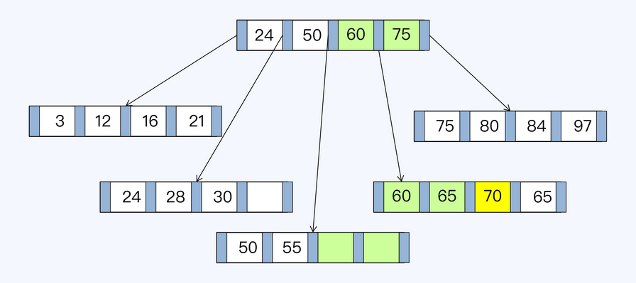

- [Database index](#database-index)
  - [Pros](#pros)
  - [Cons](#cons)
- [Balanced binary  tree](#balanced-binary--tree)
- [Skiplist](#skiplist)
- [B tree](#b-tree)
  - [Structure](#structure)
  - [Pros as index underlying data structure](#pros-as-index-underlying-data-structure)
  - [Cons as index underlying data structure](#cons-as-index-underlying-data-structure)
- [B+ Tree](#b-tree-1)
  - [Structure](#structure-1)
  - [Pros as index data structure](#pros-as-index-data-structure)
  - [Cons Characteristics](#cons-characteristics)
    - [Cons example for write amplification](#cons-example-for-write-amplification)
- [Practices to use B/B+ tree efficiently](#practices-to-use-bb-tree-efficiently)
- [References](#references)
  - [Fractal tree](#fractal-tree)

# Database index
## Pros
* Change random to sequential IO
* Reduce the amount of data to scan
* Sort data to avoid using temporary table

## Cons
* Update speed will be slowed because the index needs to be maintained.
* Increase query optimizer process time

# Balanced binary  tree
* Based on the idea of binary search tree, with the following improvements:
  * The height difference between left and right child is 1 at maximum
* Cons:
  * Lots of rebalancing during inserting new nodes
  * Each nodes could only store one value while operating system load items from disk in page size (4k).
  * Tree too high which results in large number of IO operations

# Skiplist
* Will degrade to a linked list in the worst case. 

# B tree
## Structure

## Pros as index underlying data structure
* Based on the idea of binary tree, with the following improvements:
  * Store more values in each node: For a N-degree B tree, 
    * Every non-leaf node (except root) has at least N/2 children nodes.
    * Root node has at least 2 children nodes.
    * Each node has at most N children nodes. 
  * All the leaf nodes stay on the same depth level.
  * B tree is built up in a bottom-up way. Everything is sent into a leaf node first node (in innoDB the leaf node size is 16KB). If the leaf node could not fit, then another leaf node will be created and a node will be promoted as parent. 

## Cons as index underlying data structure
* All nodes in B tree stores actual data so the index could not fit into memory. 
* Not friendly for range query. 

# B+ Tree
## Structure

## Pros as index data structure
* Suitable for range query: The leaf nodes are linked in a doubly linked list. These links will be used for range query. 
* Indexes small enough for fitting in memory: Non-leaf nodes could be stored inside memory. 
* Low height as a tree

## Cons Characteristics
* B+ tree has write amplification
* The storage is not continuous

### Cons example for write amplification
* Initial B+ tree

* B+ tree after insertion

# Practices to use B/B+ tree efficiently
* Minimise number of indexes: This is a very common strategy to increase the performance of relational databases as more index means more index updation on every INSERT & UPDATE operation. When the database grows older, delete old & probably unused indexes, hesitate to create indexes when your database crumble. Though you should be extra careful as less index means less select query performance. You might have to pay the penalty if you have less index or very heavy index.
* Sequential Insert: If you can manage to insert a lot of data together in sequential order where the primary key of the rows are sequential, then the insert operation will be faster as already the page blocks is there in memory, so possibly all the insertions will be applied in the same page blocks and then committed to database at once in a single disk I/O. A lot depends on database here though, but I assume, modern databases are designed to apply such optimizations when required.

# References
## Fractal tree 
* Fractal tree is based on B Tree structure. But there are certain optimizations to make it perform fast, very fast at least as per their performance benchmark. Fractal tree supports message buffers inside all nodes except leaf nodes. Fractal tree is used in Tokudb that was later acquired by Percona. Tokudb can be used as MySQL storage engine like InnoDB is used.
* Please see [Storage comparison for more details](https://kousiknath.medium.com/data-structures-database-storage-internals-1f5ed3619d43)

* [Some study on database storage internals](https://kousiknath.medium.com/data-structures-database-storage-internals-1f5ed3619d43)
