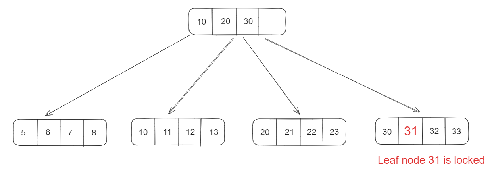
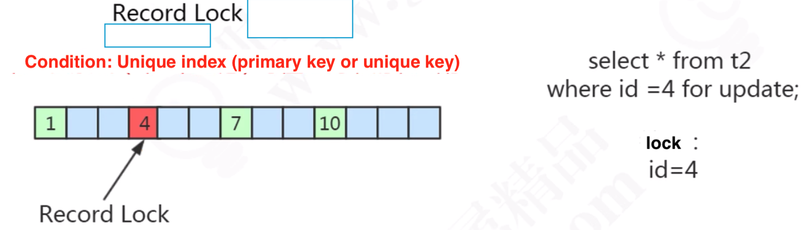
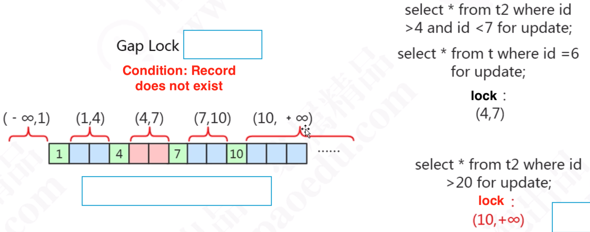
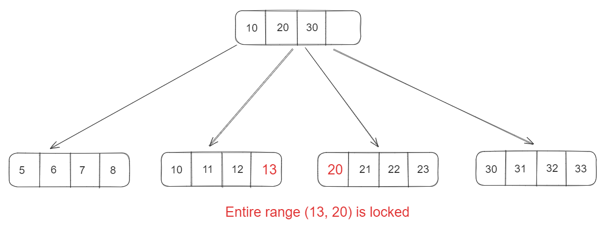
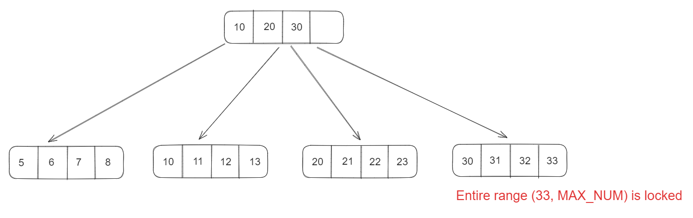
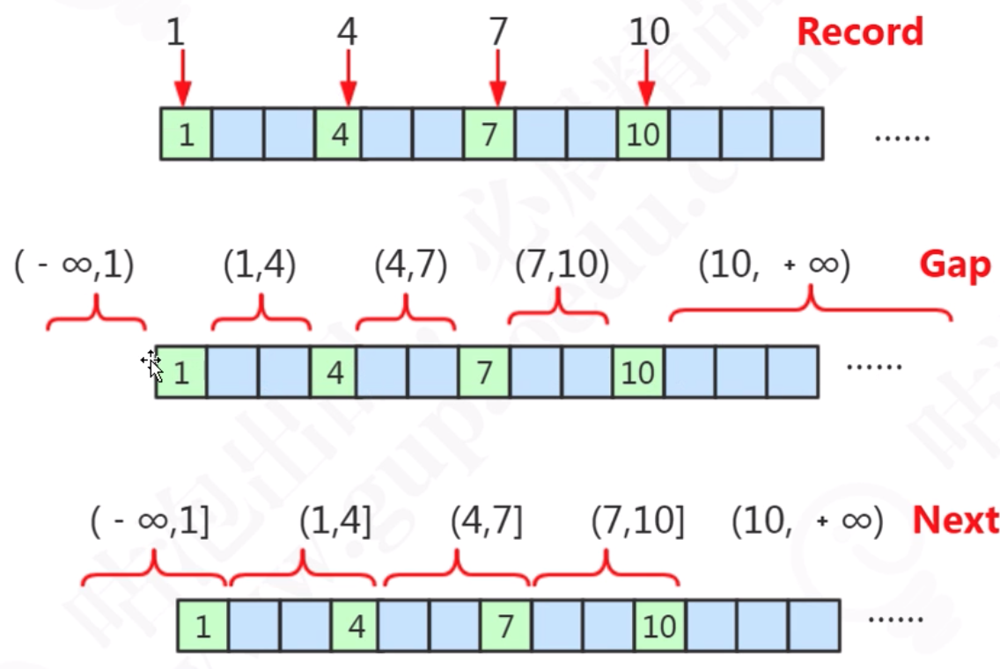
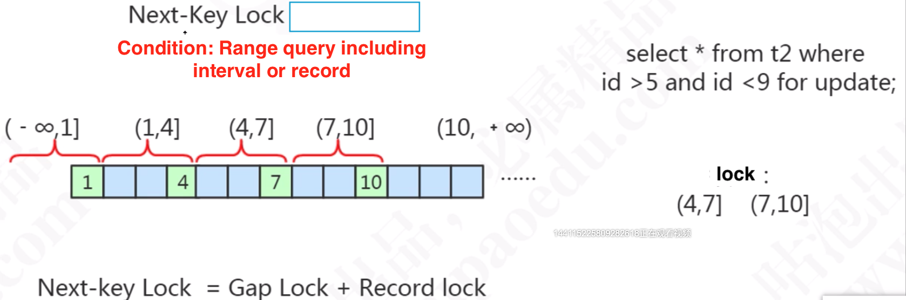

- [Lock](#lock)
- [Lock lifetime](#lock-lifetime)
- [Optimistic vs pessimisstic lock](#optimistic-vs-pessimisstic-lock)
  - [Optimistic lock](#optimistic-lock)
  - [Pessimisstic lock](#pessimisstic-lock)
- [Shared vs exclusive locks](#shared-vs-exclusive-locks)
  - [Shared lock](#shared-lock)
  - [Exclusive lock](#exclusive-lock)
- [Intentional shared/exclusive lock](#intentional-sharedexclusive-lock)
- [Row vs table locks](#row-vs-table-locks)
- [Table locks](#table-locks)
  - [Add/Release Table lock](#addrelease-table-lock)
  - [AUTO\_INC lock](#auto_inc-lock)
- [Row vs gap vs next key locks](#row-vs-gap-vs-next-key-locks)
  - [Record lock](#record-lock)
    - [Prerequistes](#prerequistes)
    - [Exmaple](#exmaple)
  - [Gap lock](#gap-lock)
    - [Prerequistes](#prerequistes-1)
    - [Example](#example)
  - [Next-key lock](#next-key-lock)
    - [Prerequistes:](#prerequistes-2)
    - [Example](#example-1)

# Lock
* Within InnoDB, all locks are put on index. 

# Lock lifetime
* Only when rollback or commit happens, the lock will be released. 

# Optimistic vs pessimisstic lock

## Optimistic lock

```sql
SELECT * FROM your_tab WHERE id = 1; -- Get a = 1
-- operations
UPDATE your_tab SET a = 3, b = 4 WHERE id = 1 AND a =1
```

## Pessimisstic lock

```sql
SELECT * FROM your_tab WHERE id = 1 FOR UPDATE; -- put lock on record 1 
-- operations
UPDATE your_tab SET a = 3, b = 4 WHERE id = 1;
```

# Shared vs exclusive locks
## Shared lock
* Def: If transaction T1 holds a shared (S) lock on row r, then requests from some distinct transaction T2 for a lock on row r are handled as follows:
  * A request by T2 for an S lock can be granted immediately. As a result, both T1 and T2 hold an S lock on r.
  * A request by T2 for an X lock cannot be granted immediately.
* Add lock:   
  1. select ...from XXX where YYY lock in share mode
  2. insert ... into select ... 
* Release lock:  commit / rollback

## Exclusive lock
* Def: If a transaction T1 holds an exclusive (X) lock on row r, a request from some distinct transaction T2 for a lock of either type on r cannot be granted immediately. Instead, transaction T2 has to wait for transaction T1 to release its lock on row r.
* Add lock: Automatically by default
  1. update
  2. delete
  3. insert
  4. select ... from XXX where YYY from update
     * If there is no index on YYY, then it will lock the entire table. 
* Release lock: commit / rollback

# Intentional shared/exclusive lock
* Goal: Divide the operation for adding lock into multiple phases. This is especially useful in cases of table locks. 
* Operation: Automatically added by database. If a shared lock needs to be acquired, then an intentional shared lock needs to be acquired first; If an exclusive lock needs to be acquired, then an intentional exclusive lock needs to be acquired first. 

# Row vs table locks
* Row lock implementation is based on index

# Table locks
* If the query does not hit any index, then only table lock could be used. 

## Add/Release Table lock
* Add:
  1. Lock Table tableName READ
  2. Lock Table tableName WRITE
  3. discard table
  4. import  
* Release:
  * Commit / Rollback

## AUTO_INC lock
* Be triggered automatically when insert ... into Table xxx happens

# Row vs gap vs next key locks
* By default use next key locks except the following two cases:
  * 

## Record lock
### Prerequistes 
* Both needs to be met:
  * "Where condition" uses exact match (==) and the record exists. 
  * "Where condition" uses primary key. 

### Exmaple

```sql
-- record lock: locked leaf node 31
select * from table where id = 31 for update
```





## Gap lock
* Typically gap lock is open on both the "OPEN" and "CLOSE" part. 

### Prerequistes
* One of the following:
  * Where condition uses exact match (==) on a unique index and the record does not exist.
  * Where condition uses range match on a unique index.
  * Where condition doesn't have a unique index. (table lock will be used)
  * Where condition has index but is not unique index.

### Example



```sql
-- Gap key lock (12, 17)
SELECT * FROM your_tab WHERE id = 15 FOR UPDATE
```




```sql
-- Gap key lock (33, MAX_NUM)
SELECT * FROM your_tab WHERE id > 33 FOR UPDATE
```




## Next-key lock
### Prerequistes:
* If the where condition covers both gap lock and record lock, then next-key lock will be used. 

### Example
* Relationship with other locks:



* Next key = record lock + gap lock + record on the right border


