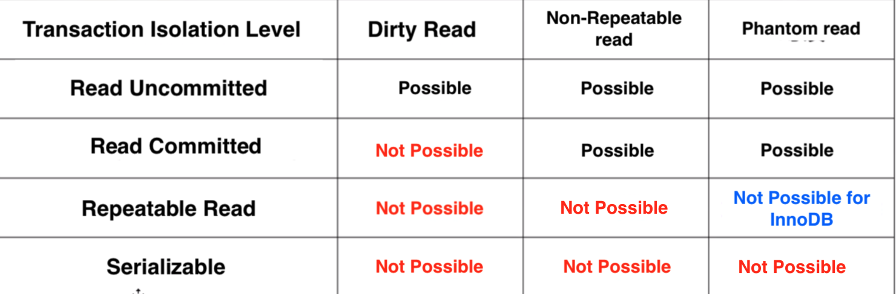
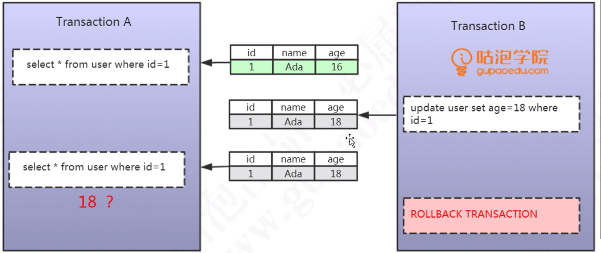
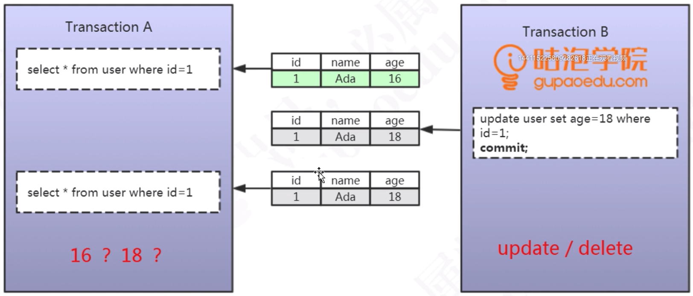
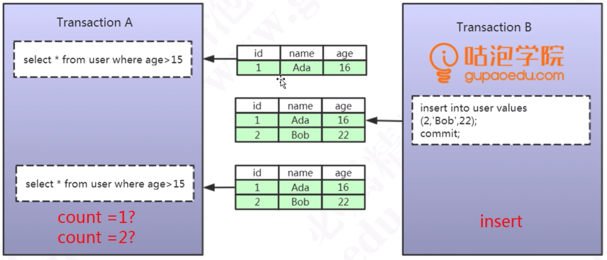
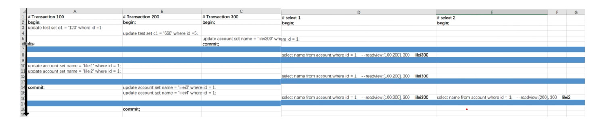
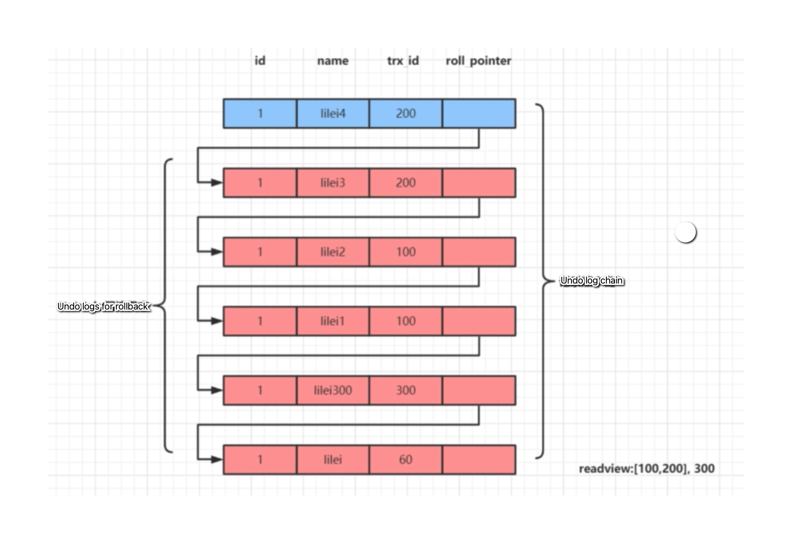
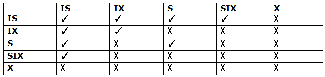

- [Transaction model](#transaction-model)
  - [ACID and InnoDB](#acid-and-innodb)
  - [Three problems](#three-problems)
  - [Four isolation solution options](#four-isolation-solution-options)
  - [MVCC (multi-version concurrency control)](#mvcc-multi-version-concurrency-control)
  - [Lock](#lock)
- [TODO](#todo)

### Transaction model

* There are three problems related to 

#### ACID and InnoDB

* InnoDB implements ACID by using undo, redo log and locks
  * Atomic: Undo log is used to record the state before transaction. 
  * Consistency: Redo log is used to record the state after transaction.
  * Isolation: Locks are used for resource isolation. 
  * Durability: Redo log and undo log combined to realize this. 

#### Three problems

**Dirty read**

* Def: SQL-transaction T1 modifies a row. SQL-transaction T2 then reads that row before T1 performs a COMMIT. If T1 then performs a ROLLBACK, T2 will have read a row that was never committed and that may thus be considered to have never existed.

**Non-repeatable read**

* Def: P2 ("Non-repeatable read"): SQL-transaction T1 reads a row. SQL-transaction T2 then modifies or deletes that row and performs a COMMIT. If T1 then attempts to reread the row, it may receive the modified value or discover that the row has been deleted. It only applies to UPDATE / DELETE operation. 

**Phantam read**

* Def: SQL-transaction T1 reads the set of rows N that satisfy some . SQL-transaction T2 then executes SQL-statements that generate one or more rows that satisfy the  used by SQL-transaction T1. If SQL-transaction T1 then repeats the initial read with the same , it obtains a different collection of rows.

#### Four isolation solution options

**Read uncommitted**

* Def: Not solving any concurrent transaction problems.

**Read committed**

* Def: When a transaction starts, could only see the modifications by the transaction itself. 

**Repeatable read**

* Def: Within a transaction, it always read the same data. 

**Serializable**

* Def: Everything is conducted in an exlusive way with lock. 

#### MVCC (multi-version concurrency control)

**Motivation**

* A traditional approach to resolve concurrency control problem is using locks. MVCC eliminates locking so that the processes can run concurrently without blocking each other.
* MVCC has different implementation for different database such as MySQL and PostgreSQL. This section focuses on MySQL's MVCC implemenation. 
* MySQL implements MVCC mechanism for both Read Committed and Repeatable Read isolation level. By default, MySQL uses Repeatable read. 
* MySQL MVCC consists of two components: Data versioning and read view. 

**InnoDB MVCC Interals**

* Undo log uses transaction id for data versioning
* Read view consists of:
  * An array of all uncommitted transaction ids. 
  * Already created max transaction id. 

**Example**

* Repeatable read
  * Read view will only be executed once in a transaction when the first statement executes. This is why #select 2 reads a different value when compared with #select 1. 
  * MySQL will go through the undo log from the latest to the older ones, and use the first log record bigger than its read view as true value. 

* Read committed
  * Read view will be generated each time when a statement is executed. 
  * The rest will stay same as repeatable read. 

#### Lock

**Shared vs exclusive locks**

**Shared lock**

* Def: If transaction T1 holds a shared (S) lock on row r, then requests from some distinct transaction T2 for a lock on row r are handled as follows:
  * A request by T2 for an S lock can be granted immediately. As a result, both T1 and T2 hold an S lock on r.
  * A request by T2 for an X lock cannot be granted immediately.
* Add lock:   
  1. select ...from XXX where YYY lock in share mode
  2. insert ... into select ... 
* Release lock:  commit / rollback

**Exclusive lock**

* Def: If a transaction T1 holds an exclusive (X) lock on row r, a request from some distinct transaction T2 for a lock of either type on r cannot be granted immediately. Instead, transaction T2 has to wait for transaction T1 to release its lock on row r.
* Add lock: Automatically by default
  1. update
  2. delete
  3. insert
  4. select ... from XXX where YYY from update
     * If there is no index on YYY, then it will lock the entire table. 
* Release lock: commit / rollback

**Intentional shared/exclusive lock**

* Goal: Improve the efficiency of adding table wise lock. Divide the operation for adding lock into multiple phases. This is especially useful in cases of table locks. 
* Operation: Automatically added by database. If a shared lock needs to be acquired, then an intentional shared lock needs to be acquired first; If an exclusive lock needs to be acquired, then an intentional exclusive lock needs to be acquired first. 

**Row vs table locks**

* There are locks at different granularity and their conflicting status is documented below. 
* References: [https://www.javatpoint.com/dbms-multiple-granularity](https://www.javatpoint.com/dbms-multiple-granularity)

**Table locks**

**Add/Release Table lock:**

* Add:
  1. Lock Table tableName READ
  2. Lock Table tableName WRITE
  3. discard table
  4. import  
* Release:
  * Commit / Rollback

**AUTO_INC lock**

* Be triggered automatically when insert ... into Table xxx happens

**Some Row locks (exclusive lock)**

**Record lock**

* Prerequistes: Both needs to be met:
  * Where condition uses exact match (==) and the record exists. 
  * Where condition uses unique index. 

**Gap lock**

* Prerequistes: Both needs to be met:
  * Database isolation level is repeatable read. 
  * One of the following:
    * Where condition uses exact match (==) on a unique index and the record does not exist.
    * Where condition uses range match on a unique index.
    * Where condition doesn't have a unique index. (table lock will be used)
    * Where condition has index but is not unique index.

**Next-key lock**

* Prerequistes:
  * If the where condition covers both gap lock and record lock, then next-key lock will be used. 
* Relationship with other locks:

* Next key = record lock + gap lock + record on the right border

### TODO

* [MySQL index deep dive](https://medium.com/free-code-camp/database-indexing-at-a-glance-bb50809d48bd)
* [MVCC](https://kousiknath.medium.com/how-mvcc-databases-work-internally-84a27a380283)
* index and schema design
  * 分析磁盘I/O时间 [https://blog.csdn.net/mysteryhaohao/article/details/51719871](https://blog.csdn.net/mysteryhaohao/article/details/51719871)
* Problems of mySQL: [https://time.geekbang.org/column/article/267741](https://time.geekbang.org/column/article/267741)
* Isolation level: [https://time.geekbang.org/column/article/12288](https://time.geekbang.org/column/article/12288)
