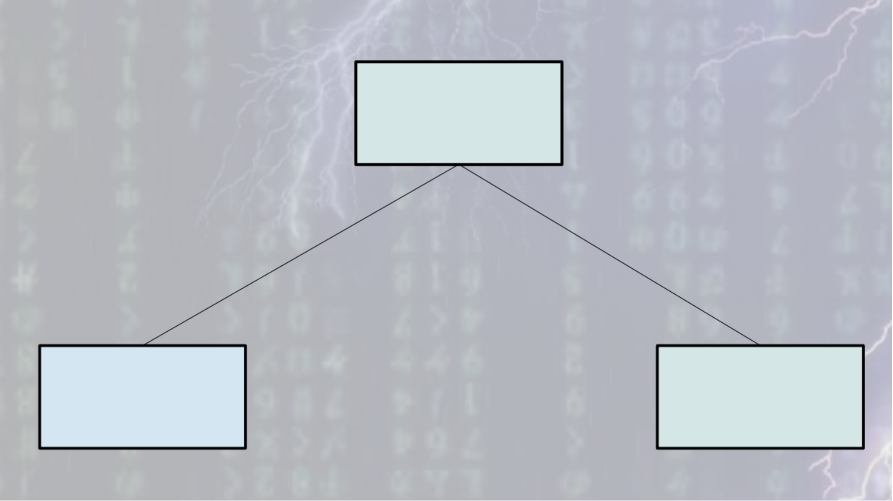
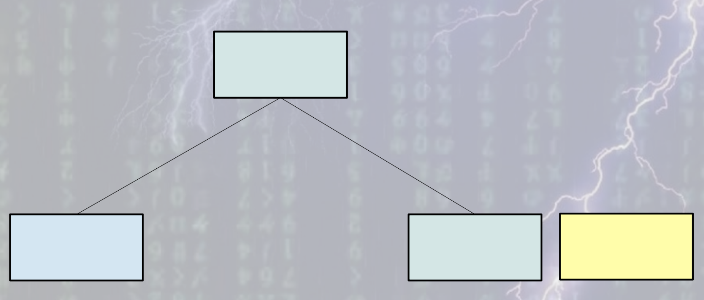
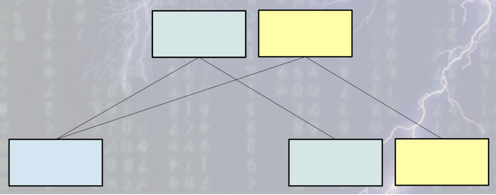
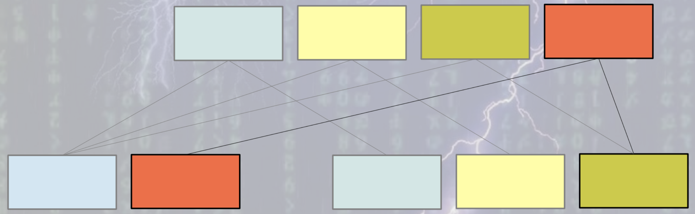
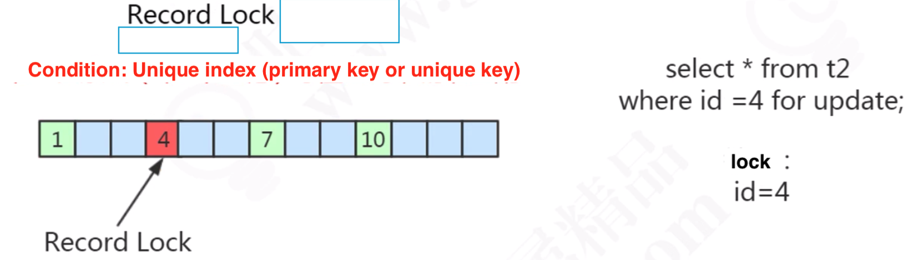
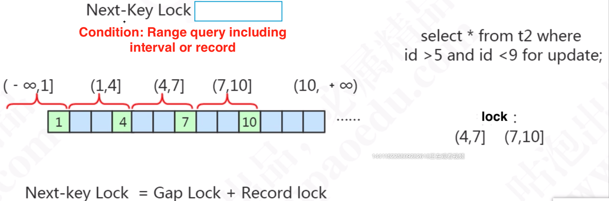

- [Transaction model](#transaction-model)
  - [ACID and InnoDB](#acid-and-innodb)
  - [MVCC (multi-version concurrency control)](#mvcc-multi-version-concurrency-control)
    - [Motivation](#motivation)
    - [InnoDB MVCC idea](#innodb-mvcc-idea)
    - [Pros](#pros)
    - [Cons](#cons)
    - [Example](#example)
  - [Lock](#lock)
    - [Shared vs exclusive locks](#shared-vs-exclusive-locks)
      - [Shared lock](#shared-lock)
      - [Exclusive lock](#exclusive-lock)
    - [Intentional shared/exclusive lock](#intentional-sharedexclusive-lock)
    - [Row vs table locks](#row-vs-table-locks)
    - [Table locks](#table-locks)
      - [Add/Release Table lock](#addrelease-table-lock)
      - [AUTO_INC lock](#auto_inc-lock)
    - [Some Row locks (exclusive lock)](#some-row-locks-exclusive-lock)
      - [Record lock](#record-lock)
      - [Gap lock](#gap-lock)
      - [Next-key lock](#next-key-lock)
- [TODO](#todo)

# Transaction model

* There are three problems related to 

## ACID and InnoDB

* InnoDB implements ACID by using undo, redo log and locks
  * Atomic: Undo log is used to record the state before transaction. 
  * Consistency: Redo log is used to record the state after transaction.
  * Isolation: Locks are used for resource isolation. 
  * Durability: Redo log and undo log combined to realize this. 

## MVCC (multi-version concurrency control)

### Motivation

* A traditional approach to resolve concurrency control problem is using locks. MVCC eliminates locking so that the processes can run concurrently without blocking each other.
* MVCC has different implementation for different database such as MySQL and PostgreSQL. This section focuses on MySQL's MVCC implemenation. 
* MySQL implements MVCC mechanism for both Read Committed and Repeatable Read isolation level. By default, MySQL uses Repeatable read. 
* MySQL MVCC consists of two components: Data versioning and read view. 

### InnoDB MVCC idea
* Undo log uses transaction id for data versioning
* Read view consists of:
  * An array of all uncommitted transaction ids. 
  * Already created max transaction id. 
* MVCC systems also use B-Tree internally. But it does not do in place B-Tree update as random write is very costly and less efficient in any kind of disk. Instead it takes append only approach like LSM tree systems. Each & every time some data is updated, a copy of the original leaf node is created and appended to the end of the file. Not only the leaf, but also the whole leaf to root path is recreated and appended to the end of file. Other nodes remain intact. The root node is always written last. So update operation is always bottom up.
* An illustration on the idea
  1. A very simple tree with 3 node exists somewhere on disk
  2. The rightmost node has to be updated. So a copy is created.
  3. Copy the root. The new root now points to the new leaf node as well. The earlier nodes exist in their position.
  4. The left most node has to updated. So a copy is created.
  5. New root copy is creates as well. Earlier versions exist.

### Pros
* Append only is very very fast on disk — magnetic hard drive or Solid State Drive whatever it is.
* Due to append-only nature, database is never corrupt, because what is already written to disk is immutable.
* Probably no need to maintain WAL — Write Ahead Log. Because database is never going to be corrupt. No in-place update, always the database has some consistent view.
* Backup or taking snapshot is easy. Normally for backup operation, you need to take the database offline or freeze it or stop doing update operations for some time because during backing up, if some update operation occurs, it might impact the backup or it might not be a part of the snapshot at all. Also there might be some problems with locking during backup etc. With append only, there is no such overhead as it’s the file already contains immutable state of data. Just copy the file to a different machine and done. Even if there is a downtime, it is very very small.
* There is ideally no locking involved. So writers don’t block readers, readers don’t block the writer. Readers always see some consistent view of the database. So you can ideally run single serialised writer with multiple readers.
* After crash, there is no rebuild or reindex required. Just backup of the database file is enough.
* Replication is also as simple as backup.

### Cons
* High space usage is the biggest issue. Everything in the world comes at a cost. So the speed of such systems comes from such space overhead.
* B-Tree is a very highly compact data structure i.e; the internal or branch nodes contain array of hundreds or thousands of keys. So it boils down to similar number of children per branch node. So there are thousands to millions of leaf to root path that might get practically copied at high scale.

### Example

* Repeatable read
  * Read view will only be executed once in a transaction when the first statement executes. This is why #select 2 reads a different value when compared with #select 1. 
  * MySQL will go through the undo log from the latest to the older ones, and use the first log record bigger than its read view as true value. 

* Read committed
  * Read view will be generated each time when a statement is executed. 
  * The rest will stay same as repeatable read. 

## Lock

### Shared vs exclusive locks

#### Shared lock

* Def: If transaction T1 holds a shared (S) lock on row r, then requests from some distinct transaction T2 for a lock on row r are handled as follows:
  * A request by T2 for an S lock can be granted immediately. As a result, both T1 and T2 hold an S lock on r.
  * A request by T2 for an X lock cannot be granted immediately.
* Add lock:   
  1. select ...from XXX where YYY lock in share mode
  2. insert ... into select ... 
* Release lock:  commit / rollback

#### Exclusive lock

* Def: If a transaction T1 holds an exclusive (X) lock on row r, a request from some distinct transaction T2 for a lock of either type on r cannot be granted immediately. Instead, transaction T2 has to wait for transaction T1 to release its lock on row r.
* Add lock: Automatically by default
  1. update
  2. delete
  3. insert
  4. select ... from XXX where YYY from update
     * If there is no index on YYY, then it will lock the entire table. 
* Release lock: commit / rollback

### Intentional shared/exclusive lock

* Goal: Improve the efficiency of adding table wise lock. Divide the operation for adding lock into multiple phases. This is especially useful in cases of table locks. 
* Operation: Automatically added by database. If a shared lock needs to be acquired, then an intentional shared lock needs to be acquired first; If an exclusive lock needs to be acquired, then an intentional exclusive lock needs to be acquired first. 

### Row vs table locks

* There are locks at different granularity and their conflicting status is documented below. 
* References: [https://www.javatpoint.com/dbms-multiple-granularity](https://www.javatpoint.com/dbms-multiple-granularity)

### Table locks

#### Add/Release Table lock

* Add:
  1. Lock Table tableName READ
  2. Lock Table tableName WRITE
  3. discard table
  4. import  
* Release:
  * Commit / Rollback

#### AUTO_INC lock

* Be triggered automatically when insert ... into Table xxx happens

### Some Row locks (exclusive lock)

#### Record lock

* Prerequistes: Both needs to be met:
  * Where condition uses exact match (==) and the record exists. 
  * Where condition uses unique index. 

#### Gap lock

* Prerequistes: Both needs to be met:
  * Database isolation level is repeatable read. 
  * One of the following:
    * Where condition uses exact match (==) on a unique index and the record does not exist.
    * Where condition uses range match on a unique index.
    * Where condition doesn't have a unique index. (table lock will be used)
    * Where condition has index but is not unique index.

#### Next-key lock

* Prerequistes:
  * If the where condition covers both gap lock and record lock, then next-key lock will be used. 
* Relationship with other locks:

* Next key = record lock + gap lock + record on the right border

# TODO

* [MySQL index deep dive](https://medium.com/free-code-camp/database-indexing-at-a-glance-bb50809d48bd)
* [MVCC](https://kousiknath.medium.com/how-mvcc-databases-work-internally-84a27a380283)
* index and schema design
  * 分析磁盘I/O时间 [https://blog.csdn.net/mysteryhaohao/article/details/51719871](https://blog.csdn.net/mysteryhaohao/article/details/51719871)
* Problems of mySQL: [https://time.geekbang.org/column/article/267741](https://time.geekbang.org/column/article/267741)
* Isolation level: [https://time.geekbang.org/column/article/12288](https://time.geekbang.org/column/article/12288)
