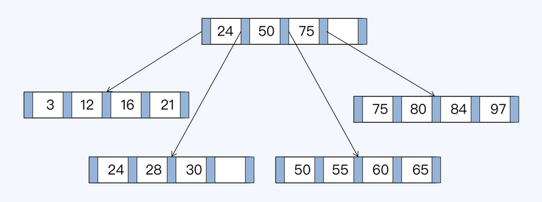

* [Data structures](algorithm_databasedatastructure.md#data-structures)
  * [Rum Conjecture](algorithm_databasedatastructure.md#rum-conjecture)
  * [Database data structures](algorithm_databasedatastructure.md#database-data-structures)
    * [Binary search tree](algorithm_databasedatastructure.md#binary-search-tree)
    * [Balanced binary  tree](algorithm_databasedatastructure.md#balanced-binary--tree)
    * [B tree](algorithm_databasedatastructure.md#b-tree)
    * [B+ Tree](algorithm_databasedatastructure.md#b-tree-1)
      * [Rum conjecture](algorithm_databasedatastructure.md#rum-conjecture-1)
      * [Capacity for clustered index - 5M](algorithm_databasedatastructure.md#capacity-for-clustered-index---5m)
      * [Capacity for unclustered index - 1G](algorithm_databasedatastructure.md#capacity-for-unclustered-index---1g)
    * [LSM tree](algorithm_databasedatastructure.md#lsm-tree)
      * [Read-optimization: Compaction](algorithm_databasedatastructure.md#read-optimization-compaction)
        * [Minor compaction](algorithm_databasedatastructure.md#minor-compaction)
        * [Major compaction](algorithm_databasedatastructure.md#major-compaction)
      * [Read steps](algorithm_databasedatastructure.md#read-steps)
  * [TODO](algorithm_databasedatastructure.md#todo)

# MySQL data structures

* For visualization of different data structures, please refer to [https://www.cs.usfca.edu/\~galles/visualization/Algorithms.html](https://www.cs.usfca.edu/\~galles/visualization/Algorithms.html)

## Binary search tree

* Cons: Not balanced, worst case is a list

## Balanced binary  tree

* Based on the idea of binary search tree, with the following improvements:
  * The height difference between left and right child is 1 at maximum
* Cons:
  * Lots of rebalancing during inserting new nodes
  * Each nodes could only store one value while operating system load items from disk in page size (4k).
  * Tree too high which results in large number of IO operations

## B tree
* Based on the idea of binary tree, with the following improvements:
  * Store more values in each node: For a N-degree B tree, 
    * Every non-leaf node (except root) has at least N/2 children nodes.
    * Root node has at least 2 children nodes.
    * Each node has at most N children nodes. 
  * All the leaf nodes stay on the same depth level.
  * B tree is built up in a bottom-up way. Everything is sent into a leaf node first node (in innoDB the leaf node size is 16KB). If the leaf node could not fit, then another leaf node will be created and a node will be promoted as parent. 
* Cons:
  * Non-leaf node stores both data and index. There is really limited data stored on each non-leaf nodes. 

* The number of rows that exist within a block size:
  * The MySQL InnoDB database engine has block size of 16 KB. It means every time you read or write data to the database, a block of disk pages of size 16 KB will be fetched from the disk into RAM, it will get manipulated and then written back to disk again if required. 
  * B Tree takes advantage of this block oriented operation. Say the average size of a row is 128 bytes ( The actual size may vary ), a disk block ( in this case, a leaf node ) of size 16 KB can store a total of (16 * 1024) / 128 = 128 rows.

## B+ Tree

* Based on top of B Tree, with the following improvements:
  * Non-leaf nodes only contain index, which enables any non-leaf node  could include more index data and the entire tree will be shorter. 
  * The leaf nodes are linked in a doubly linked list. These links will be used for range query. 

* Characteristics:
  * B+ tree has write amplification
  * The storage is not continuous
* Initial B+ tree

* B+ tree after insertion

### Capacity for clustered index - 5M

* Suggested InnoDB record num not bigger than 5 million
* Assumptions: 
  * InnoDB page size for read and write: 16KB. It means that each B+ tree node size is 16KB. 
  * For non-leaf node, suppose that the primary key is an integer (8 Byte / 64 bits) and the address pointer to next level is also 8 bytes / 64 bits. 
  * For leaf node, suppose that record size is 1KB. 
* Capacity in each layer:
  * First/Root layer (Store indexes only): 
    * 1 node with 16 KB / 16 Byte = 1K children
    * 1,024 
  * Second layer (Store indexes only): 
    * 1K node with 1K \* 1K = 1M children 
    * 1024 \* 1024 = 1,048,576
  * Third layer (Store indexes and record): 
    * Each node could store 16KB / 1KB = 16 records. 
    * In total, there could be
      * 1M \* 16 = 16M records stored in an InnoDB table. 
      * Store 1,048,576 \* 16 =  16,777,216
    * In practice, each InnoDB usage not bigger than 5 million

### Capacity for unclustered index - 1G

* Unclustered index approach could store more data because all three layers of tree are indexes. 
  * 1024 _ 1024 _ 1024 = 1G records

# References

* [Some study on database storage internals](https://kousiknath.medium.com/data-structures-database-storage-internals-1f5ed3619d43)
