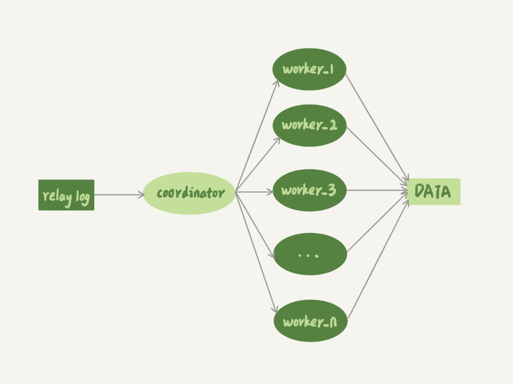
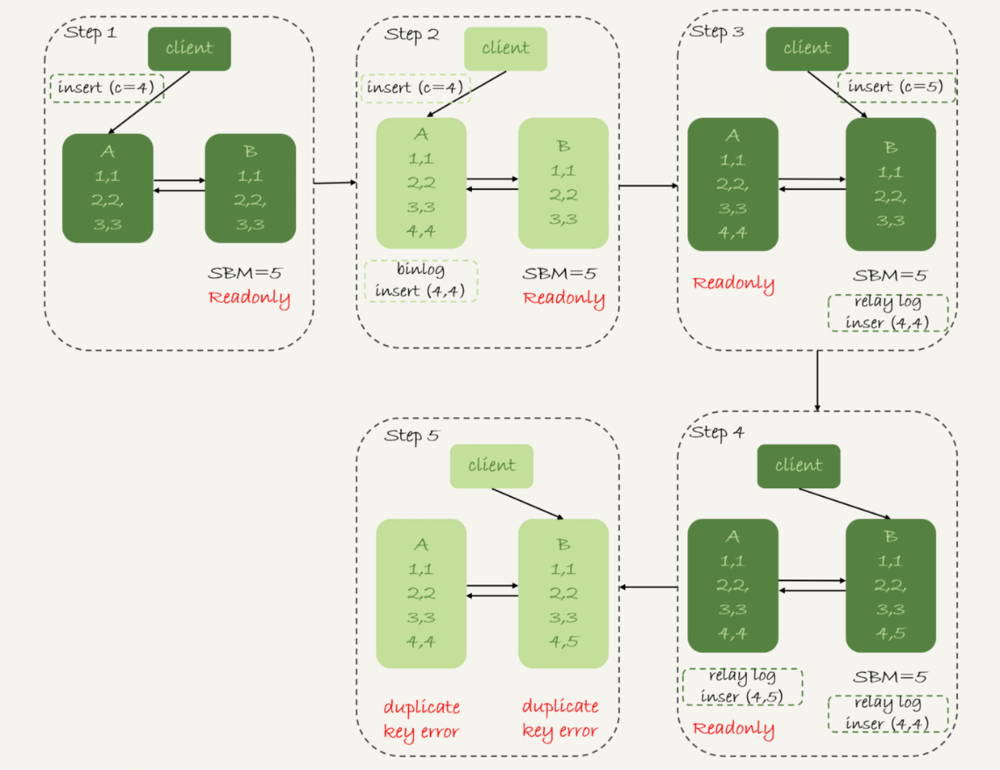

- [Replication](#replication)
  - [Category](#category)
  - [Process](#process)
    - [Flowchart](#flowchart)
    - [binlog](#binlog)
      - [Statement](#statement)
      - [Row](#row)
      - [Mixed](#mixed)
      - [Why MySQL 5.7 default to Row instead of Mixed](#why-mysql-57-default-to-row-instead-of-mixed)
  - [Replication delay](#replication-delay)
    - [Def](#def)
    - [Delay sources](#delay-sources)
    - [How to reduce replication delay](#how-to-reduce-replication-delay)
  - [Use cases](#use-cases)
    - [Handle old data - Archive](#handle-old-data---archive)
      - [Use case](#use-case)
      - [Implementation](#implementation)
      - [Flowchart](#flowchart-1)
    - [Backup](#backup)
    - [High availability with failover](#high-availability-with-failover)
      - [Two servers](#two-servers)
        - [Reliability first failover](#reliability-first-failover)
        - [Approaches](#approaches)
        - [Availability first failover](#availability-first-failover)
      - [Multiple servers](#multiple-servers)
        - [New challenges - find sync point between multiple servers](#new-challenges---find-sync-point-between-multiple-servers)
        - [Problem with binlog position](#problem-with-binlog-position)
        - [GTID to rescue](#gtid-to-rescue)

# Replication

## Category

* Synchronous replication: 
* Asynchronous replication: 
* Semi-Synchronous replication:
* Replication topology
  * [https://coding.imooc.com/lesson/49.html#mid=491](https://coding.imooc.com/lesson/49.html#mid=491)

```
SQL > STOP SLAVE;
SQL > Change master to 
master_host = '192.168.99.102',
master_port = 3306,
master_user = 'xxx',
master_password = 'yyy';
SQL > START SLAVE;
SQL > SHOW SLAVE STATUS;

// Watch the Slave_IO_Running and Slave_SQL_running field from the output
```

## Process

### Flowchart


### binlog

* Format

* Please see [MySQL official documents](https://dev.mysql.com/doc/refman/8.0/en/replication-sbr-rbr.html)

#### Statement

* Statement: not always safe, but may save storage place and faster
  * Pros: 
    1. Low number of logs generated, save I/O bandwidth
    2. Does not require consistency between master and slave table schema 
  * Cons: 
    1. Inapplicable for many SQL statements. For non-deterministic functions, could not gaurantee the consistency between master and slave server
       1. Database locks: Needs to lock a bigger chunk of data

#### Row

* Binlog: always safe, possibly very slow and inefficient in time and space
  * Pros:
    1. Database locks: Only need to lock a specific row
    2. Applicable to any SQL statement. 
  * Cons: 
    1. High number of logs generated
    2. Does not require consistency between master and slave table schema

#### Mixed

* Mixed: best of both worlds in theory. Most queries are replicated by statement. But transactions MySQL knows are non-deterministic are replicated by row. Mixed Mode uses row-based replication for any transaction that:
  * Uses user defined functions
  * Uses the UUID(), USER(), or CURRENT_USER() functions
  * Uses LOAD_FILE (which otherwise assumes every slave has the exact same file on the local file system and doesn't replicate the data)
  * Updates two tables with auto_increment columns (the binlog format only carries one auto_increment value per statement)

#### Why MySQL 5.7 default to Row instead of Mixed

* Main reason is for backup and data recovery
* For example
  * For delete SQL commands, Row based format will record the entire original record. 
  * For insert SQL commands, Row based format will record the inserted record. 
  * For update SQL commands, Row based format will record the before and after record. 

## Replication delay
### Def

* The master-slave latency is defined as the difference between T3 and T1. 
  1. Master DB executes a transaction, writes into binlog and finishes at timestamp T1.
  2. The statement is replicated to binlog, Slave DB received it from the binlog T2.
  3. Slave DB executes the transaction and finishes at timestamp T3. 

### Delay sources

* Inferior slave machines: Slave machine is insuperior to master
* Too much load for slave
  * Causes: Many analytical queries run on top of slave. 
  * Solutions:
    * Multiple slaves
    * Output telemetry to external statistical systems such as Hadoop through binlog 
* Big transactions
  * If a transaction needs to run for as long as 10 minutes on the master database, then it must wait for the transaction to finish before running it on slave. Slave will be behind master for 10 minutes. 
    * e.g. Use del to delete too many records within DB
    * e.g. mySQL DDL within big tables. 
* Before MySQL 5.6, there isn't much built-in support for parallel relay log processing. If there is a steady difference between the write speed on master server and relay speed on slave server, then the replication delay between master and slave could become several hours. For more details, please check this file in [geektime in Chinese](https://time.geekbang.org/column/article/77083)



### How to reduce replication delay

* Solution1: After write to master, write to cache as well. 
  * What if write to cache fails
    * If read from master, slave useless
    * If read from slave, still replication delay
* Solution2: If cannot read from slave, then read from master. 
  * It works for DB add operation
  * It doesn't work for DB update operation
* Solution3: If master and slave are located within the same location, synchronous replication

## Use cases

### Handle old data - Archive

* Archive old data in time and save disk space

#### Use case

* If a single SQL table's size exceeds 20M rows, then its performance will be slow. Partitioning and Sharding have already been applied. Due to the use cases, there are some hot and cold data, e.g. ecommerce website orders.

#### Implementation

* MySQL engine for archiving
  * InnoDB is based on B+ tree, each time a write happens, the clustered index will need to modified again. The high traffic during archiving process decides that InnoDB will not be a great fit. 
  * TukoDB has higher write performance
* Create archiving tables

```
CREATE Table t_orders_2021_03 {
    ...
} Engine = TokuDB;
```

* Pt-archiver: One of the utils of Percona-toolkit and used to archive rows from a MySQL table into another table or a file. [https://www.percona.com/doc/percona-toolkit/LATEST/pt-archiver.html](https://www.percona.com/doc/percona-toolkit/LATEST/pt-archiver.html)

#### Flowchart

```
┌──────────────────────────┐                                                                                        
│         Shard A          │                              ┌ ─ ─ ─ ─ ─ ─ ─ ─ ─ ─ ─ ─ ─ ─ ─ ─ ┐                       
│                          │                                                                                        
│   ┌─────────────────┐    │                              │                                 │                       
│   │                 │    │                                                                                        
│   │    Cold data    │────┼──┐                           │                                 │                       
│   │                 │    │  │                               ┌──────────────────────────┐          ┌──────────────┐
│   └─────────────────┘    │  │                           │   │         HA Proxy         │  │       │              │
│                          │  │                               │                          │          │              │
│   ┌─────────────────┐    │  │                           │   │  ┌───────────────────┐   │  │       │  Archive DB  │
│   │                 │    │  │                               │  │    Keepalived     │   │      ┌──▶│              │
│   │    Hot data     │    │  │                           │   │  └───────────────────┘   │  │   │   │              │
│   │                 │    │  │                               │                          │      │   │              │
│   └─────────────────┘    │  │       ┌──────────────┐    │   └──────────────────────────┘  │   │   └──────────────┘
│                          │  │       │              │                                          │                   
│                          │  │       │              │    │                                 │   │                   
└──────────────────────────┘  │       │  Virtual IP  │                                          │                   
                              ├──────▶│   address    │───▶│                                 │───┤                   
┌──────────────────────────┐  │       │              │                                          │                   
│         Shard Z          │  │       │              │    │   ┌──────────────────────────┐  │   │   ┌──────────────┐
│                          │  │       └──────────────┘        │         HA Proxy         │      │   │              │
│   ┌─────────────────┐    │  │                           │   │                          │  │   │   │              │
│   │                 │    │  │                               │   ┌───────────────────┐  │      │   │  Archive DB  │
│   │    Cold data    │────┼──┘                           │   │   │    Keepalived     │  │  │   └──▶│              │
│   │                 │    │                                  │   └───────────────────┘  │          │              │
│   └─────────────────┘    │                              │   │                          │  │       │              │
│                          │                                  └──────────────────────────┘          └──────────────┘
│   ┌─────────────────┐    │                              │                                 │                       
│   │                 │    │                                                                                        
│   │    Hot data     │    │                              │                                 │                       
│   │                 │    │                                                                                        
│   └─────────────────┘    │                              │                                 │                       
│                          │                               ─ ─ ─ ─ ─ ─ ─ ─ ─ ─ ─ ─ ─ ─ ─ ─ ─                        
│                          │                                                                                        
└──────────────────────────┘
```

### Backup

* Recovery test on the backup data

### High availability with failover

* Usually reliability first is preferred to availability first to avoid data consistency problems. 
* For reliability first failover, the duration for downtime depends on the replication delay between master and slave. 
* Problems to be solved:
  1. After switch, how to notify applications the new address of master
  2. How to determine the master is available
  3. After switch, how to decide on the master-slave replication relationship 

#### Two servers

##### Reliability first failover

* There will be a brief period when both server A and server B are readonly between step (2-4)
  1. Check the value of slave server's seconds_behind_master, if it is smaller than certain threshold (e.g. 5s), continue to next step; Else repeat this step
  2. Change master server A's state to readonly (set readonly flag to true)
  3. Check the value of slave server's seconds_behind_master until its value becomes 0. 
  4. Change slave server B's state to read-write (set readonly flag to false)
  5. Switch the traffic to slave server B

##### Approaches

1. Reliability first - After step 2 and before step4 below, both master and slave will be in readonly state. 

```
                  │     │         ┌──────────────────────┐                          
                  │     │         │Step5. Switch traffic │                          
                  │     │         │     from A to B      │                          
                  │     │         └──────────────────────┘                          
                 Requests                                                           
                  │     │                                                           
                  │     │                                                           
                  │     │                                                           
                  ▼     ▼                                                           

┌────────────────────────────┐                         ┌───────────────────────────┐
│          Master A          │                         │         Master B          │
│ ┌───────────────────────┐  │                         │ ┌───────────────────────┐ │
│ │step2. Change master to│  │                         │ │step1. check           │ │
│ │readonly state         │  │                         │ │seconds_behind_master  │ │
│ └───────────────────────┘  │                         │ │until it is smaller    │ │
│                            │                         │ │than 5 seconds         │ │
│                            │                         │ └───────────────────────┘ │
│                            │                         │ ┌───────────────────────┐ │
│                            │                         │ │step3. wait until      │ │
│                            │                         │ │seconds_behind_master  │ │
│                            │                         │ │to become 0            │ │
└────────────────────────────┘                         │ │                       │ │
                                                       │ └───────────────────────┘ │
                                                       │ ┌───────────────────────┐ │
                                                       │ │step4. change to       │ │
                                                       │ │read/write state       │ │
                                                       │ │instead of readonly    │ │
                                                       │ │                       │ │
                                                       │ └───────────────────────┘ │
                                                       │                           │
                                                       │                           │
                                                       └───────────────────────────┘
```


##### Availability first failover

* There is no blank period for availability. The switch always happens immediately. 
* When the binlog format is set to row based, it will be easier to discover the inconsistency between master and slave. 

```
                  │     │         ┌──────────────────────┐                          
                  │     │         │Step3. Switch traffic │                          
                  │     │         │     from A to B      │                          
                  │     │         └──────────────────────┘                          
                 Requests                                                           
                  │     │                                                           
                  │     │                                                           
                  │     │                                                           
                  ▼     ▼                                                           

┌────────────────────────────┐                         ┌───────────────────────────┐
│          Master A          │                         │         Master B          │
│ ┌───────────────────────┐  │                         │                           │
│ │step2. Change master to│  │                         │ ┌───────────────────────┐ │
│ │readonly state         │  │                         │ │step1. change to       │ │
│ └───────────────────────┘  │                         │ │read/write state       │ │
│                            │                         │ │instead of readonly    │ │
│                            │                         │ │                       │ │
│                            │                         │ └───────────────────────┘ │
│                            │                         │                           │
│                            │                         │                           │
│                            │                         │                           │
└────────────────────────────┘                         └───────────────────────────┘
```

* Example setup: Server A is master and B is slave. 
  * In mixed format, only the statement is sent along. 
  * In row format, the entire record is sent along so it will be easier to detect the conflict (duplicate key error shown below)

```
// table structure and already setup record
mysql> CREATE TABLE `t` (
  `id` int(11) unsigned NOT NULL AUTO_INCREMENT,
  `c` int(11) unsigned DEFAULT NULL,
  PRIMARY KEY (`id`)
) ENGINE=InnoDB;

insert into t(c) values(1),(2),(3);

// The next examples discuss what happens for an availability first failover
insert into t(c) values(4); // Send to server A
insert into t(c) values(5); // Send to server B
```




#### Multiple servers

##### New challenges - find sync point between multiple servers

* It has the following setup


* After failing over, A' becomes the new master. The new challenges 


##### Problem with binlog position

* Hard to be accurate with MASTER_LOG_POS

```
// The command to execute when set B as A's slave
CHANGE MASTER TO 
MASTER_HOST=$host_name 
MASTER_PORT=$port 
MASTER_USER=$user_name 
MASTER_PASSWORD=$password 
MASTER_LOG_FILE=$master_log_name 
MASTER_LOG_POS=$master_log_pos  // master binlog offset position, hard to be accurate !!!
```

* Reason for the inaccuracy. The sync point is usually found by locating a timestamp in original master server. Then according to this problematic timestamp, find transaction id in new master server. It is hard to guarantee that slave servers are behind new master server (e.g. might execute the same command twice)

##### GTID to rescue

* Traditional MySQL replication is based on relative coordinates — each replica keeps track of its position with respect to its current primary’s binary log files. GTID enhances this setup by assigning a unique identifier to every transaction, and each MySQL server keeps track of which transactions it has already executed. This permits “auto-positioning,” the ability for a replica to be pointed at a primary instance without needing to specify a binlog filename or position in the CHANGE PRIMARY statement.
* Auto-positioning makes failover simpler, faster, and less error-prone. It becomes trivial to get replicas in sync after a primary failure, without requiring an external tool such as Master High Availability (MHA). Planned primary promotions also become easier, as it is no longer necessary to stop all replicas at the same position first. Database administrators need not worry about manually specifying incorrect positions; even in the case of human error, the server is now smart enough to ignore transactions it has already executed.

```
CHANGE MASTER TO 
MASTER_HOST=$host_name 
MASTER_PORT=$port 
MASTER_USER=$user_name 
MASTER_PASSWORD=$password 
master_auto_position=1  // This means the replication method is GTID
```

* More detailed explanation available at [Geektime MySQL](https://time.geekbang.org/column/article/77427)
