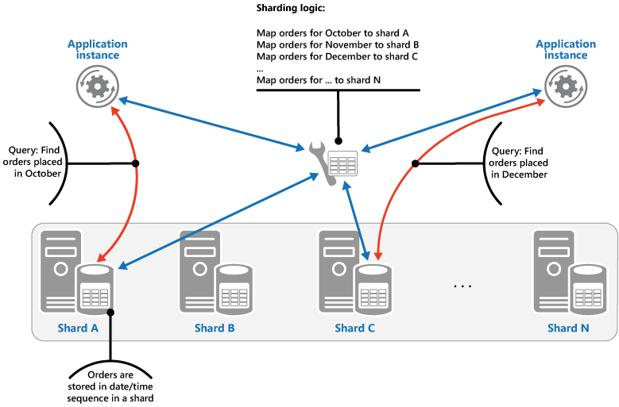

- [High concurrent writes and large volume in a single table: MySQL table partitioning](#high-concurrent-writes-and-large-volume-in-a-single-table-mysql-table-partitioning)
  - [Def](#def)
  - [Benefits](#benefits)
  - [MySQL only supports horizontal partition](#mysql-only-supports-horizontal-partition)
  - [Limitations: Partition column and unique indexes](#limitations-partition-column-and-unique-indexes)
  - [Use cases](#use-cases)
  - [Types](#types)
    - [RANGE Partitioning](#range-partitioning)
    - [List partitioning](#list-partitioning)
    - [Hash partitioning](#hash-partitioning)
  - [References](#references)
- [High concurrent writes and large volume across tables: MySQL DB Sharding](#high-concurrent-writes-and-large-volume-across-tables-mysql-db-sharding)
  - [Use cases](#use-cases-1)
    - [Last resort](#last-resort)
    - [Triggers](#triggers)
    - [Capacity planning](#capacity-planning)
  - [Introduced problems](#introduced-problems)
    - [How to choose sharding key](#how-to-choose-sharding-key)
    - [Choose the number of shards](#choose-the-number-of-shards)
    - [Limited SQL queries](#limited-sql-queries)
    - [Sharding stratgies](#sharding-stratgies)
      - [Lookup strategy](#lookup-strategy)
      - [Range strategy](#range-strategy)
      - [By customer or tenant](#by-customer-or-tenant)
      - [By geography](#by-geography)
      - [By time](#by-time)
      - [Hash strategy](#hash-strategy)
        - [By entity id](#by-entity-id)
    - [How to store unsharded table](#how-to-store-unsharded-table)
    - [How to deploy shards on nodes](#how-to-deploy-shards-on-nodes)
    - [Cross shard join](#cross-shard-join)
    - [Distributed transactions (write across shards)](#distributed-transactions-write-across-shards)
    - [Unique global ID](#unique-global-id)
    - [Challenges in Graph DB sharding](#challenges-in-graph-db-sharding)
  - [ShardingSphere](#shardingsphere)
  - [Sharding JDBC](#sharding-jdbc)
  - [Sharding Proxy\*\*](#sharding-proxy)
    - [Sharding example (In Chinese)](#sharding-example-in-chinese)

# High concurrent writes and large volume in a single table: MySQL table partitioning

## Def

* MySQL table partitioning means to divide one table into multiple partitions and each partition resides on a single disk. 
* Horizontal partitioning means that all rows matching the partitioning function will be assigned to different physical partitions. 
  * When a single table's number of rows exceed 20M, the performance will degrade quickly.
  * Based on certain fields, put **rows of a table** into different tables. 
* Vertical partitioning allows different table columns to be split into different physical partitions. 
  * Put different **fields of a table** into different tables
  * Segmented tables usually share the primary key for correlating data


## Benefits

* Storage: It is possible to store more data in one table than can be held on a single disk or file system partition. As known, the upper limit number of rows in a single MySQL is 20M due to the B+ tree depth. MySQL table partitioning enables more rows in any single table because these different partitions are stored in different disks.
* Deletion: Dropping a useless partition is almost instantaneous (partition level lock), but a classical DELETE query run in a very large table could lock the entire table (table level lock). 
* Partition Pruning: This is the ability to exclude non-matching partitions and their data from a search; it makes querying faster. Also, MySQL 5.7 supports explicit partition selection in queries, which greatly increases the search speed. (Obviously, this only works if you know in advance which partitions you want to use.) This also applies for DELETE, INSERT, REPLACE, and UPDATE statements as well as LOAD DATA and LOAD XML.
* A much cheaper option than sharding: Does not need cluster


## MySQL only supports horizontal partition

* Currently, MySQL supports horizontal partitioning but not vertical. The engine’s documentation clearly states it won’t support vertical partitions any time soon: ”There are no plans at this time to introduce vertical partitioning into MySQL.”
* [https://dev.mysql.com/doc/mysql-partitioning-excerpt/8.0/en/partitioning-overview.html](https://dev.mysql.com/doc/mysql-partitioning-excerpt/8.0/en/partitioning-overview.html)

## Limitations: Partition column and unique indexes

* Partition Columns: The rule of thumb here is that all columns used in the partitioning expression must be part of every unique key in the partitioned table. This apparently simple statement imposes certain important limitations. 


* Parition key could not be used in child query

## Use cases

* Time Series Data

## Types

### RANGE Partitioning

* This type of partition assigns rows to partitions based on column values that fall within a stated range. The values should be contiguous, but they should not overlap each other. The VALUES LESS THAN operator will be used to define such ranges in order from lowest to highest (a requirement for this partition type). Also, the partition expression – in the following example, it is YEAR(created) – must yield an integer or NULL value.
* Use cases:
  * Deleting Old Data: In the above example, if logs from 2013 need to be deleted, you can simply use ALTER TABLE userslogs DROP PARTITION from\_2013\_or_less; to delete all rows. This process will take almost no time, whereas running DELETE FROM userslogs WHERE YEAR(created) <= 2013; could take minutes if there are lots of rows to delete.
  * Series Data: Working with a range of data expressions comes naturally when you’re dealing with date or time data (as in the example) or other types of “series” data.
  * Frequent Queries on the Partition Expression Column: If you frequently perform queries directly involving the column used in the partition expression (where the engine can determine which partition(s) it needs to scan based directly on the WHERE clause), RANGE is quite efficient. 
* Example

```SQL
CREATE TABLE userslogs (
    username VARCHAR(20) NOT NULL,
    logdata BLOB NOT NULL,
    created DATETIME NOT NULL,
    PRIMARY KEY(username, created)
)
PARTITION BY RANGE( YEAR(created) )(
    PARTITION from_2013_or_less VALUES LESS THAN (2014),
    PARTITION from_2014 VALUES LESS THAN (2015),
    PARTITION from_2015 VALUES LESS THAN (2016),
    PARTITION from_2016_and_up VALUES LESS THAN MAXVALUE;

// An alternative to RANGE is RANGE COLUMNS, which allows the expression to include more than one column involving STRING, INT, DATE, and TIME type columns (but not functions). In such a case, the VALUES LESS THAN operator must include as many values as there are columns listed in the partition expression. For example:
CREATE TABLE rc1 (
    a INT,
    b INT
)
PARTITION BY RANGE COLUMNS(a, b) (
    PARTITION p0 VALUES LESS THAN (5, 12),
    PARTITION p3 VALUES LESS THAN (MAXVALUE, MAXVALUE)
);
```

### List partitioning

* LIST partitioning is similar to RANGE, except that the partition is selected based on columns matching one of a set of discrete values. In this case, the VALUES IN statement will be used to define matching criteria.
* Example

```SQL
CREATE TABLE serverlogs (
    serverid INT NOT NULL, 
    logdata BLOB NOT NULL,
    created DATETIME NOT NULL
)
PARTITION BY LIST (serverid)(
    PARTITION server_east VALUES IN(1,43,65,12,56,73),
    PARTITION server_west VALUES IN(534,6422,196,956,22)
);

// LIST comes with an alternative – LIST COLUMNS. Like RANGE COLUMNS, this statement can include multiple columns and non-INT data types, such as STRING, DATE, and TIME. The general syntax would look like this

CREATE TABLE lc (
    a INT NULL,
    b INT NULL
)
PARTITION BY LIST COLUMNS(a,b) (
    PARTITION p0 VALUES IN( (0,0), (NULL,NULL) ),
    PARTITION p1 VALUES IN( (0,1), (0,2), (0,3), (1,1), (1,2) ),
    PARTITION p2 VALUES IN( (1,0), (2,0), (2,1), (3,0), (3,1) ),
    PARTITION p3 VALUES IN( (1,3), (2,2), (2,3), (3,2), (3,3) )
);
```

### Hash partitioning

* In HASH partitioning, a partition is selected based on the value returned by a user-defined expression. This expression operates on column values in rows that will be inserted into the table. A HASH partition expression can consist of any valid MySQL expression that yields a nonnegative integer value. HASH is used mainly to evenly distribute data among the number of partitions the user has chosen.
* Example

```SQL
CREATE TABLE serverlogs2 (
    serverid INT NOT NULL, 
    logdata BLOB NOT NULL,
    created DATETIME NOT NULL
)
PARTITION BY HASH (serverid)
PARTITIONS 10;
```

## References

* [https://www.vertabelo.com/blog/everything-you-need-to-know-about-mysql-partitions/](https://www.vertabelo.com/blog/everything-you-need-to-know-about-mysql-partitions/)

# High concurrent writes and large volume across tables: MySQL DB Sharding

## Use cases

### Last resort

* Sharding should be used as a last resort after you exhausted the following:
  * Add cache
  * Add read-write separation
  * Consider table partition

### Triggers

* Only use in OLTP cases (OLAP is more likely to have complex changing SQL queries)
* A single table's capacity reaches 2GB. 
* A database should not contain more than 1,000 tables.
* Each individual table should not exceed 1 GB in size or 20 million rows;
* The total size of all the tables in a database should not exceed 2 GB.

### Capacity planning

* For fast growing data (e.g. order data in ecommerce website), use 2X planned capacity to avoid resharding
* For slow growing data (e.g. user identity data in ecommerce website), use 3-year estimated capacity to avoid resharding. 

## Introduced problems

### How to choose sharding key

* Avoid cross shard joins
* Make data distribution even across shards

### Choose the number of shards

* If has a cap on storage:
  * Each shard could contain at most 1TB data.
  * number of shards = total storage / 1TB
* If has a cap on number of records:
  * Suppose the size of row is 100 bytes
    * User table: uid (long 8 bytes), name (fixed char 16 bytes), city (int 4 bytes), timestamp (long 8 bytes), sex (int 4 bytes), age (int 4 bytes) = total 40 bytes
  * Total size of the rows: 100 bytes \* Number_of_records
  * number of shards = total size of rows / 1TB

### Limited SQL queries

* Not all single node SQL will be supported. 
* See this for [a detailed example of ShardingSphere](https://shardingsphere.apache.org/document/current/en/features/sharding/use-norms/sql/)

### Sharding stratgies

#### Lookup strategy

* Pros:
  * Easy to migrate data
* Cons: 
  * Need an additional hop when query
  * If the lookup table is really big, it could also need to be sharded


#### Range strategy

* Pros:
  * Easy to add a new shard. No need to move the original data. For example, each month could have a new shard.
* Cons:
  * Uneven distribution. For example, July is the hot season but December is the cold season. 



#### By customer or tenant

* If it is a SaaS business, it is often true that data from one customer doesn't interact with data from any of your other customers. These apps are usually called multi-tenant apps. 
  * Multi-tenant apps usually require strong consistency where transaction is in place and data loss is not possible. 
  * Multi-tenant data usually evolves over time to provide more and more functionality. Unlike consumer apps which benefit from network effects to grow, B2B applications grows by adding new features for customers. 

#### By geography

* Apps such as postmate, lyft or instacart.
* You’re not going to live in Alabama and order grocery delivery from California. And if you were to order a Lyft pick-up from California to Alabama you’ll be waiting a good little while for your pickup.

#### By time

* Time sharding is incredibly common when looking at some form of event data. Event data may include clicks/impressions of ads, it could be network event data, or data from a systems monitoring perspective.
* This approach should be used when
  * You generate your reporting/alerts by doing analysis on the data with time as one axis.
  * You’re regularly rolling off data so that you have a limited retention of it.

#### Hash strategy


##### By entity id

* Shard based on hashing value of a field. 
* Pros:
  * Evenly distributed data
* Cons:
  * Hard to add a new shard. Lots of data migration need to happen. 

### How to store unsharded table

* Store a copy within each shard
  * Cons: Write across to guarantee consistency
* Use a centralized node to store
  * Cons: Need to have cross shard joins

### How to deploy shards on nodes

* Each shard gets stored in a separate database, and each database gets stored in a separate node. 
* Each shard gets stored in a separate database, and multiple database gets stored in a single node. 

### Cross shard join

* Query types:
  * Join queries: 
  * count queries:
  * order by queries:
* Solutions:
  * Aggregate query result for different shard within application code.
  * Usually use two sets of data to solve the problem
    * One data is based on unique sharding key.
    * The other one is data replicated asynchronously to Elasticsearch or Solr.

### Distributed transactions (write across shards)

* Original transaction needs to be conducted within a distributed transaction.
  * e.g. ecommerce example (order table and inventory table)
* There are wwo ways in general to implement distributed transactions:
  * 2PC 
  * TCC
* For example, some software has built-in implementations such as:
  * MySQL XA
  * Spring JTA

### Unique global ID

* Please see [ID generator](Scenario_IDGenerator.md)

### Challenges in Graph DB sharding

* Graph model is most common in B2C apps like Facebook and Instagram. 
* With this model, data is often replicated in a few different forms. Then it is the responsibility of the application to map to the form that is most useful to acquire the data. The result is you have multiple copies for your data sharded in different ways, eventual consistency of data typically, and then have some application logic you have to map to your sharding strategy. For apps like Facebook and Reddit there is little choice but to take this approach, but it does come at some price.

## ShardingSphere

* ShardingSphere has three solutions: ShardingJDBC / ShardingProxy / ShardingSphere

## Sharding JDBC


## Sharding Proxy**


### Sharding example (In Chinese)

* Original table


* Sharded result
  * Vertical sharding: Store, product and Sku should be stored in three different databases.
  * Fast growing table: Among all three database, Sku table will grow much faster than product and store. 
  * Binding table: Sku and SkuInfo always appear together. Product and productType usually appear together. They should be sharded according to the same column. 


