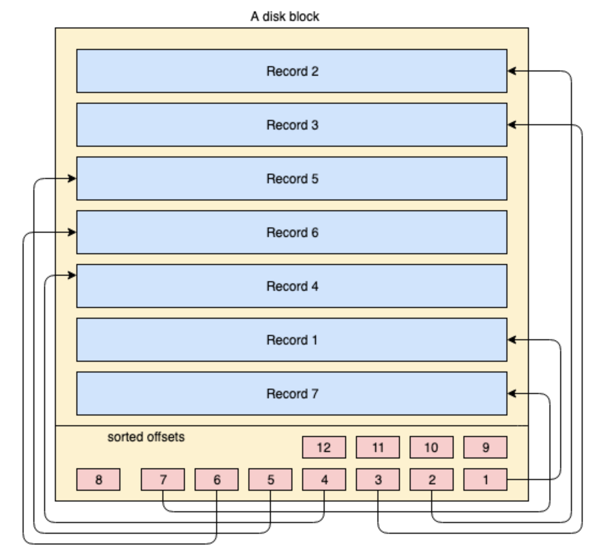

- [Factors impacting DB performance](#factors-impacting-db-performance)
- [Primary key](#primary-key)
- [Index](#index)
  - [Use case](#use-case)
  - [Clustered/Primary](#clusteredprimary)
    - [Def](#def)
    - [Structure](#structure)
    - [Comparison with unclustered index](#comparison-with-unclustered-index)
  - [Unclustered / Secondary index](#unclustered--secondary-index)
    - [Def](#def-1)
    - [Structure](#structure-1)
  - [Unique index](#unique-index)
  - [B+ tree vs hash index](#b-tree-vs-hash-index)
  - [Adaptive hash index](#adaptive-hash-index)
  - [Composite index](#composite-index)
    - [Def](#def-2)
    - [Why not multiple secondary index](#why-not-multiple-secondary-index)
    - [Covering index](#covering-index)
  - [Partial index](#partial-index)
- [Choose index columns](#choose-index-columns)
- [Slow query](#slow-query)
- [Best practices](#best-practices)
  - [Do](#do)
    - [Always define a primary key for each table](#always-define-a-primary-key-for-each-table)
    - [Use auto-increment int column when possible](#use-auto-increment-int-column-when-possible)
    - [Push range query conditions to last](#push-range-query-conditions-to-last)
    - [Order/Group By](#ordergroup-by)
    - [Use IN for low radix attributes if leftmost prefix index could not be used](#use-in-for-low-radix-attributes-if-leftmost-prefix-index-could-not-be-used)
    - [Use efficient pagination](#use-efficient-pagination)
    - [Use covering index to avoid low](#use-covering-index-to-avoid-low)
    - [Join](#join)
    - [NOT NULL constraint on column](#not-null-constraint-on-column)
  - [Don't](#dont)
    - [IN operator](#in-operator)
    - [Unequal filter when possible](#unequal-filter-when-possible)
    - [Filtering based on Nullable match conditions](#filtering-based-on-nullable-match-conditions)
    - [Prefix based fuzzy matching](#prefix-based-fuzzy-matching)
    - [Type conversion in the filtering condition](#type-conversion-in-the-filtering-condition)
    - [Functions on index](#functions-on-index)
    - [Computation expression on index](#computation-expression-on-index)
    - [Or condition](#or-condition)
  - [References](#references)

# Factors impacting DB performance

* Hardware 
* Operating system
* DB engine selection
* DB configuration parameters
* DB schema design
  * Slow queries

# Primary key
* A primary key should be part of many vital queries in your application.
* Primary key is a constraint that uniquely identifies each row in a table. If multiple columns are part of the primary key, that combination should be unique for each row.
* Primary key should be Non-null. Never make null-able fields your primary key. By ANSI SQL standards, primary keys should be comparable to each other, and you should definitely be able to tell whether the primary key column value for a particular row is greater, smaller or equal to the same from other row. Since NULL means an undefined value in SQL standards, you can’t deterministically compare NULL with any other value, so logically NULL is not allowed.
* The ideal primary key type should be a number like INT or BIGINT because integer comparisons are faster, so traversing through the index will be very fast.

# Index
## Use case
* Pros:
  * Change random to sequential IO
  * Reduce the amount of data to scan
  * Sort data to avoid using temporary table
* Cons: 
  * Slow down writing speed
  * Increase query optimizer process time

## Clustered/Primary
### Def
* If within the index, the leaf node stores the entire data record, then it is a clustered index. "Clustered" literrally means whether the index and data are clustered together. 
* Overview
  * The yellow coloured big rectangle represents a disk block / data block
  * The blue coloured rectangles represent data stored as rows inside that block
  * The footer area represents the index of the block where red coloured small rectangles reside in sorted order of a particular key. These small blocks are nothing but sort of pointers pointing to offsets of the records.



### Structure


### Comparison with unclustered index

|   | `Clustered index`  | `Unclustered index`  |
|---|---|---|
| `Number`  | Since a clustered index impacts the physical organization of the data, there can be only one clustered index per table.  | Since an unclustered index only points to data location, at least two operations need to be performed for accessing data.   |
| `Example`  | mySQL innoDB primary key index is a clustered index (both index and data inside \*.idb file)  | mySQL myISAM index is an unclustered index (index inside _.myi file and data inside \\_.myd file)  |
| `Perf`  | For read queries: Clustered index will typically perform a bit faster because only needs to read disk once (data and index stored together)  | For write updates/deletes: Unclustered index will typically perform a bit faster because for unclustered index approach, the data part could be written in an append-only fashion and index part could be inserted.   |
| `Range query` | Primary/Clustered index based range queries are very efficient. There might be a possibility that the disk block that the database has read from the disk contains all the data belonging to the query, since the primary index is clustered & records are ordered physically. So the locality of data can be provided by the primary index | Since the primary index contains a direct reference to the data block address through the virtual address space & disk blocks are physically organized in the order of the index key, every time the OS does some disk page split due to DML operations like INSERT / UPDATE / DELETE, the primary index also needs to be updated. So DML operations puts some pressure on the performance of the primary index.
 |

## Unclustered / Secondary index
### Def
* Def: Primary index points to data and secondary index points to primary key. Primary index will be a clustered index and secondary index will be an unclustered index.  

### Structure
* Why secondary index only points to primary key: 
  * Save space: Avoid storing copies of data. 
  * Keep data consistency: When there are updates on primary key, all other secondary indexes need to be updated at the same time. 


## Unique index
* Like primary keys, unique keys can also identify records uniquely with one difference — the unique key column can contain null values.
* Unlike other database servers, in MySQL a unique key column can have as many null values as possible. In SQL standard, null means an undefined value. So if MySQL has to contain only one null value in a unique key column, it has to assume that all null values are the same.

```SQL
CREATE UNIQUE INDEX unique_idx_1 ON index_demo (pan_no);
```

## B+ tree vs hash index

* B+ tree index
  * Use case: Used in 99.99% case because it supports different types of queries
* Hash index
  * Use case: Only applicable for == and IN type of query, does not support range/order by query, could not be used in left-prefix composite index

## Adaptive hash index


## Composite index
### Def
* Multiple column builds a single index. MySQL lets you define indices on multiple columns, up to 16 columns. This index is called a Multi-column / Composite / Compound index. If certain fields are appearing together regularly in queries, please consider creating a composite index.
* Let’s say we have an index defined on 4 columns — col1, col2, col3, col4. With a composite index, we have search capability on col1, (col1, col2) , (col1, col2, col3) , (col1, col2, col3, col4). So we can use any left side prefix of the indexed columns, but we can’t omit a column from the middle & use that like — (col1, col3) or (col1, col2, col4) or col3 or col4 etc. These are invalid combinations.

### Why not multiple secondary index
* MySQL uses only one index per table per query except for UNION. (In a UNION, each logical query is run separately, and the results are merged.) So defining multiple indices on multiple columns does not guarantee those indices will be used even if they are part of the query.

### Covering index
* A covering index is a special kind of composite index where all the columns specified in the query somewhere exist in the index. So the query optimizer does not need to hit the database to get the data — rather it gets the result from the index itself. Example: we have already defined a composite index on (pan_no, name, age) , so now consider the following query:
* The columns mentioned in the SELECT & WHERE clauses are part of the composite index. So in this case, we can actually get the value of the age column from the composite index itself. Let’s see what the EXPLAIN command shows for this query:

```SQL
SELECT age FROM index_demo WHERE pan_no = 'HJKXS9086W' AND name = 'kousik'
```

## Partial index
* We already know that Indices speed up our queries at the cost of space. The more indices you have, the more the storage requirement. We have already created an index called secondary_idx_1 on the column name. The column name can contain large values of any length. Also in the index, the row locators’ or row pointers’ metadata have their own size. So overall, an index can have a high storage & memory load.
* In MySQL, it’s possible to create an index on the first few bytes of data as well. Example: the following command creates an index on the first 4 bytes of name. Though this method reduces memory overhead by a certain amount, the index can’t eliminate many rows, since in this example the first 4 bytes may be common across many names. Usually this kind of prefix indexing is supported on CHAR ,VARCHAR, BINARY, VARBINARY type of columns.


# Choose index columns

* General rules
  * On columns not changing often
  * On columns which have high cardinality
  * On columns whose sizes are smaller. If the column's size is big, could consider build index on its prefix. 
* Create indexes on columns frequently used in Where / Order By / Group By / Distinct condition
* Avoid create indexes when
  * There are too few records

```SQL
-- create index on prefix of a column
CREAT INDEX on index_name ON table(col_name(n))
```

# Slow query

* In most cases, please use EXPLAIN to understand the execution plan before optimizing. But there are some patterns practices which are known to have bad performance. 
* [https://coding.imooc.com/lesson/49.html\#mid=513](https://coding.imooc.com/lesson/49.html#mid=513)
* [https://study.163.com/course/courseLearn.htm?courseId=1209773843\#/learn/video?lessonId=1280437152&courseId=1209773843](https://study.163.com/course/courseLearn.htm?courseId=1209773843#/learn/video?lessonId=1280437152&courseId=1209773843)

# Best practices
## Do
### Always define a primary key for each table

1. When PRIMARY KEY is defined, InnoDB uses primary key index as the clustered index. 
2. When PRIMARY KEY is not defined, InnoDB will use the first UNIQUE index where all the key columns are NOT NULL and InnoDB uses it as the clustered index.
3. When PRIMRARY KEY is not defined and there is no logical unique and non-null column or set of columns, InnoDB internally generates a hidden clustered index named GEN\_CLUST\_INDEX on a synthetic column containing ROWID values. The rows are ordered by the ID that InnoDB assigns to the rows in such a table. The ROWID is a 6-byte field that increases monotonically as new rows are inserted. Thus, the rows ordered by the row ID are physically in insertion order.

### Use auto-increment int column when possible

* Why prefer auto-increment over random \(e.g. UUID\)? 
  * In most cases, primary index uses B+ tree index. 
  * For B+ tree index, if a new record has an auto-increment primary key, then it could be directly appended in the leaf node layer. Otherwise, B+ tree node split and rebalance would need to be performed. 
* Why int versus other types \(string, composite primary key\)?
  * Smaller footprint: Primary key will be stored within each B tree index node, making indexes sparser. Things like composite index or string based primary key will result in less index data being stored in every node. 

### Push range query conditions to last

* For range query candidate, please push it to the last in composite index because usually the column after range query won't really be sorted. 

### Order/Group By

* When using EXPLAIN, the ext column means whether the Order/Group By uses file sort or index sort
* If the combination of WHERE and ORDER/GROUP BY satisfies the leftmost prefix index, then 

### Use IN for low radix attributes if leftmost prefix index could not be used

```SQL
-- using dating website as an example
-- 1. Composite index: city, sex, age
select * from users_table where city == XX and sex == YY and age <= ZZ

-- 2. There will be cases where some users don't filter based on sex
select * from users_table where city == XX and age <= ZZ

-- 3. Could use IN to make WHERE clause satisfy leftmost prefix condition
select * from users_table where city == XX and Sex in ('male', 'female') and age <= ZZ
```

### Use efficient pagination

* Pagination starts from a large offset index.

```SQL
-- Original query
select * from myshop.ecs_order_info order by myshop.ecs_order_info.order_id limit 4000000, 100

-- Optimization option 1 if order_id is continuous, 
select * from myshop.ecs_order_info order where myshop.ecs_order_info.order_id between 4000000 and 4000100

-- Optimization option 2 if order_id is not continuous,
-- Compared the original query, the child query "select order_id ..." uses covering index and will be faster.
select * from myshop.ecs_order_info where 
(myshop.ecs_order_info.order_id >= (select order_id from myshop.ecs_order_info order by order_id limit 4000000,1) limit 100)
```

```SQL
-- Original query
select * from myshop.ecs_users u where u.last_login_time >= 1590076800 order by u.last_login_time, u.user_id limit 200000, 10

-- Optimization with join query
select * from myshop.ecs_users u (select user_id from myshop.ecs_users where u.last_login_time >= 1590076800) u1 where u1.user_id = u.user_id order by u.user_id
```

### Use covering index to avoid low

* Def: A special kind of composite index where all the columns specified in the query exist in the index. So the query optimizer does not need to hit the database to get the data — rather it gets the result from the index itself. 
* Special benefits: Avoid second-time query on Innodb primary key
* Limitations:
  * Only a limited number of indexes should be set up on each table. So could not rely on covered index. 
  * There are some db engine which does not support covered index

```SQL
-- original query
select * from orders where order = 1

-- Optimized by specifying the columns to return
-- order_id column has index
-- queried columns already contain filter columns
select order_id from orders where order_id = 1
```

### Join
* When joining two tables, assume table A has num1 returned according to the JOIN condition, table B has num2 returned according to the JOIN condition. And Assume num1 &gt; num2. 
* Make sure:
  * Query against table B \(smaller\) will be executed first.
  * filters on table A \(bigger\) will be based on indexed column. 
* Avoid using more than three joins in any case. 
  * For join, handle that inside application code when the join is big. Business applications are easier to scale. 
* Two algorithms:
  * Block nested join
  * Nested loop join

### NOT NULL constraint on column

## Don't

### IN operator
* When there are too few or many operators inside IN, it might not go through index. 

### Unequal filter when possible
* Don't use "IS NOT NULL" or "IS NULL": Index \(binary tree\) could not be created on Null values. 
* Don't use != : Index could not be used. Could use &lt; and &gt; combined together.
  * Select name from abc where id != 20
  * Optimized version: Select name from abc where id &gt; 20 or id &lt; 20

### Filtering based on Nullable match conditions
* There are only two values for a null filter \(is null or is not null\). In most cases it will do a whole table scanning. 

### Prefix based fuzzy matching
* Use % in the beginning will cause the database for a whole table scanning. 

```SQL 
SELECT name from abc where name like %xyz
```

### Type conversion in the filtering condition

### Functions on index

* [https://coding.imooc.com/lesson/49.html\#mid=439](https://coding.imooc.com/lesson/49.html#mid=439)
* Don't use function or expression on index column

```SQL
-- Original query:
select ... from product
where to_days(out_date) - to_days(current_date) <= 30

-- Improved query:
select ... from product
where out_date <= date_add(current_date, interval 30 day)
```

### Computation expression on index

```SQL
SELECT comment_id, user_id, comment_text FROM product_comment WHERE comment_id+1 = 900001
```

### Or condition
* If only one condition inside OR has index. 

```SQL
SELECT comment_id, user_id, comment_text FROM product_comment WHERE comment_id = 900001 OR comment_text = '462eed7ac6e791292a79'
```

## References
* https://medium.com/free-code-camp/database-indexing-at-a-glance-bb50809d48bd