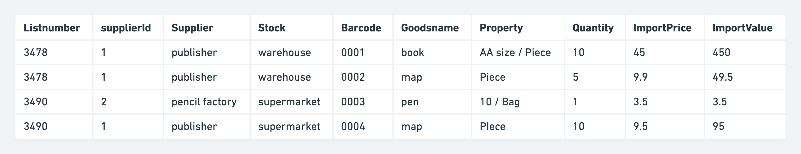
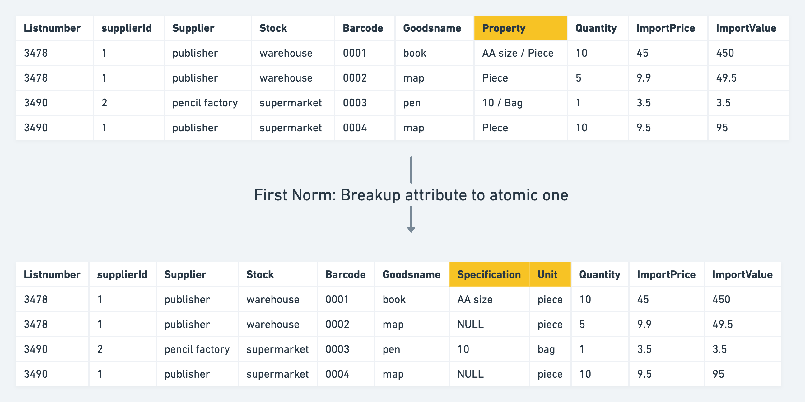
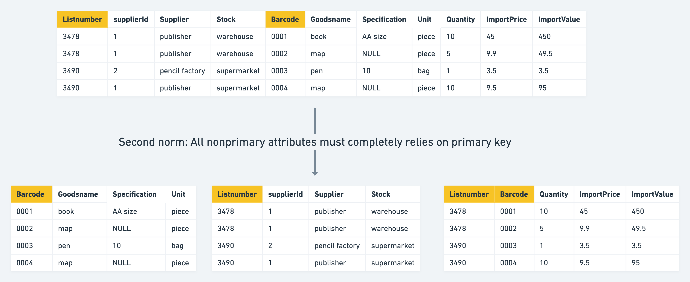
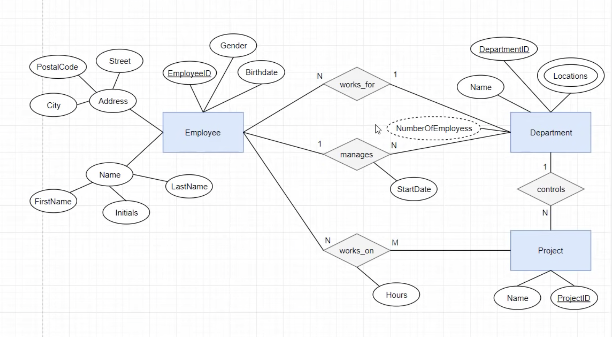

- [Logical design](#logical-design)
  - [Normal forms with example](#normal-forms-with-example)
    - [First normal form](#first-normal-form)
    - [Second normal form](#second-normal-form)
    - [Third normal form](#third-normal-form)
    - [Denormalization](#denormalization)
      - [Use case](#use-case)
      - [Example](#example)
  - [ER diagram design with example](#er-diagram-design-with-example)
    - [Rules](#rules)
- [Physical design](#physical-design)
  - [Select the DB engine](#select-the-db-engine)
  - [Select the correct data type](#select-the-correct-data-type)
    - [Integer types](#integer-types)
    - [Float/Double and decimal types](#floatdouble-and-decimal-types)
    - [Text](#text)
    - [Date time](#date-time)
  - [Best practices for primary key of Innodb engine](#best-practices-for-primary-key-of-innodb-engine)

# Logical design
## Normal forms with example

* Normal forms are a way to measure the redundancy and potential maintenance \(Needs to update multiple relation tables\). They should not be bindly followed to minimize redundancy because they will also increase query cost. 

### First normal form
* Def: 
  * A relation is in first normal form if every attribute in that relation is atomic and could not be split further.
* Examples for violations:
  * Use Json as an attribute.
  * Use concatination of multiple attribute as an attribute. 
* Apply to the example: Attribute property could be split further. 

### Second normal form
* Def: 
  * Prerequisite: If a relation satisfy second norm form, then it must satisfy first norm form. 
  * A relation is in 2NF if it has No Partial Dependency, i.e., no non-prime attribute \(attributes which are not part of any candidate key\) is dependent on any proper subset of any candidate key of the table.
* Examples for violations: 
  * Redundancy in tables. Partial primary key could determine another attribute. 
* Apply to the example: When using attribute "listnumber" + "barcode" as primary key, 
  * "goodsname", "specification", "unit" only relies on "barcode". Separate into a different table. 
  * "supplierId", "supplierName", "stock" only relies on "list number". Separate into a different table. 

### Third normal form
* Def: 
  * Prerequisite: If a relation satisfy third norm form, then it must satisfy second norm form. 
  * A relation is not in third normal form if a non-prime attribute is dependent on a non-prime attribute. 
* Apply to the example:
  * SupplierName depends on SupplierId

### Denormalization
#### Use case
* When the size of table to join is big (~million level), then the performance gain from denormalization (~0.5s) could help. 
* Typically used in dataware house scenarios where historial data is stored for analytics purpose. 

#### Example
* Within the above table, although quantity * importprice = importvalue and importvalue is redundant column
  * If using multiplication of importprice * quantity, it might not equal to importvalue. E.g. Importprice might change if the supplier has any promotion selling activity. 
* Vice versa, importprice = importvalue / quantity, importprice is redundant column
  * Most of financial calculations for cost rely on importprice. If it is a derivative value, it will increase a lot of computational cost overhead. 

## ER diagram design with example
* Example: https://www.exploredatabase.com/2017/07/reduce-er-diagram-to-relation-table-solved-exercise.html
* https://www.youtube.com/watch?v=OwdFzygGZqk&ab_channel=OrangeOutputs

### Rules
* Strong entity: Convert to a table
* Weak entity: Convert to a table. Since weak entity cannot exist without a strong entity, the table needs to include a foreign key referencing the strong entity. 
* 1:M relationship: Use foreign key
* M:N relationship: Use a separate table
 
# Physical design

## Select the DB engine

* Comparison between different DB engines: [https://coding.imooc.com/lesson/49.html\#mid=403](https://coding.imooc.com/lesson/49.html#mid=403) 3.08'

## Select the correct data type

* Cheatsheet for all data types: [https://tableplus.com/blog/2018/07/mysql-data-types-cheatsheet.html](https://tableplus.com/blog/2018/07/mysql-data-types-cheatsheet.html)
* Determine the type category: number, string, time, binary

### Integer types
* TinyInt vs SmallInt vs MediumInt vs Int vs BigInt: Use TinyInt to replace enum. 
* Int is the most frequently used type, uses 4 bytes.
* Guarantee that the data won't overflow first, then save space.

### Float/Double and decimal types
* Floating-point types: Float vs Double Use binary to represent decimal and could be inaccurate. 
* Fixed-Point types: Decimal/Numeric separate the int and Use decimal whenever possible because it is more precise.
  * Decimal(M,D): M represents digit, D represents decimal

### Text
* Types: Tinytext/text/mediumtext/longtext
* Varchar vs Char: Char has fixed size length. Space will be padded in the end. 0-255 byte; Varchar has a larger upperbound 65535 byte. 
  * Use char whenever possible. 
  * Use varchar on cases where max size could be much bigger than average and not so often updated \(Updating on varchar might break indexes\)
* Text could not be used as primary key 

### Date time
* Datetime vs Timestamp vs Date vs Time: 
  * In most case use Datetime \(twice the size of Timestamp but unlimited time range. Timestamp only extends until 2038\).
 
## Best practices for primary key of Innodb engine

* [https://coding.imooc.com/lesson/49.html\#mid=406](https://coding.imooc.com/lesson/49.html#mid=406)

