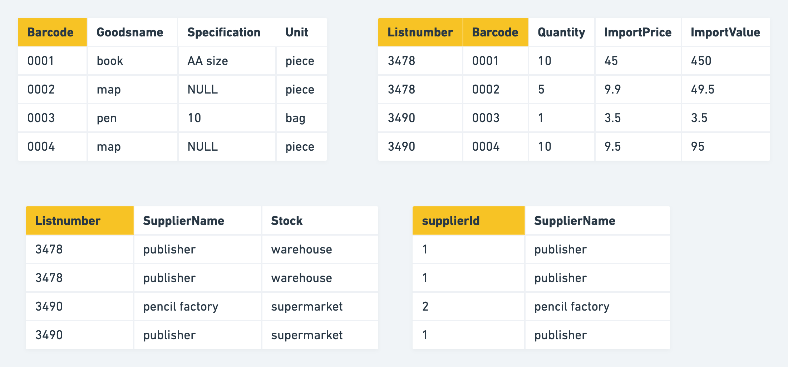

- [Logical design](#logical-design)
  - [Normal forms with example](#normal-forms-with-example)
    - [First normal form](#first-normal-form)
    - [Second normal form](#second-normal-form)
    - [Third normal form](#third-normal-form)
    - [Violation exceptions](#violation-exceptions)
  - [ER diagram design with example](#er-diagram-design-with-example)
    - [Entity](#entity)
    - [Relationship](#relationship)
    - [Procedure](#procedure)
- [Physical design](#physical-design)
  - [Select the DB engine](#select-the-db-engine)
  - [Select the correct data type](#select-the-correct-data-type)
    - [Integer types](#integer-types)
    - [Float/Double and decimal types](#floatdouble-and-decimal-types)
    - [Text](#text)
    - [Date time](#date-time)
  - [Best practices for primary key of Innodb engine](#best-practices-for-primary-key-of-innodb-engine)
    - [Performance optimization](#performance-optimization)
      - [Factors impacting DB performance](#factors-impacting-db-performance)
      - [\[TODO:::\] Slow queries](#todo-slow-queries)
      - [Query optimization](#query-optimization)
- [Appendix](#appendix)
  - [ecommerce MySQL physical design](#ecommerce-mysql-physical-design)

# Logical design
## Normal forms with example

* Normal forms are a way to measure the redundancy and potential maintenance \(Needs to update multiple relation tables\). They should not be bindly followed to minimize redundancy because they will also increase query cost. 


### First normal form
* Def: 
  * A relation is in first normal form if every attribute in that relation is atomic and could not be split further.
* Examples for violations:
  * Use Json as an attribute.
  * Use concatination of multiple attribute as an attribute. 
* Apply to the example: Attribute property could be split further. 


### Second normal form
* Def: 
  * Prerequisite: If a relation satisfy second norm form, then it must satisfy first norm form. 
  * A relation is in 2NF if it has No Partial Dependency, i.e., no non-prime attribute \(attributes which are not part of any candidate key\) is dependent on any proper subset of any candidate key of the table.
* Examples for violations: 
  * Redundancy in tables. Partial primary key could determine another attribute. 
* Apply to the example: When using attribute "listnumber" + "barcode" as primary key, 
  * "goodsname", "specification", "unit" only relies on "barcode". Separate into a different table. 
  * "supplierId", "supplierName", "stock" only relies on "list number". Separate into a different table. 


### Third normal form
* Def: 
  * Prerequisite: If a relation satisfy third norm form, then it must satisfy second norm form. 
  * A relation is not in third normal form if a non-prime attribute is dependent on a non-prime attribute. 
* Apply to the example:
  * SupplierName depends on SupplierId


### Violation exceptions
* Within the above table, although quantity * importprice = importvalue and importvalue is redundant column
  * If using multiplication of importprice * quantity, it might not equal to importvalue. E.g. Importprice might change if the supplier has any promotion selling activity. 
* Vice versa, importprice = importvalue / quantity, importprice is redundant column
  * Most of financial calculations for cost rely on importprice. If it is a derivative value, it will increase a lot of computational cost overhead. 



## ER diagram design with example
* Example: https://www.exploredatabase.com/2017/07/reduce-er-diagram-to-relation-table-solved-exercise.html
* https://www.youtube.com/watch?v=OwdFzygGZqk&ab_channel=OrangeOutputs


### Entity
* Strong entity: Convert to a table
* Weak entity: Convert to a table. Since weak entity cannot exist without a strong entity, the table needs to include a foreign key referencing the strong entity. 

### Relationship
* 1:M relationship: Use foreign key
* M:N relationship: Use a separate table

### Procedure

* Based on the requirements, write down SQL queries. 
* Then based on the complexity of these SQL queries, write down 

# Physical design

## Select the DB engine

* Comparison between different DB engines: [https://coding.imooc.com/lesson/49.html\#mid=403](https://coding.imooc.com/lesson/49.html#mid=403) 3.08'

## Select the correct data type

* Cheatsheet for all data types: [https://tableplus.com/blog/2018/07/mysql-data-types-cheatsheet.html](https://tableplus.com/blog/2018/07/mysql-data-types-cheatsheet.html)
* Determine the type category: number, string, time, binary

### Integer types
* TinyInt vs SmallInt vs MediumInt vs Int vs BigInt: Use TinyInt to replace enum. 
* Int is the most frequently used type, uses 4 bytes.
* Guarantee that the data won't overflow first, then save space.

### Float/Double and decimal types
* Floating-point types: Float vs Double Use binary to represent decimal and could be inaccurate. 
* Fixed-Point types: Decimal/Numeric separate the int and Use decimal whenever possible because it is more precise.
  * Decimal(M,D): M represents digit, D represents decimal

### Text
* Types: Tinytext/text/mediumtext/longtext
* Varchar vs Char: Char has fixed size length. Space will be padded in the end. 0-255 byte; Varchar has a larger upperbound 65535 byte. 
  * Use char whenever possible. 
  * Use varchar on cases where max size could be much bigger than average and not so often updated \(Updating on varchar might break indexes\)
* Text could not be used as primary key 

### Date time
* Datetime vs Timestamp vs Date vs Time: 
  * In most case use Datetime \(twice the size of Timestamp but unlimited time range. Timestamp only extends until 2038\).
 
## Best practices for primary key of Innodb engine

* [https://coding.imooc.com/lesson/49.html\#mid=406](https://coding.imooc.com/lesson/49.html#mid=406)

### Performance optimization

#### Factors impacting DB performance

* Hardware 
* Operating system
* DB engine selection
* DB configuration parameters
* DB schema design
  * Slow queries

#### \[TODO:::\] Slow queries

* [https://coding.imooc.com/lesson/49.html\#mid=513](https://coding.imooc.com/lesson/49.html#mid=513)
* [https://study.163.com/course/courseLearn.htm?courseId=1209773843\#/learn/video?lessonId=1280437152&courseId=1209773843](https://study.163.com/course/courseLearn.htm?courseId=1209773843#/learn/video?lessonId=1280437152&courseId=1209773843)

#### Query optimization

* In most cases, please use EXPLAIN to understand the execution plan before optimizing. But there are some patterns practices which are known to have bad performance. 

**Choose index columns**

* [Where to set up index](https://www.freecodecamp.org/news/database-indexing-at-a-glance-bb50809d48bd/)
  * On columns not changing often
  * On columns which have high cardinality
  * On columns whose sizes are smaller. If the column's size is big, could consider build index on its prefix. 

```text
// create index on prefix of a column
CREAT INDEX on index_name ON table(col_name(n))
```

**InnoDB clustered index**

**Always define a primary key for each table**

1. When PRIMARY KEY is defined, InnoDB uses primary key index as the clustered index. 
2. When PRIMARY KEY is not defined, InnoDB will use the first UNIQUE index where all the key columns are NOT NULL and InnoDB uses it as the clustered index.
3. When PRIMRARY KEY is not defined and there is no logical unique and non-null column or set of columns, InnoDB internally generates a hidden clustered index named GEN\_CLUST\_INDEX on a synthetic column containing ROWID values. The rows are ordered by the ID that InnoDB assigns to the rows in such a table. The ROWID is a 6-byte field that increases monotonically as new rows are inserted. Thus, the rows ordered by the row ID are physically in insertion order.

**Use auto-increment int column when possible**

* Why prefer auto-increment over random \(e.g. UUID\)? 
  * In most cases, primary index uses B+ tree index. 
  * For B+ tree index, if a new record has an auto-increment primary key, then it could be directly appended in the leaf node layer. Otherwise, B+ tree node split and rebalance would need to be performed. 
* Why int versus other types \(string, composite primary key\)?
  * Smaller footprint: Primary key will be stored within each B tree index node, making indexes sparser. Things like composite index or string based primary key will result in less index data being stored in every node. 

**Composite index**

* Def: Multiple column builds a single index. MySQL lets you define indices on multiple columns, up to 16 columns. This index is called a Multi-column / Composite / Compound index. If certain fields are appearing together regularly in queries, please consider creating a composite index.

**Push range query conditions to last**

* For range query candidate, please push it to the last in composite index because usually the column after range query won't really be sorted. 

**Order/Group By**

* When using EXPLAIN, the ext column means whether the Order/Group By uses file sort or index sort
* If the combination of WHERE and ORDER/GROUP BY satisfies the leftmost prefix index, then 

**Use IN for low radix attributes if leftmost prefix index could not be used**

```text
// using dating website as an example
// 1. Composite index: city, sex, age
select * from users_table where city == XX and sex == YY and age <= ZZ

// 2. There will be cases where some users don't filter based on sex
select * from users_table where city == XX and age <= ZZ

// 3. Could use IN to make WHERE clause satisfy leftmost prefix condition
select * from users_table where city == XX and Sex in ('male', 'female') and age <= ZZ
```

**Use efficient pagination**

* Pagination starts from a large offset index.

```text
// Original query
select * from myshop.ecs_order_info order by myshop.ecs_order_info.order_id limit 4000000, 100

// Optimization option 1 if order_id is continuous, 
select * from myshop.ecs_order_info order where myshop.ecs_order_info.order_id between 4000000 and 4000100

// Optimization option 2 if order_id is not continuous,
// Compared the original query, the child query "select order_id ..." uses covering index and will be faster.
select * from myshop.ecs_order_info where 
(myshop.ecs_order_info.order_id >= (select order_id from myshop.ecs_order_info order by order_id limit 4000000,1) limit 100)
```

```text
// Original query
select * from myshop.ecs_users u where u.last_login_time >= 1590076800 order by u.last_login_time, u.user_id limit 200000, 10

// Optimization with join query
select * from myshop.ecs_users u (select user_id from myshop.ecs_users where u.last_login_time >= 1590076800) u1 where u1.user_id = u.user_id order by u.user_id
```

**Use covering index to avoid loo**

* Def: A special kind of composite index where all the columns specified in the query exist in the index. So the query optimizer does not need to hit the database to get the data — rather it gets the result from the index itself. 
* Special benefits: Avoid second-time query on Innodb primary key
* Limitations:
  * Only a limited number of indexes should be set up on each table. So could not rely on covered index. 
  * There are some db engine which does not support covered index

```text
// original query
select * from orders where order = 1

// Optimized by specifying the columns to return
// order_id column has index
// queried columns already contain filter columns
select order_id from orders where order_id = 1
```

**Join**

* When joining two tables, assume table A has num1 returned according to the JOIN condition, table B has num2 returned according to the JOIN condition. And Assume num1 &gt; num2. 
* Make sure:
  * Query against table B \(smaller\) will be executed first.
  * filters on table A \(bigger\) will be based on indexed column. 
* Avoid using more than three joins in any case. 
  * For join, handle that inside application code when the join is big. Business applications are easier to scale. 
* Two algorithms:
  * Block nested join
  * Nested loop join

**Avoid**

**IN operator**

* When there are too few or many operators inside IN, it might not go through index. 

**Unequal filter when possible**

* Don't use "IS NOT NULL" or "IS NULL": Index \(binary tree\) could not be created on Null values. 
* Don't use != : Index could not be used. Could use &lt; and &gt; combined together.
  * Select name from abc where id != 20
  * Optimized version: Select name from abc where id &gt; 20 or id &lt; 20

**Filtering based on Nullable match conditions**

* There are only two values for a null filter \(is null or is not null\). In most cases it will do a whole table scanning. 

**Prefix based fuzzy matching**

* Use % in the beginning will cause the database for a whole table scanning. "SELECT name from abc where name like %xyz"

**Type conversion in the filtering condition**

**Functions on index**

* [https://coding.imooc.com/lesson/49.html\#mid=439](https://coding.imooc.com/lesson/49.html#mid=439)
* Don't use function or expression on index column

```text
// Original query:
select ... from product
where to_days(out_date) - to_days(current_date) <= 30

// Improved query:
select ... from product
where out_date <= date_add(current_date, interval 30 day)
```

# Appendix

## ecommerce MySQL physical design

* SPU: Standard product unit. A specific product such as an iphone 10
* SKU: Stock keeping unit. 

```text
┌───────────────────────┐                     ┌───────────────────────┐ 
│                       │                     │                       │ 
│                       │                     │                       │ 
│                       │                     │                       │ 
│    Category table     │◀─────────1:n───────▶│    Parameter table    │ 
│                       │                     │              *        │ 
│                       │                     │                       │ 
│                       │                     │                       │ 
└───────────────────────┘                     └───────────────────────┘ 
            ▲                                                           
            │                                                           
            │                                                           
           1:1                                                          
            │                                                           
            │                                                           
            ▼                                                           
┌───────────────────────┐                      ┌───────────────────────┐
│                       │                      │                       │
│                       │                      │                       │
│                       │                      │  Stock keeping unit   │
│     Product table     │◀────────1:n─────────▶│         table         │
│                       │                      │                       │
│                       │                      │                       │
│                       │                      │                       │
└───────────────────────┘                      └───────────────────────┘


┌───────────────────────┐                     ┌───────────────────────┐
│                       │                     │                       │
│                       │                     │                       │
│                       │                     │                       │
│     Retail store      │◀─────────m:n───────▶│       Warehouse       │
│                       │                     │              *        │
│                       │                     │                       │
│                       │                     │                       │
└───────────────────────┘                     └───────────────────────┘
            ▲                                             ▲            
            │                                             │            
            │                                             │            
           m:n                                            │            
            │                                             │            
            │                                             │            
            ▼                                             │            
┌───────────────────────┐                                 │            
│                       │                                 │            
│                       │                                 │            
│                       │                                 │            
│       Products        │◀─────────m:n────────────────────┘            
│                       │                                              
│                       │                                              
│                       │                                              
└───────────────────────┘
```

