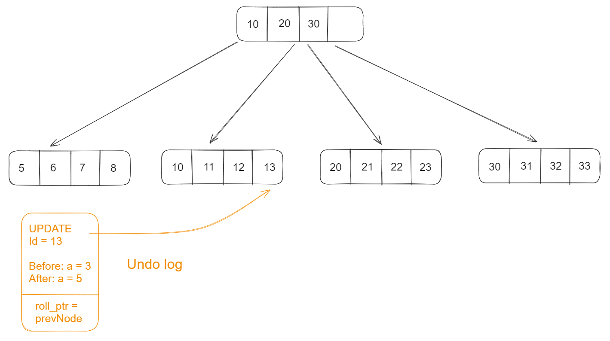

- [Undo logs and version chain](#undo-logs-and-version-chain)
  - [Insert operation](#insert-operation)
  - [Delete operation](#delete-operation)
  - [Update operation](#update-operation)
    - [Not modifying primary key](#not-modifying-primary-key)
    - [Modifying primary key](#modifying-primary-key)
- [Redo logs](#redo-logs)
  - [Flowchart](#flowchart)
  - [Motivation for introducing redo log](#motivation-for-introducing-redo-log)
  - [Config option - innodb\_flush\_log\_at\_trx\_commit](#config-option---innodb_flush_log_at_trx_commit)
- [Transaction flowchart](#transaction-flowchart)

# Undo logs and version chain
* Used for rollback purpose

## Insert operation

## Delete operation

## Update operation

### Not modifying primary key

### Modifying primary key

# Redo logs
## Flowchart

## Motivation for introducing redo log
* **Original flow**: When InnoDB engine updates record, it needs to write to buffer pool first, and then flush to disk. 
* **Problem**: To avoid DB crashing and losing data inside buffer pool, redo log is introduced. 
* **Faster sequential write, WAL**: Redo log is actually write ahead log. Redo logs write data in an append-only minner, so its much faster than directly write records to DB. 
  * InnoDB will first write to redo log, and then write data to buffer pool.

## Config option - innodb_flush_log_at_trx_commit 
* Config value "1" is the default safest option and others are possible to lose data:
  * Config value "0": Before InnoDB flush redo log buffer to disk, the machine crashes. 
  * Config value "2": After it flushes the data to page cache and before OS flushes to disk, the machine crashes. 

# Transaction flowchart