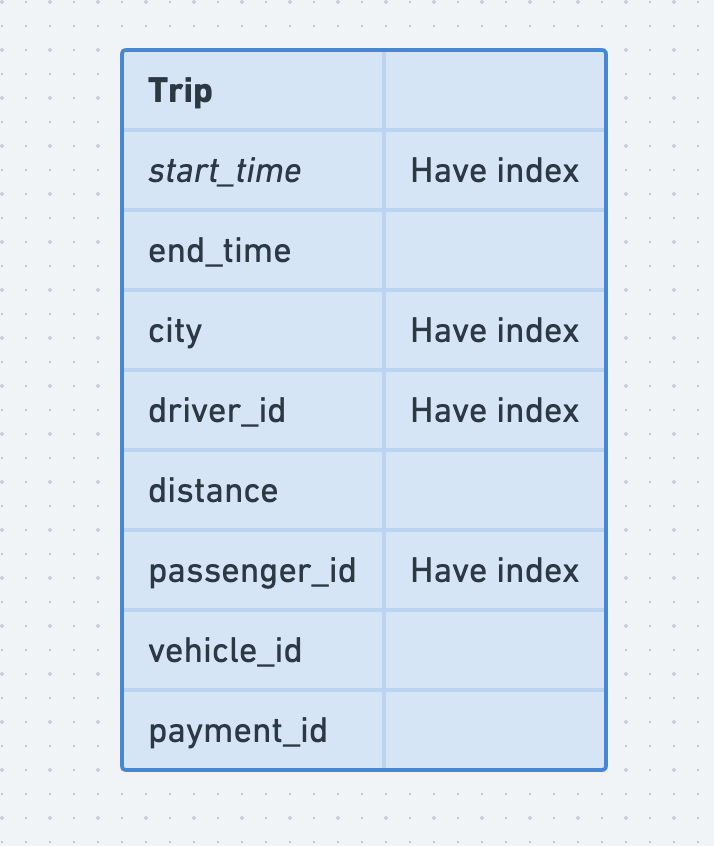
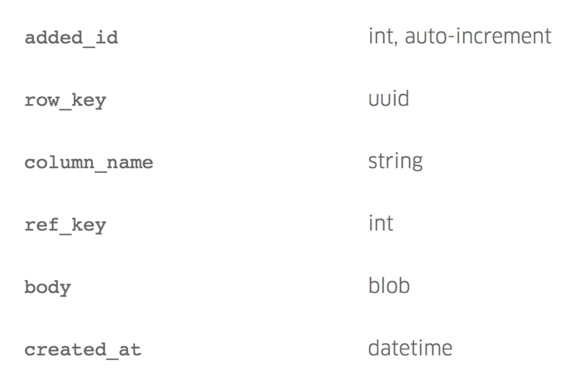

- [MySQL key to JSON value](#mysql-key-to-json-value)
  - [Traditional SQL](#traditional-sql)
  - [Attribute column + Json](#attribute-column--json)
  - [Json alone](#json-alone)
- [Reference](#reference)
  - [TODO](#todo)

# MySQL key to JSON value

## Traditional SQL



## Attribute column + Json

[](../.gitbook/assets/mysql_keyvalue_naive_0.png)



* Attributes:
  * Here added_id is the primary key, it makes MySQL write the cells linearly on disk.
  * row_key is nothing but the entity id say trip_uuid in trip database.
  * column_name hold the attribute / key of json data.
  * ref_key is the version identifier for the particular state of the json data.
  * body actual json data
  * created_at the time when the row was inserted in the table.
* Index: There is a unique index on row_key , column_name & ref_key
* Pros: it’s a very generic design. We don’t need multiple index any more. If the data store is sharded also, any query just need to go to a single shard as decided by the row_key & it will get the required data.
* Cons: Here we are using more memory as we might end up storing the same json data along with different required json attributes in the table.

## Json alone
* We will have a table with same row_key , body , ref_key , created_at but we don’t have any column to store attributes of json. Rather, we create different dedicated table for required index. So consider our json is like following:

```json
{
  'city': 'Bangalore', 
  'start_time': '2018-04-01 01:00:23', 
  'driver_id': 'jku6tr56', 
  'passenger_id': 'u12weoe'
}
```

* Index: Now we want to have index on city + driver_id , passenger. So we create 2 tables. One with the columns — city , driver_id , entity_id & another table with columns — passenger_id , entity_id. Here entity_id actually points to the row_key of the actual domain model.
* Pros: For each index, we have a table, so crating a new index is easy, deleting an existing index is easy, just remove the index table altogether. No index cluttering.
* Cons: Searching might be a little pain though, search different index tables, aggregate them in the application code. Although, in both of the above approaches, application code has to handle a lot in terms of how data is parsed and manipulated in order to prepare the data for processing.


# Reference
* https://kousiknath.medium.com/mysql-key-value-store-a-schema-less-approach-6d243a3cee5b

## TODO
* http://learn.lianglianglee.com/%E6%96%87%E7%AB%A0/%E7%BE%8E%E5%9B%A2%E4%B8%87%E4%BA%BF%E7%BA%A7%20KV%20%E5%AD%98%E5%82%A8%E6%9E%B6%E6%9E%84%E4%B8%8E%E5%AE%9E%E8%B7%B5.md