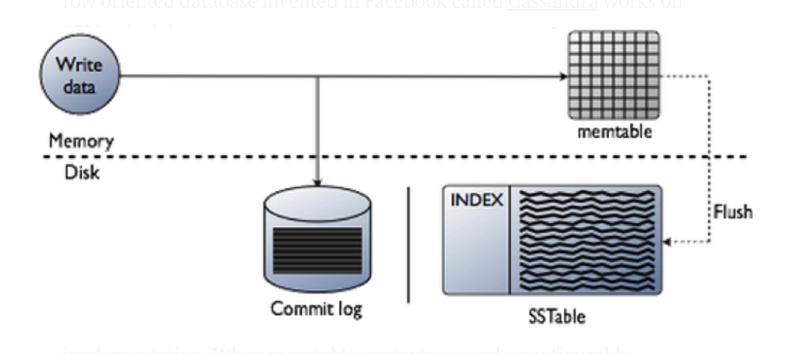
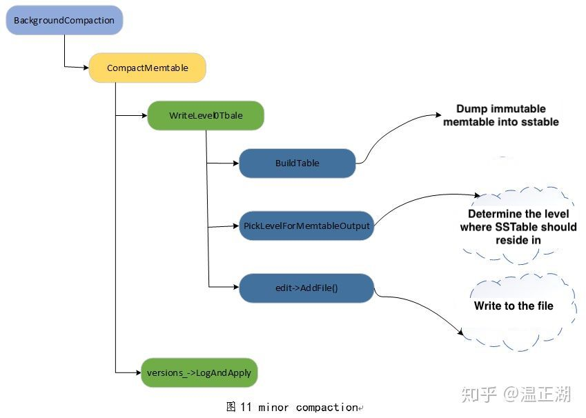
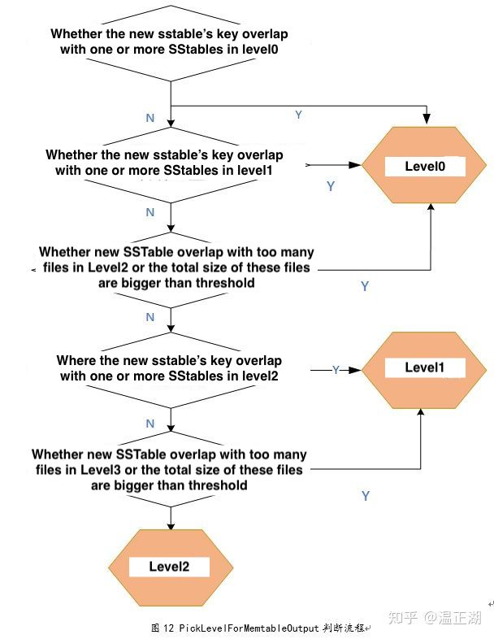
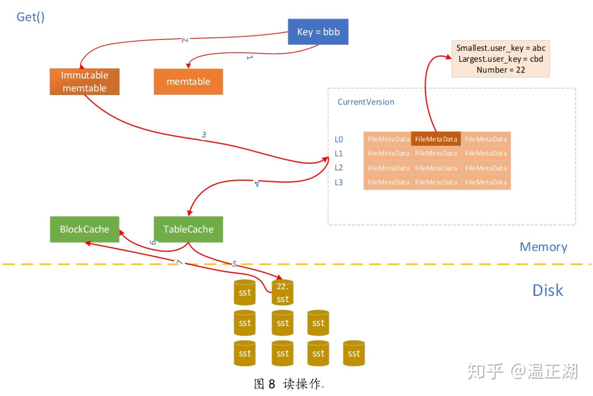
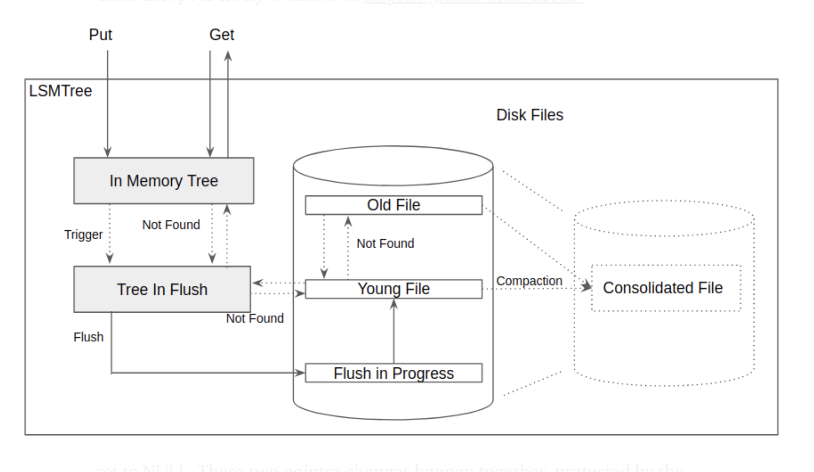

- [Log Structured Merge (LSM) Tree](#log-structured-merge-lsm-tree)
  - [Flowchart](#flowchart)
  - [Read-optimization: Compaction](#read-optimization-compaction)
    - [Minor compaction](#minor-compaction)
    - [Major compaction](#major-compaction)
  - [Read steps](#read-steps)
- [Real world](#real-world)
  - [LevelDB LSM tree impl](#leveldb-lsm-tree-impl)
  - [A LSM tree impl](#a-lsm-tree-impl)
- [References](#references)

# Log Structured Merge (LSM) Tree
* t supports high write throughput because random updates only happen in memory and all disk writes are sequential append.

## Flowchart

## Read-optimization: Compaction

### Minor compaction

* Definition: The process of turning immutable memtable dump into sstable. During this process SSTable will be pushed as further down as possible if
  * No overlap with current level
  * Overlapping with no more than 10 SSTs in the next level
* Trigger for minor compaction:
  * When write new data into level DB, if the current memtable >= default buffer size (4M)
* Steps: 1. Convert memtable into sstable format 2. Determine the level of the new sstable 3. Put sstable into the selected level

### Major compaction

* Definition: Merge SSTable in different layers
* Categories:
  * Manual compaction
  * Size compaction: There is a threshold on the size of each level
  * Seek compaction: Each 

## Read steps

1. Gets the value from memtable
2. If not found within memtable, tries to find it within immutable memtable. 
3. Look inside sstable
   * On level L0, search through each SStable
   * On L1 and up, all sstable is non-overlapped. 

# Real world
## LevelDB LSM tree impl
* Take LevelDB's LSM tree implementation as an example here
  * Having a Log-Structured Merge-Tree architecture, LevelDB does not store data directly in SST files. It stores new key/value pairs mutations (either additions or deletions) in a log file. This log file is the file with the .log suffix in your leveldb directory. The data stored in the log file is also stored in a memory structure called the memtable.
  * When the log file reaches a certain size (around 4 MB), its content is transferred to a new SST file and a new log file and memtable are initiated, the previous memtable is discarded. Those fresh SST files are collectively called the level 0 files. Files at level 0 are special because their keys can overlap since they are simply copies of the various log files.
  * When the number of files at level 0 reaches a threshold (around 10 files), a compaction is triggered. Compaction will chose a set of overlapping files at level 0 and a set of files they overlap at the next level (level 1) and will merge the data in those files to create a new set of SST files at level 1. The chosen SST files are then discarded.
  * LevelDB continuously inspects files at each level and triggers compactions when the number of files or the total size at a given level goes beyond a set threshold. LevelDB manages 7 levels of files. The list of current SST files is kept in a MANIFEST file. The id of the current MANIFEST file is stored in the CURRENT file.
  * When reading data, the set of SST files to access is retrieved from the data in the MANIFEST and the required files are opened and the data to read is reconciled from those files and the current memtable, managing overwrites and deletions.

## A LSM tree impl
* [LSM tree imple](https://eileen-code4fun.medium.com/log-structured-merge-tree-lsm-tree-implementations-a-demo-and-leveldb-d5e028257330)

# References
* https://kousiknath.medium.com/data-structures-database-storage-internals-1f5ed3619d43