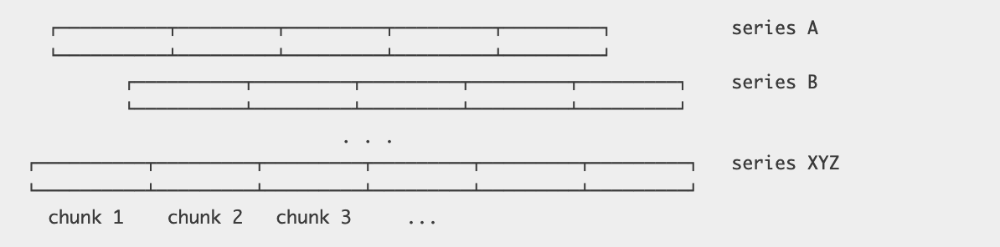
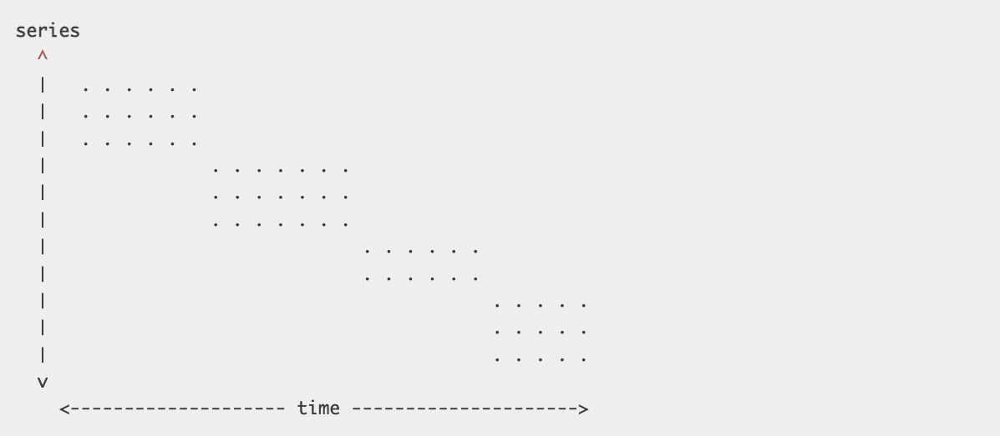
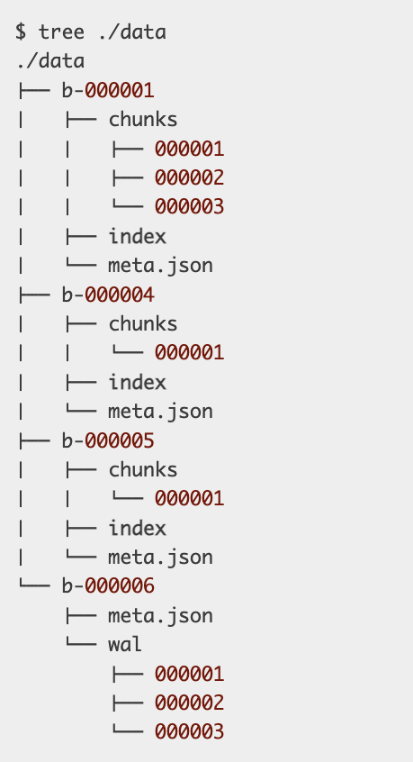
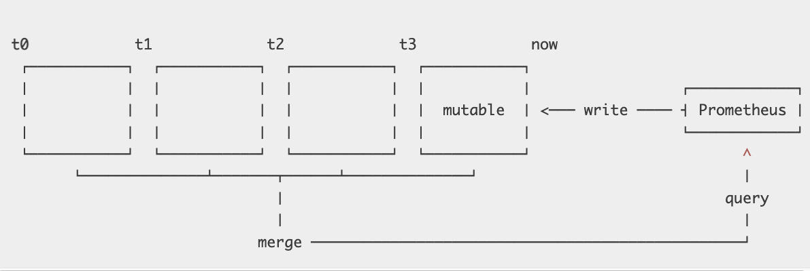

- [Problem](#problem)
  - [Time series data](#time-series-data)
  - [Vertical and horizontal](#vertical-and-horizontal)
    - [Current solution](#current-solution)
      - [Pros](#pros)
      - [Cons](#cons)
  - [Series chrun](#series-chrun)
    - [Current solution](#current-solution-1)
  - [Resource consumption](#resource-consumption)
- [Starting over](#starting-over)
  - [V3-Macro Design](#v3-macro-design)
    - [Many little databases](#many-little-databases)
      - [mmap](#mmap)
    - [Compaction](#compaction)
    - [Retention](#retention)
  - [Index](#index)
    - [Combining labels](#combining-labels)
- [Benchmarking](#benchmarking)
- [Conclusion](#conclusion)

# Problem

## Time series data

```
identifier -> (t0, v0), (t1, v1), (t2, v2), (t3, v3), ....

{__name__="requests_total", path="/status", method="GET", instance=”10.0.0.1:80”}
{__name__="requests_total", path="/status", method="POST", instance=”10.0.0.3:80”}
{__name__="requests_total", path="/", method="GET", instance=”10.0.0.2:80”}
```

## Vertical and horizontal
* Scale:
  * A single Prometheus instance collects data points from tens of thousands of targets, which expose hundreds to thousands of different time series each.
* Requirements:
  * Write pattern: At the scale of collecting millions of data points per second, batching writes is a non-negotiable performance requirement. 
    * **Spinning disks**: This is an unsurprising fact for spinning disks, as their head would have to physically move to different sections all the time
    * **SSD**: While SSDs are known for fast random writes, they actually can’t modify individual bytes but only write in pages of 4KiB or more. This means writing a 16 byte sample is equivalent to writing a full 4KiB page. This behavior is part of what is known as write amplification, which as a bonus causes your SSD to wear out – so it wouldn’t just be slow, but literally destroy your hardware within a few days or weeks.
  * Query pattern: 
    * **Query pattern summary**: We can query a single datapoint for a single series, a single datapoint for 10000 series, weeks of data points for a single series, weeks of data points for 10000 series, etc. So on our two-dimensional plane, queries are neither fully vertical or horizontal, but a rectangular combination of the two.
      * Recording rules mitigates this for known queries https://prometheus.io/docs/practices/rules/
    * **Too much random read**:When querying data points for a series over a time window, not only would it be hard to figure out where the individual points can be found, we’d also have to read from a lot of random places on disk. With possibly millions of touched samples per query, this is slow even on the fastest SSDs. Reads will also retrieve more data from our disk than the requested 16 byte sample. SSDs will load a full page, HDDs will at least read an entire sector. Either way, we are wasting precious read throughput.
    * **Ideal approach**: Samples for the same series would be stored sequentially so we can just scan through them with as few reads as possible. On top, we only need to know where this sequence starts to access all data points.

```
series
  ^   
  │   . . . . . . . . . . . . . . . . .   . . . . .   {__name__="request_total", method="GET"}
  │     . . . . . . . . . . . . . . . . . . . . . .   {__name__="request_total", method="POST"}
  │         . . . . . . .
  │       . . .     . . . . . . . . . . . . . . . .                  ... 
  │     . . . . . . . . . . . . . . . . .   . . . .   
  │     . . . . . . . . . .   . . . . . . . . . . .   {__name__="errors_total", method="POST"}
  │           . . .   . . . . . . . . .   . . . . .   {__name__="errors_total", method="GET"}
  │         . . . . . . . . .       . . . . .
  │       . . .     . . . . . . . . . . . . . . . .                  ... 
  │     . . . . . . . . . . . . . . . .   . . . . 
  v
    <-------------------- time --------------------->
```

### Current solution
* **One file per time series**: We create one file per time series that contains all of its samples in sequential order. As appending single samples to all those files every few seconds is expensive, we batch up 1KiB chunks of samples for a series in memory and append those chunks to the individual files, once they are full.



#### Pros
* This approach solves a large part of the problem. Writes are now batched, samples are stored sequentially. 
* It also enables incredibly efficient compression formats, based on the property that a given sample changes only very little with respect to the previous sample in the same series

#### Cons
* **Series Churn**: We actually need a lot more files than the number of time series we are currently collecting data for. With several million files, sooner or later way may run out of inodes on our filesystem. This is a condition we can only recover from by reformatting our disks, which is as invasive and disruptive as it could be. We generally want to avoid formatting disks specifically to fit a single application.
* **Thousands of writes even batched**: Even when chunked, several thousands of chunks per second are completed and ready to be persisted. This still requires thousands of individual disk writes every second. While it is alleviated by also batching up several completed chunks for a series, this in return increases the total memory footprint of data which is waiting to be persisted.
* **Resource consumption**: It’s infeasible to keep all files open for reads and writes. In particular because ~99% of data is never queried again after 24 hours. If it is queried though, we have to open up to thousands of files, find and read relevant data points into memory, and close them again. As this would result in high query latencies, data chunks are cached rather aggressively leading to problems outlined further in the section on “Resource Consumption”.
* **Write amplification from deleting old files**: Eventually, old data has to be deleted and data needs to be removed from the front of millions of files. This means that deletions are actually write intensive operations. Additionally, cycling through millions of files and analyzing them makes this a process that often takes hours. By the time it completes, it might have to start over again. Oh yea, and deleting the old files will cause further write amplification for your SSD!
* **Lost of memory**: Chunks that are currently accumulating are only held in memory. If the application crashes, data will be lost. To avoid this, the memory state is periodically checkpointed to disk, which may take significantly longer than the window of data loss we are willing to accept. Restoring the checkpoint may also take several minutes, causing painfully long restart cycles.

## Series chrun
* Def: Describe that a set of time series becomes inactive, i.e. receives no more data points, and a new set of active series appears instead.
  * All series exposed by a given microservice instance have a respective “instance” label attached that identifies its origin. If we perform a rolling update of our microservice and swap out every instance with a newer version, series churn occurs.
  * Cluster orchestration systems like Kubernetes allow continuous auto-scaling and frequent rolling updates of applications, potentially creating tens of thousands of new application instances, and with them completely new sets of time series, every day.
  * So even if the entire infrastructure roughly remains constant in size, over time there’s a linear growth of time series in our database.



### Current solution
* **Existing solution**: Prometheus has an index based on LevelDB for all series that are currently stored. 
* **Problem**: It allows querying series containing a given label pair, but lacks a scalable way to combine results from different label selections. Prometheus needed an improved indexing approach for quickly searching hundreds of millions of time series.
  * For example, selecting all series with label __name__="requests_total" works efficiently, but selecting all series with instance="A" AND __name__="requests_total" has scalability problems. We will later revisit what causes this and which tweaks are necessary to improve lookup latencies.

## Resource consumption
* Problem: 
  * **Steady phase**: By its architecture the V2 storage slowly builds up chunks of sample data, which causes the memory consumption to ramp up over time. As chunks get completed, they are written to disk and can be evicted from memory. Eventually, Prometheus’s memory usage reaches a steady state. 
  * **Spiking phase**: That is until the monitored environment changes — series churn increases the usage of memory, CPU, and disk IO every time we scale an application or do a rolling update.

# Starting over
## V3-Macro Design
* At the top level, we have a sequence of numbered blocks, prefixed with b-. Each block obviously holds a file containing an index and a “chunk” directory holding more numbered files.
  * The “chunks” directory contains nothing but raw chunks of data points for various series. Just as for V2, this makes reading series data over a time windows very cheap and allows us to apply the same efficient compression algorithms. 
  * There is no longer a single file per series but instead a handful of files holds chunks for many of them. 



* Questions
  1. But why are there several directories containing the layout of index and chunk files? 
  2. And why does the last one contain a “wal” directory instead? 

### Many little databases
* Each block acts as a fully independent database containing all time series data for its time window. Hence, it has its own index and set of chunk files.
  * **In memory database**: Every block of data is immutable. Of course, we must be able to add new series and samples to the most recent block as we collect new data. For this block, all new data is written to an in-memory database that provides the same lookup properties as our persistent blocks. The in-memory data structures can be updated efficiently.
  * **Write ahead log**: To prevent data loss, all incoming data is also written to a temporary write ahead log, which is the set of files in our “wal” directory, from which we can re-populate the in-memory database on restart.
  * **meta.json**: Each block also contains a meta.json file. It simply holds human-readable information about the block to easily understand the state of our storage and the data it contains.



* This horizontal partitioning adds a few great capabilities:
  * When querying a time range, we can easily ignore all data blocks outside of this range. It trivially addresses the problem of series churn by reducing the set of inspected data to begin with.
  * When completing a block, we can persist the data from our in-memory database by sequentially writing just a handful of larger files. We avoid any write-amplification and serve SSDs and HDDs equally well.
  * We keep the good property of V2 that recent chunks, which are queried most, are always hot in memory.
  * Nicely enough, we are also no longer bound to the fixed 1KiB chunk size to better align data on disk. We can pick any size that makes the most sense for the individual data points and chosen compression format.
  * Deleting old data becomes extremely cheap and instantaneous. We merely have to delete a single directory. Remember, in the old storage we had to analyze and re-write up to hundreds of millions of files, which could take hours to converge.

#### mmap
* **A handful of larger files**: Moving from millions of small files to a handful of larger allows us to keep all files open with little overhead. This unblocks the usage of mmap(2), a system call that allows us to transparently back a virtual memory region by file contents. For simplicity, you might want to think of it like swap space, just that all our data is on disk already and no writes occur when swapping data out of memory.

### Compaction
* 

### Retention
## Index
### Combining labels
# Benchmarking
# Conclusion