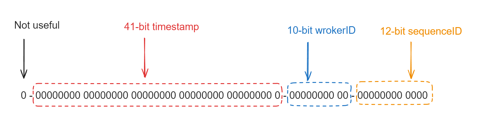

- [Snowflake structure](#snowflake-structure)
- [Pros](#pros)
- [Cons](#cons)
  - [Problem: Data skew](#problem-data-skew)
  - [Problem: Exhausted sequence number](#problem-exhausted-sequence-number)
- [Variants](#variants)
  - [Cons](#cons-1)
- [Possible optimization](#possible-optimization)

# Snowflake structure

* The IDs are made up of the following components:
  1. First bit: Not used. 
  2. Epoch timestamp in millisecond precision - 41 bits (gives us 69 years with a custom epoch)
  3. Configured machine id - 10 bits (gives us up to 1024 machines)
  4. Sequence number - 12 bits (A local counter per machine that rolls over every 4096)
* In theory, the QPS for snowflake could be 409.6 * 10^4 /s. 

# Pros
1. 64-bit unique IDs, half the size of a UUID
2. Can use time as first component and remain sortable
3. Distributed system that can survive nodes dying

# Cons
1. Would introduce additional complexity and more ‘moving parts’ (ZooKeeper, Snowflake servers) into our architecture.
2. If local system time is not accurate, it might generate duplicated IDs. For example, when time is reset/rolled back, duplicated ids will be generated.

## Problem: Data skew
* If the QPS is not high such as 1 ID per second, then the generated ID will always end with "1" or some number, which resulting in uneven shards when used as primary key. 
* Solutions: Use random number as starting bit, rather than 0. 

## Problem: Exhausted sequence number
* If there are too many requests and the 12 bits are exhausted for the given timestamp, then more bits for sequence number could be allocated. 

# Variants
* Embed business sharding key inside generated IDs. Useful in sharding cases.

## Cons
* It could not guarantee the global uniqueness: What if the same user ID generated two idential sequence number?  Although the probability is low.

# Possible optimization
* Retrieve IDs in batch
* Prefetch IDs