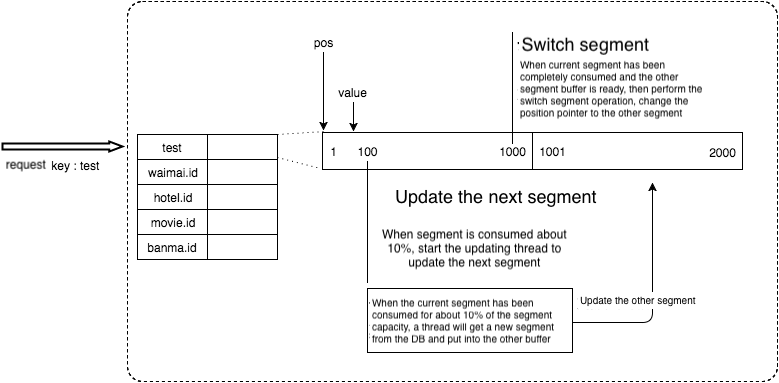

- [Meituan leaf-segment](#meituan-leaf-segment)
  - [Pros](#pros)
  - [Cons](#cons)
  - [Single machine implementation](#single-machine-implementation)
    - [Insert statement](#insert-statement)
    - [Replace statement](#replace-statement)
  - [Multiple machine implementation](#multiple-machine-implementation)
  - [Leaf-Segment multi-machine implementation](#leaf-segment-multi-machine-implementation)
  - [Leaf-Segment multi-machine implementation with double buffer](#leaf-segment-multi-machine-implementation-with-double-buffer)
  - [Leaf-Segment multi-machine implementation with double buffer and Multi DB](#leaf-segment-multi-machine-implementation-with-double-buffer-and-multi-db)
  - [Snowflake-based Leaf-Segment multi-machine implementation with double buffer and Multi DB](#snowflake-based-leaf-segment-multi-machine-implementation-with-double-buffer-and-multi-db)
    - [How to resolve the inaccurate time](#how-to-resolve-the-inaccurate-time)
- [References](#references)
  - [Instagram Postgres](#instagram-postgres)
  - [Meituan](#meituan)

# Meituan leaf-segment

* This approach uses a centralized database server to generate unique incrementing IDs. It is adopted by companies such as Flicker, Instagram, Meituan. 

## Pros

* DBs are well understood and have pretty predictable scaling factors
* No extra component in the system

## Cons

* The generated ID won't be known to you without a roundtrip to the database. 
* One more component in infrastructure that needs to be managed.
* If using a single DB, becomes single point of failure. If using multiple DBs, can no longer guarantee that they are sortable over time.

## Single machine implementation

### Insert statement

* Mechanism: 
  * Primary key has AUTO_INCREMENT option configured. 
  * A new incremented primary key will be created upon INSERT statement. 
* Steps:

```sql
-- 1. Create a table with automatic increment

CREATE TABLE `test_auto_increment` (
  `id` bigint(11) unsigned NOT NULL AUTO_INCREMENT,
  PRIMARY KEY (`id`)
)

-- 2. Insert several statements

insert into `test_auto_increment` (id) values (0);
insert into `test_auto_increment` (id) values (0);

-- 3. Use select LAST_INSERT_ID() to retrieve the latest value produced by auto_increment
select LAST_INSERT_ID();
```

* Cons: 
  * Produce lots of unused records 

### Replace statement

* Mechanism: 
  * REPLACE works by delete the row which has the same primary key or unique index first, then add a new row
* Motivation:
  * Insert method works, but created many unused records. To reduce the cost, developer could use a timer to clean up the records on a needed basis. However, it still requires manual work. 
* Steps:

```sql
-- 1. Create a database table which has a unique key
delete * from test_auto_increment; 
alter table test_auto_increment add column stub int unique key;

-- 2. Replace a record
replace into `test_auto_increment` (stub) values (2019);
SELECT LAST_INSERT_ID();
```


* Cons:
  * Single point failure of DB. 
  * Performance bottleneck of a single DB.  

## Multiple machine implementation

* [Flicker team has a ticket server implementation](https://code.flickr.net/2010/02/08/ticket-servers-distributed-unique-primary-keys-on-the-cheap/)
* Suppose there are N servers
  * auto-increment-increment set to the number of machines: Determines the difference between self-increasing sequence
  * auto-increment-offset set to the server's machine index: Determines the starting value of the self-increasing sequence


* Cons:
  * Each time when scaling up/down, the offset needs to be set to a value which is bigger than all previously generated value to avoid conflict. Lots of maintenance cost. 
  * Each time to get ID, it needs to read the database. 
  * The number maintains the increasing trend, but is not consecutive. 


## Leaf-Segment multi-machine implementation

* [Meituan team has a leaf segment implementation](https://tech.meituan.com/2017/04/21/mt-leaf.html)
* Motivation:
  * In the previous approach each time to get ID, it needs to read the database. 
  * To reduce the number of calls to database, a leaf server sits between service and DB. The leaf server reads segment instead of ID from DB master. 
* Steps:

```sql
-- 1. Get ID from leaf server's segment if it is still within the max_id
-- 2. Query the DB to get a new segment 

Begin
UPDATE table SET max_id=max_id+step WHERE biz_tag=xxx
SELECT tag, max_id, step FROM table WHERE biz_tag=xxx
Commit
```


* Pros:
  * Easy to scale. 
    * Much lower load on database servers so much fewer DB servers needed for sharding purpose.
    * Introduce the biz_tag field which separates different business into their own sequence space. 
  * More fault tolerant
    * When DB goes down shortly, leaf servers could still serve the traffic. The step size could be set to 600 \* QPS, which means that the system could still work for 10 minutes even if the DB goes down. 
* Cons:
  * T99 fluctuates greatly when the db query happens. 
  * DB is still the single point of failure.
  * Generated ID is not randomized and is not secure. For example, the generated could not be used for order id. The competitor could infer how many orders have happened during the past 1 day by looking at the difference of order id of 1 day. 

## Leaf-Segment multi-machine implementation with double buffer

* Motivation:
  * In the previous approach each time when the segment is exhausted, the thread to query DB to get a new ID will be blocked, resulting in high 99 latency. 
  * Use double buffer to reduce the 99 latency. When the current segment has consumed 10% and if the next segment is not 

```json
// Reference: https://juejin.im/post/6844903609973506062
// Schema on the leaf server, could be thought of as a key-value store. Leaf server could also be replaced by a redis. 
key: <string> // biz_tag
value: 
{
  cur: <long>，// current sequence number
  max: <long>，// the maximum available sequence number in current segment
}

// Schema on the DB master
{
 bizTag: <string> // biz_tag
 max: <long> // maximum available sequence number 
 step: <int> // incremental segment length
 timestamp: <long> // timestamp to update data
}
```



* Pros:
  * There is no T99 spike
* Cons:
  * Still suffers from DB single point of failure

## Leaf-Segment multi-machine implementation with double buffer and Multi DB

* Motivation: 
  * In the previous approach there is still a single point of failure - the database. 
  * To improve the availability of DB, one master two slave could be set up and they could be synchronized using semisynchronous replication. 


* Pros:
  * Resolves the problem of single point of failure
* Cons: 
  * There is the possibility of inconsistency if only using semisynchronous replication. To guarantee 100% availability, algorithm similar to PAXOS (e.g. MySQL 5.7 Group Replication) could be adopted to guarantee strong consistency. 

## Snowflake-based Leaf-Segment multi-machine implementation with double buffer and Multi DB

* Steps:
  1. Start leaf-snowflake service and connect to ZooKeeper, check whether it has been registered under the leaf_forever root node. 
  2. If it has registered, then get its own machine ID. 
  3. If it has not registered, then create a persistent node under the root node and get its sequence as its machine it. 


### How to resolve the inaccurate time

* Steps:
  1. If the node has registered within the Zookeeper, then use its own system time to compare with the time on leaf_forever/$self. If smaller than leaf_forever/$self, then consider the time is inaccurate. 
  2. If the node has not registered with 


# References
## Instagram Postgres

* [https://instagram-engineering.com/sharding-ids-at-instagram-1cf5a71e5a5c](https://instagram-engineering.com/sharding-ids-at-instagram-1cf5a71e5a5c)

## Meituan
* https://tech.meituan.com/2017/04/21/mt-leaf.html