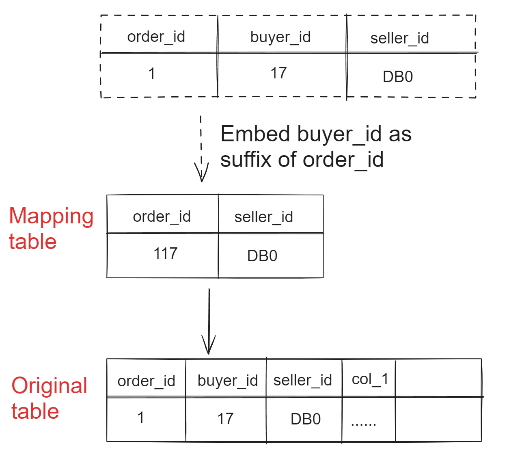
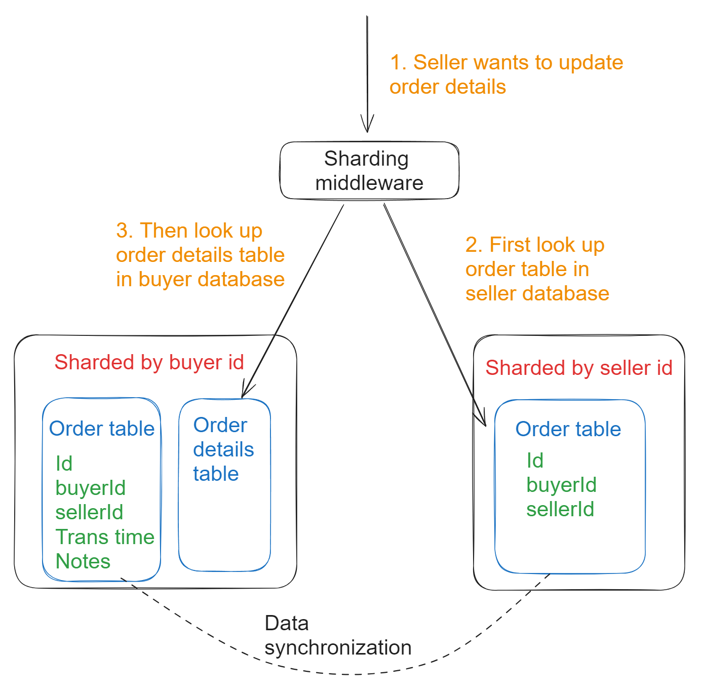
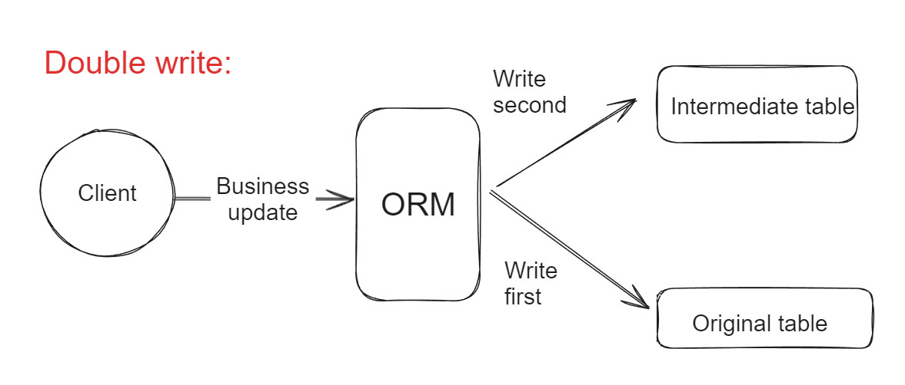
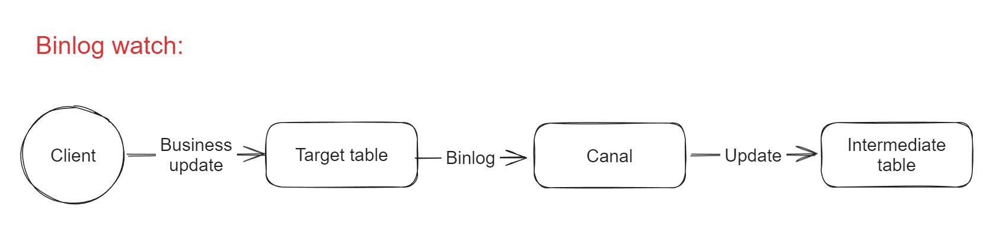
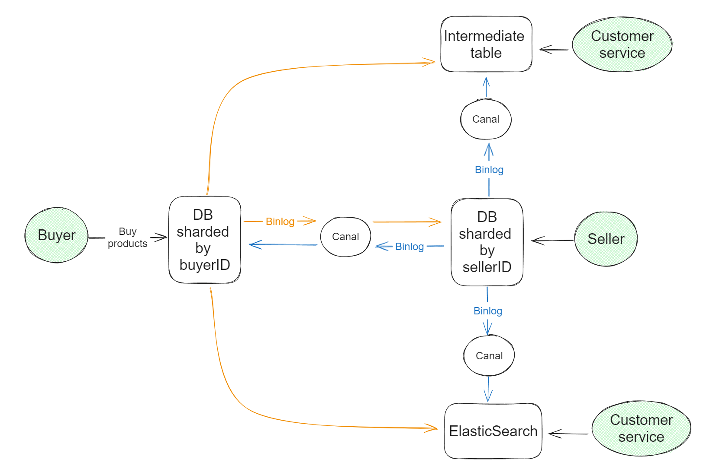

- [Problem](#problem)
- [1. Embed query key inside sharding key](#1-embed-query-key-inside-sharding-key)
- [2. Intermediate table](#2-intermediate-table)
  - [Cons](#cons)
    - [Write bottleneck](#write-bottleneck)
    - [Poor flexibility](#poor-flexibility)
    - [Consistency](#consistency)
- [3. Redundant sharding](#3-redundant-sharding)
  - [Cons](#cons-1)
    - [Consistency](#consistency-1)
      - [Double write](#double-write)
      - [Binlog watch and monitor](#binlog-watch-and-monitor)
- [4. Other middlewares such as ElasticSearch](#4-other-middlewares-such-as-elasticsearch)
- [5. Combined approach](#5-combined-approach)

# Problem
* For example, most e-commerce platform uses buyer id as sharding key. If we need to search by order id, what are the options?

# 1. Embed query key inside sharding key
* Similar to what we have done in snowflake id generator, we could embed the query key inside sharding key. 
* More specificly, we could embed the buyer id inside order id. Then we could extract it from order id. 

# 2. Intermediate table
* An intermediate table could be created to store the mapping between order id, buyer id, and seller id. 
* Furthermore, if the buyer id is embedded inside order id, then we could remove the buyer id column inside intermediate table. 

## Cons
### Write bottleneck
* If some columns of intermediate table need to be updated frequently, then intermediate tables themselves have write bottleneck. 
* Possible remediation options: To have fewer columns inside intermediate table and avoid frequently updated columns.

### Poor flexibility
* Intermediate table is typically a big table. Updating table structure for a big table is a risky operation. 

### Consistency
* Please refer to the Cons section under redundant sharding

# 3. Redundant sharding
* Same set of data will be sharded by two different keys. 
* However, the redundant copy doesn't need to clone everything. 
  * For example, the order details table doesn't need to be cloned. 
  * Specific columns such as notes, transaction time don't need to be cloned. 

* When designing the redundant copy of data sharded by seller id, as long as most of queries don't need to trace back to the data sharded by buyer id, it will be great. 

## Cons
### Consistency
* How to keep the consistency between original copy and intermediate table / copy sharded by another key?

#### Double write

#### Binlog watch and monitor

# 4. Other middlewares such as ElasticSearch
* Introduce search engine for more complex queries. 

# 5. Combined approach
* If allowing both buyer and seller to update their shard copy, then concurrent writes need to be controlled by distributed lock and double write. 

