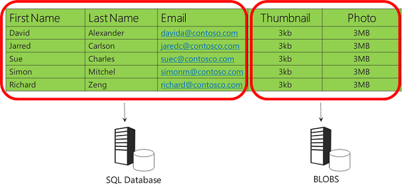

- [High concurrent writes and large volume in a single table: MySQL table partitioning](#high-concurrent-writes-and-large-volume-in-a-single-table-mysql-table-partitioning)
  - [Def](#def)
  - [Benefits](#benefits)
  - [MySQL only supports horizontal partition](#mysql-only-supports-horizontal-partition)
  - [Limitations: Partition column and unique indexes](#limitations-partition-column-and-unique-indexes)
  - [Use cases](#use-cases)
  - [Types](#types)
    - [RANGE Partitioning](#range-partitioning)
    - [List partitioning](#list-partitioning)
    - [Hash partitioning](#hash-partitioning)
  - [References](#references)

# High concurrent writes and large volume in a single table: MySQL table partitioning

## Def

* MySQL table partitioning means to divide one table into multiple partitions and each partition resides on a single disk. 
* Horizontal partitioning means that all rows matching the partitioning function will be assigned to different physical partitions. 
  * When a single table's number of rows exceed 20M, the performance will degrade quickly.
  * Based on certain fields, put **rows of a table** into different tables. 
* Vertical partitioning allows different table columns to be split into different physical partitions. 
  * Put different **fields of a table** into different tables
  * Segmented tables usually share the primary key for correlating data




## Benefits

* Storage: It is possible to store more data in one table than can be held on a single disk or file system partition. As known, the upper limit number of rows in a single MySQL is 20M due to the B+ tree depth. MySQL table partitioning enables more rows in any single table because these different partitions are stored in different disks.
* Deletion: Dropping a useless partition is almost instantaneous (partition level lock), but a classical DELETE query run in a very large table could lock the entire table (table level lock). 
* Partition Pruning: This is the ability to exclude non-matching partitions and their data from a search; it makes querying faster. Also, MySQL 5.7 supports explicit partition selection in queries, which greatly increases the search speed. (Obviously, this only works if you know in advance which partitions you want to use.) This also applies for DELETE, INSERT, REPLACE, and UPDATE statements as well as LOAD DATA and LOAD XML.
* A much cheaper option than sharding: Does not need cluster


## MySQL only supports horizontal partition

* Currently, MySQL supports horizontal partitioning but not vertical. The engine’s documentation clearly states it won’t support vertical partitions any time soon: ”There are no plans at this time to introduce vertical partitioning into MySQL.”
* [https://dev.mysql.com/doc/mysql-partitioning-excerpt/8.0/en/partitioning-overview.html](https://dev.mysql.com/doc/mysql-partitioning-excerpt/8.0/en/partitioning-overview.html)

## Limitations: Partition column and unique indexes

* Partition Columns: The rule of thumb here is that all columns used in the partitioning expression must be part of every unique key in the partitioned table. This apparently simple statement imposes certain important limitations. 


* Parition key could not be used in child query

## Use cases

* Time Series Data

## Types

### RANGE Partitioning

* This type of partition assigns rows to partitions based on column values that fall within a stated range. The values should be contiguous, but they should not overlap each other. The VALUES LESS THAN operator will be used to define such ranges in order from lowest to highest (a requirement for this partition type). Also, the partition expression – in the following example, it is YEAR(created) – must yield an integer or NULL value.
* Use cases:
  * Deleting Old Data: In the above example, if logs from 2013 need to be deleted, you can simply use ALTER TABLE userslogs DROP PARTITION from\_2013\_or_less; to delete all rows. This process will take almost no time, whereas running DELETE FROM userslogs WHERE YEAR(created) <= 2013; could take minutes if there are lots of rows to delete.
  * Series Data: Working with a range of data expressions comes naturally when you’re dealing with date or time data (as in the example) or other types of “series” data.
  * Frequent Queries on the Partition Expression Column: If you frequently perform queries directly involving the column used in the partition expression (where the engine can determine which partition(s) it needs to scan based directly on the WHERE clause), RANGE is quite efficient. 
* Example

```SQL
CREATE TABLE userslogs (
    username VARCHAR(20) NOT NULL,
    logdata BLOB NOT NULL,
    created DATETIME NOT NULL,
    PRIMARY KEY(username, created)
)
PARTITION BY RANGE( YEAR(created) )(
    PARTITION from_2013_or_less VALUES LESS THAN (2014),
    PARTITION from_2014 VALUES LESS THAN (2015),
    PARTITION from_2015 VALUES LESS THAN (2016),
    PARTITION from_2016_and_up VALUES LESS THAN MAXVALUE;

// An alternative to RANGE is RANGE COLUMNS, which allows the expression to include more than one column involving STRING, INT, DATE, and TIME type columns (but not functions). In such a case, the VALUES LESS THAN operator must include as many values as there are columns listed in the partition expression. For example:
CREATE TABLE rc1 (
    a INT,
    b INT
)
PARTITION BY RANGE COLUMNS(a, b) (
    PARTITION p0 VALUES LESS THAN (5, 12),
    PARTITION p3 VALUES LESS THAN (MAXVALUE, MAXVALUE)
);
```

### List partitioning

* LIST partitioning is similar to RANGE, except that the partition is selected based on columns matching one of a set of discrete values. In this case, the VALUES IN statement will be used to define matching criteria.
* Example

```SQL
CREATE TABLE serverlogs (
    serverid INT NOT NULL, 
    logdata BLOB NOT NULL,
    created DATETIME NOT NULL
)
PARTITION BY LIST (serverid)(
    PARTITION server_east VALUES IN(1,43,65,12,56,73),
    PARTITION server_west VALUES IN(534,6422,196,956,22)
);

// LIST comes with an alternative – LIST COLUMNS. Like RANGE COLUMNS, this statement can include multiple columns and non-INT data types, such as STRING, DATE, and TIME. The general syntax would look like this

CREATE TABLE lc (
    a INT NULL,
    b INT NULL
)
PARTITION BY LIST COLUMNS(a,b) (
    PARTITION p0 VALUES IN( (0,0), (NULL,NULL) ),
    PARTITION p1 VALUES IN( (0,1), (0,2), (0,3), (1,1), (1,2) ),
    PARTITION p2 VALUES IN( (1,0), (2,0), (2,1), (3,0), (3,1) ),
    PARTITION p3 VALUES IN( (1,3), (2,2), (2,3), (3,2), (3,3) )
);
```

### Hash partitioning

* In HASH partitioning, a partition is selected based on the value returned by a user-defined expression. This expression operates on column values in rows that will be inserted into the table. A HASH partition expression can consist of any valid MySQL expression that yields a nonnegative integer value. HASH is used mainly to evenly distribute data among the number of partitions the user has chosen.
* Example

```SQL
CREATE TABLE serverlogs2 (
    serverid INT NOT NULL, 
    logdata BLOB NOT NULL,
    created DATETIME NOT NULL
)
PARTITION BY HASH (serverid)
PARTITIONS 10;
```

## References

* [https://www.vertabelo.com/blog/everything-you-need-to-know-about-mysql-partitions/](https://www.vertabelo.com/blog/everything-you-need-to-know-about-mysql-partitions/)
