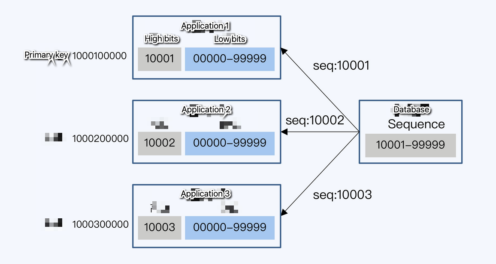

- [Preferred characteristics](#preferred-characteristics)
- [Auto-increment primary key](#auto-increment-primary-key)
  - [Limitations](#limitations)
  - [Not continously increasing](#not-continously-increasing)
  - [Not monotonically increasing](#not-monotonically-increasing)
- [UUID](#uuid)
  - [Pros](#pros)
  - [Cons](#cons)
- [Snowflake](#snowflake)
  - [Pros](#pros-1)
  - [Cons](#cons-1)
- [Architecture](#architecture)
- [Generate IDs in web application](#generate-ids-in-web-application)
- [Deployment as a separate service](#deployment-as-a-separate-service)
  - [Redis](#redis)
  - [Wechat seqsvr](#wechat-seqsvr)
- [TODO](#todo)


# Preferred characteristics

* Generated IDs should be sortable by time (so a list of photo IDs, for example, could be sorted without fetching more information about the photos). This is because: 
  1. Save space: There are plenty of scenarios where we need to order records by time. e.g. Order user comments on a forum / order user shopping history on an ecommerce website. If primary key is not ordered in time, then another column for timestamp needs to be created, wasting much space. 
  2. Improve performance: MySQL InnoDB engine uses B+ tree to store index data and index data is stored in order. Primary key is also an index. If primary key is not ordered, then each time needs to add a record, it first needs to locate the position before insertion. 
* IDs should ideally be 64 bits (for smaller indexes, and better storage in systems like Redis)
* The system should introduce as few new ‘moving parts’ as possible — a large part of how we’ve been able to scale Instagram with very few engineers is by choosing simple, easy-to-understand solutions that we trust.
* Has business meanings: If ID has some sort of business meaning, it will be really helpful in troubleshooting problems. 


# Auto-increment primary key

* Different ways to define automatic incremental primary key

```sql
-- MySQL
create table ‘test’ (
  ‘id’  int(16) NOT NULL AUTO_INCREMENT,
  ‘name’  char(10) DEFAULT NULL,
  PRIMARY KEY(‘id’) 
) ENGINE = InnoDB;

-- Oracle create sequence
create sequence test_seq increment by 1 start with 1;
insert into test(id, name) values(test_seq.nextval, ' An example ');
```

## Limitations

* Typically, there are three expectations on the global key
  * Uniqueness
  * Monotonically increasing: The records inserted later will have a bigger value than one inserted earlier. 
  * Continuously increasing: Primary key increment 1 each time

## Not continously increasing

* However, auto-increment primary key is not a continuously increasing sequence. 
* For example, two transactions T1 and T2 are getting primary key 25 and 26. However, T1 transaction gets rolled back and then 


## Not monotonically increasing

* Oracle uses sequence to implement automatic incremental key. To avoid ID generator to becomes the bottleneck, the ID generator only assigns five higher bits. And each machine will be responsible for generating the 10 local machine bits. 
* However, this approach could not guarantee that the primary key is monotonically increasing. 



# UUID

* UUIDs are 128-bit hexadecimal numbers that are globally unique. The chances of the same UUID getting generated twice is negligible.

## Pros

* Self-generation uniqueness: They can be generated in isolation and still guarantee uniqueness in a distributed environment. 
* Minimize points of failure: Each application thread generates IDs independently, minimizing points of failure and contention for ID generation. 

## Cons

* Generally requires more storage space (96 bits for MongoDB Object ID / 128 bits for UUID). It takes too much space as primary key of database. 
* UUID could be computed by using hash of the machine's MAC address. There is the security risk of leaking MAC address. 

# Snowflake

* The IDs are made up of the following components:
  1. Epoch timestamp in millisecond precision - 41 bits (gives us 69 years with a custom epoch)
  2. Configured machine id - 10 bits (gives us up to 1024 machines)
  3. Sequence number - 12 bits (A local counter per machine that rolls over every 4096)


## Pros

1. 64-bit unique IDs, half the size of a UUID
2. Can use time as first component and remain sortable
3. Distributed system that can survive nodes dying

## Cons

1. Would introduce additional complexity and more ‘moving parts’ (ZooKeeper, Snowflake servers) into our architecture.
2. If local system time is not accurate, it might generate duplicated IDs. For example, when time is reset/rolled back, duplicated ids will be generated.
3. (Minor) If the QPS is not high such as 1 ID per second, then the generated ID will always end with "1" or some number, which resulting in uneven shards when used as primary key. 
   * Solutions: 1. timestamp uses ms instead of s. 2. the seed for generating unique number could be randomized.

# Architecture

# Generate IDs in web application

* Within application code
  * Pros:
    * No extra network call when generating global unique number
  * Cons:
    * If using UUID, 
    * If using Snowflake. Usually there are large number of application servers, and it means we will need many bits for machine ID. In addition, to guarantee the uniqueness of machine ID when application servers scale up/down or restart, some coordinator service such as ZooKeeper will need to be imported.

# Deployment as a separate service

* As a separate service - Unique number generation service
  * Pros:
    * For machine ID, 
      1. If the service is deployed in a master-slave manner and there is only one generation service, then machine ID could be avoided at all. 
      2. Even if it needs to be deployed on multiple instances, the number of unique number generation service will still be limited. Machine ID could be hardcoded in the config file of unique number generation service machine. 
  * Cons:
    * One additional network call when generating global unique number. However, the network call within intranet should still be fine. 

## Redis

* Using redis to generate a unique ID

## Wechat seqsvr

* [https://www.infoq.cn/article/wechat-serial-number-generator-architecture/](https://www.infoq.cn/article/wechat-serial-number-generator-architecture/)

# TODO
* http://www.52im.net/thread-1998-1-1.html