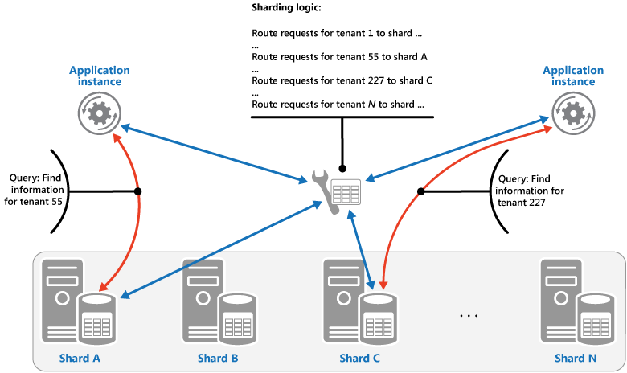
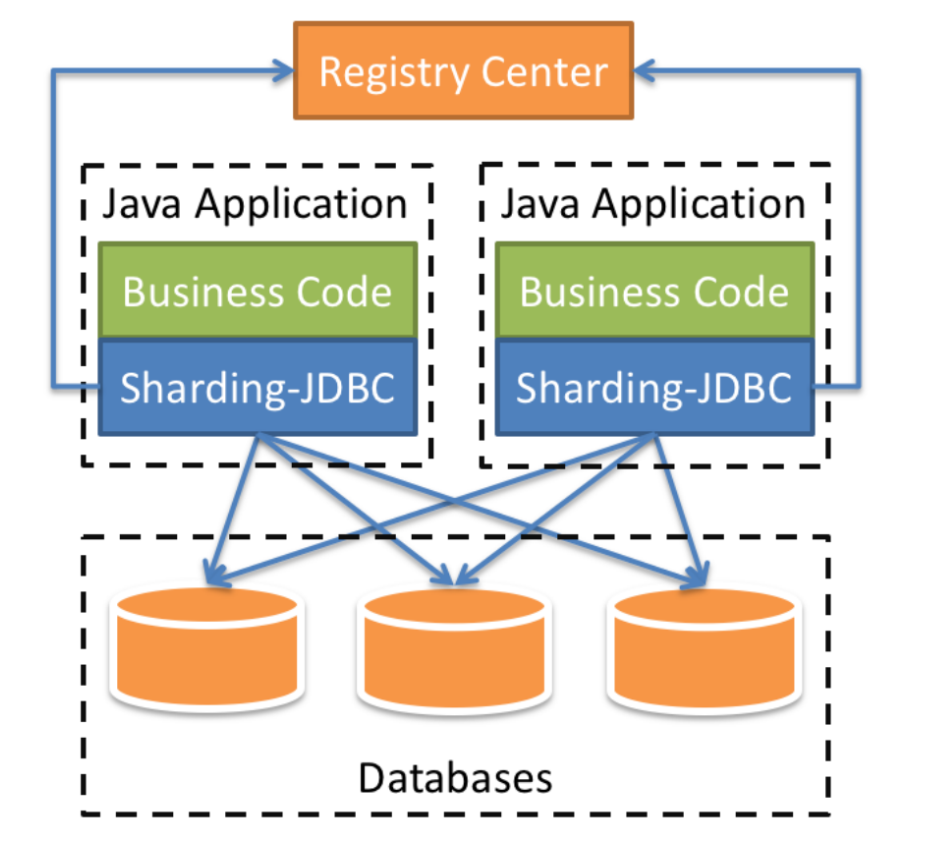

- [How to choose sharding key](#how-to-choose-sharding-key)
- [Sharding strategies](#sharding-strategies)
  - [Lookup strategy](#lookup-strategy)
  - [Range strategy](#range-strategy)
  - [Hash strategy](#hash-strategy)
- [Typical sharding keys](#typical-sharding-keys)
  - [By customer or tenant id](#by-customer-or-tenant-id)
  - [By geography](#by-geography)
  - [By time](#by-time)
- [Sharding middleware formats](#sharding-middleware-formats)
  - [SDK format](#sdk-format)
  - [Proxy format](#proxy-format)
  - [Cons](#cons)

# How to choose sharding key
* Avoid cross shard joins
* Make data distribution even across shards

# Sharding strategies
## Lookup strategy

* Pros:
  * Easy to migrate data
* Cons: 
  * Need an additional hop when query
  * If the lookup table is really big, it could also need to be sharded

## Range strategy

* Pros:
  * Easy to add a new shard. No need to move the original data. For example, each month could have a new shard.
* Cons:
  * Uneven distribution. For example, July is the hot season but December is the cold season. 

## Hash strategy
* Shard based on hashing value of a field. 
* Pros:
  * Evenly distributed data
* Cons:
  * Hard to add a new shard. Lots of data migration need to happen. 

# Typical sharding keys
## By customer or tenant id

* If it is a SaaS business, it is often true that data from one customer doesn't interact with data from any of your other customers. These apps are usually called multi-tenant apps. 
  * Multi-tenant apps usually require strong consistency where transaction is in place and data loss is not possible. 
  * Multi-tenant data usually evolves over time to provide more and more functionality. Unlike consumer apps which benefit from network effects to grow, B2B applications grows by adding new features for customers. 

## By geography

* Apps such as postmate, lyft or instacart.
* You’re not going to live in Alabama and order grocery delivery from California. And if you were to order a Lyft pick-up from California to Alabama you’ll be waiting a good little while for your pickup.

## By time

* Time sharding is incredibly common when looking at some form of event data. Event data may include clicks/impressions of ads, it could be network event data, or data from a systems monitoring perspective.
* This approach should be used when
  * You generate your reporting/alerts by doing analysis on the data with time as one axis.
  * You’re regularly rolling off data so that you have a limited retention of it.

# Sharding middleware formats
## SDK format
* It lives as dependency injection format within the code.

## Proxy format
* It works like a independent database. 

## Cons
* Low performance when compared with SDK formats. Since all data query is sent to it, it will easily become the bottleneck. 

