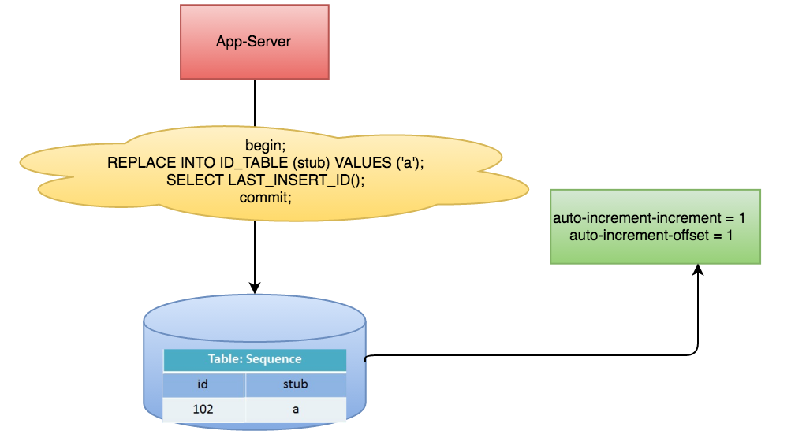
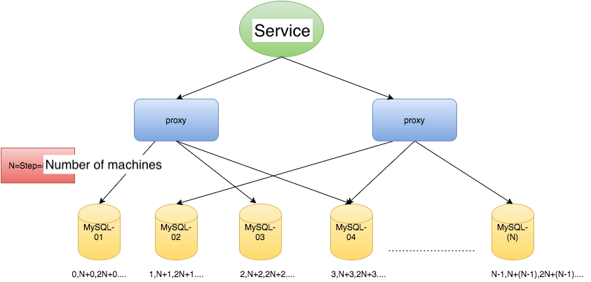
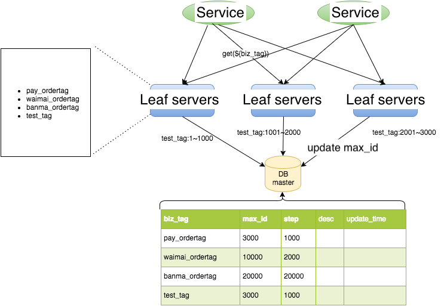
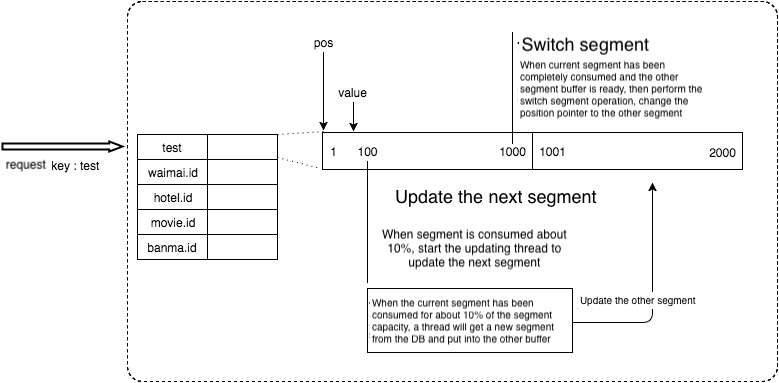
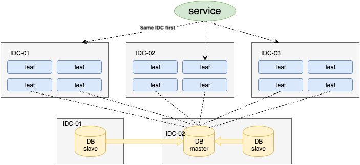
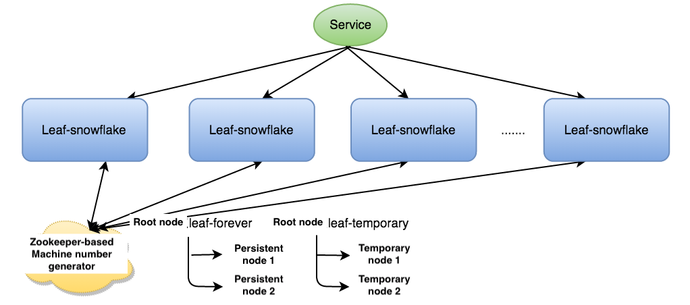
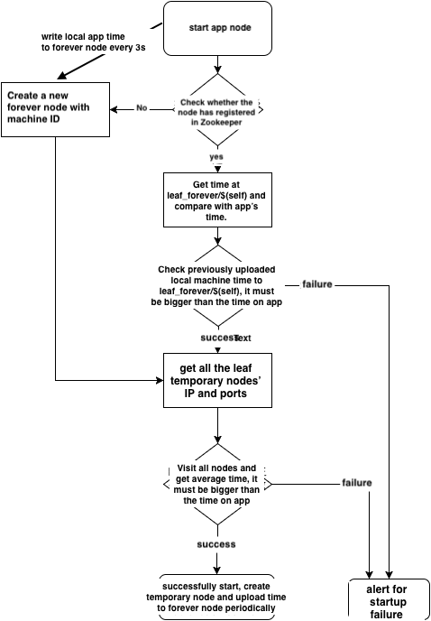

<!-- MarkdownTOC -->

- [Unique global key](#unique-global-key)
	- [Preferred characteristics](#preferred-characteristics)
	- [Use case](#use-case)
	- [Ways to generate unique ID](#ways-to-generate-unique-id)
		- [UUID](#uuid)
			- [Pros](#pros)
			- [Cons](#cons)
		- [Snowflake](#snowflake)
			- [Pros](#pros-1)
			- [Cons](#cons-1)
	- [Architecture](#architecture)
		- [Generate IDs in web application](#generate-ids-in-web-application)
		- [Deployment as a separate service](#deployment-as-a-separate-service)
		- [Database approach](#database-approach)
			- [Pros](#pros-2)
			- [Cons](#cons-2)
			- [Single machine implementation](#single-machine-implementation)
				- [Insert statement](#insert-statement)
				- [Replace statement](#replace-statement)
			- [Multiple machine implementation](#multiple-machine-implementation)
			- [Leaf-Segment multi-machine implementation](#leaf-segment-multi-machine-implementation)
			- [Leaf-Segment multi-machine implementation with double buffer](#leaf-segment-multi-machine-implementation-with-double-buffer)
			- [Leaf-Segment multi-machine implementation with double buffer and Multi DB](#leaf-segment-multi-machine-implementation-with-double-buffer-and-multi-db)
			- [Snowflake-based Leaf-Segment multi-machine implementation with double buffer and Multi DB](#snowflake-based-leaf-segment-multi-machine-implementation-with-double-buffer-and-multi-db)
				- [How to resolve the inaccurate time](#how-to-resolve-the-inaccurate-time)
		- [Instagram Postgres schema](#instagram-postgres-schema)
	- [Wechat seqsvr](#wechat-seqsvr)
		- [Design by yourself](#design-by-yourself)

<!-- /MarkdownTOC -->


# Unique global key

## Preferred characteristics
* Generated IDs should be sortable by time (so a list of photo IDs, for example, could be sorted without fetching more information about the photos). This is because: 
	1. Save space: There are plenty of scenarios where we need to order records by time. e.g. Order user comments on a forum / order user shopping history on an ecommerce website. If primary key is not ordered in time, then another column for timestamp needs to be created, wasting much space. 
	2. Improve performance: MySQL InnoDB engine uses B+ tree to store index data and index data is stored in order. Primary key is also an index. If primary key is not ordered, then each time needs to add a record, it first needs to locate the position before insertion. 
* IDs should ideally be 64 bits (for smaller indexes, and better storage in systems like Redis)
* The system should introduce as few new ‘moving parts’ as possible — a large part of how we’ve been able to scale Instagram with very few engineers is by choosing simple, easy-to-understand solutions that we trust.
* Has business meanings: If ID has some sort of business meaning, it will be really helpful in troubleshooting problems. 

## Use case
* As primary key in sharding scenarios

## Ways to generate unique ID
### UUID
* UUIDs are 128-bit hexadecimal numbers that are globally unique. The chances of the same UUID getting generated twice is negligible.

#### Pros
* Self-generation uniqueness: They can be generated in isolation and still guarantee uniqueness in a distributed environment. 
* Minimize points of failure: Each application thread generates IDs independently, minimizing points of failure and contention for ID generation. 

#### Cons
* Generally requires more storage space (96 bits for MongoDB Object ID / 128 bits for UUID). It takes too much space as primary key of database. 
* UUID could be computed by using hash of the machine's MAC address. There is the security risk of leaking MAC address. 

### Snowflake
* The IDs are made up of the following components:
	1. Epoch timestamp in millisecond precision - 41 bits (gives us 69 years with a custom epoch)
	2. Configured machine id - 10 bits (gives us up to 1024 machines)
	3. Sequence number - 12 bits (A local counter per machine that rolls over every 4096)


#### Pros
1. 64-bit unique IDs, half the size of a UUID
2. Can use time as first component and remain sortable
3. Distributed system that can survive nodes dying

#### Cons
1. Would introduce additional complexity and more ‘moving parts’ (ZooKeeper, Snowflake servers) into our architecture.
2. If local system time is not accurate, it might generate duplicated IDs. For example, when time is reset/rolled back, duplicated ids will be generated.
3. (Minor) If the QPS is not high such as 1 ID per second, then the generated ID will always end with "1" or some number, which resulting in uneven shards when used as primary key. 
	- Solutions: 1. timestamp uses ms instead of s. 2. the seed for generating unique number could be randomized.

## Architecture
### Generate IDs in web application
* Within application code
	- Pros:
		+ No extra network call when generating global unique number
	- Cons:
		+ If using UUID, 
		+ If using Snowflake. Usually there are large number of application servers, and it means we will need many bits for machine ID. In addition, to guarantee the uniqueness of machine ID when application servers scale up/down or restart, some coordinator service such as ZooKeeper will need to be imported.

### Deployment as a separate service
* As a separate service - Unique number generation service
	- Pros:
		+ For machine ID, 
			1. If the service is deployed in a master-slave manner and there is only one generation service, then machine ID could be avoided at all. 
			2. Even if it needs to be deployed on multiple instances, the number of unique number generation service will still be limited. Machine ID could be hardcoded in the config file of unique number generation service machine. 
	- Cons:
		+ One additional network call when generating global unique number. However, the network call within intranet should still be fine. 

### Database approach
* This approach uses a centralized database server to generate unique incrementing IDs. It is adopted by companies such as Flicker, Instagram, Meituan. 

#### Pros
* DBs are well understood and have pretty predictable scaling factors
* No extra component in the system

#### Cons
* The generated ID won't be known to you without a roundtrip to the database. 
* One more component in infrastructure that needs to be managed.
* If using a single DB, becomes single point of failure. If using multiple DBs, can no longer guarantee that they are sortable over time.

#### Single machine implementation
##### Insert statement
* Mechanism: 
	- Primary key has AUTO_INCREMENT option configured. 
	- A new incremented primary key will be created upon INSERT statement. 
* Steps:

```
// 	1. Create a table with automatic increment

CREATE TABLE `test_auto_increment` (
  `id` bigint(11) unsigned NOT NULL AUTO_INCREMENT,
  PRIMARY KEY (`id`)
)

// 2. Insert several statements

insert into `test_auto_increment` (id) values (0);
insert into `test_auto_increment` (id) values (0);

// 3. Use select LAST_INSERT_ID() to retrieve the latest value produced by auto_increment
select LAST_INSERT_ID();
```

* Cons: 
	- Produce lots of unused records 

##### Replace statement
* Mechanism: 
	- REPLACE works by delete the row which has the same primary key or unique index first, then add a new row
* Motivation: 
	- Insert method works, but created many unused records. To reduce the cost, developer could use a timer to clean up the records on a needed basis. However, it still requires manual work. 

* Steps:

```
// 1. Create a database table which has a unique key
delete * from test_auto_increment; 
alter table test_auto_increment add column stub int unique key;

// 2. Replace a record
replace into `test_auto_increment` (stub) values (2019);
SELECT LAST_INSERT_ID();
```



* Cons:
	- Single point failure of DB. 
	- Performance bottleneck of a single DB.  

#### Multiple machine implementation
* [Flicker team has a ticket server implementation](https://code.flickr.net/2010/02/08/ticket-servers-distributed-unique-primary-keys-on-the-cheap/)
* Suppose there are N servers
	- auto-increment-increment set to the number of machines: Determines the difference between self-increasing sequence
	- auto-increment-offset set to the server's machine index: Determines the starting value of the self-increasing sequence



* Cons:
	- Each time when scaling up/down, the offset needs to be set to a value which is bigger than all previously generated value to avoid conflict. Lots of maintenance cost. 
	- Each time to get ID, it needs to read the database. 
	- The number maintains the increasing trend, but is not consecutive. 


#### Leaf-Segment multi-machine implementation
* [Meituan team has a leaf segment implementation](https://tech.meituan.com/2017/04/21/mt-leaf.html)

* Motivation:
	- In the previous approach each time to get ID, it needs to read the database. 
	- To reduce the number of calls to database, a leaf server sits between service and DB. The leaf server reads segment instead of ID from DB master. 

* Steps:

```
1. Get ID from leaf server's segment if it is still within the max_id

2. Query the DB to get a new segment 

Begin
UPDATE table SET max_id=max_id+step WHERE biz_tag=xxx
SELECT tag, max_id, step FROM table WHERE biz_tag=xxx
Commit
```



* Pros:
	- Easy to scale. 
		+ Much lower load on database servers so much fewer DB servers needed for sharding purpose.
		+ Introduce the biz_tag field which separates different business into their own sequence space. 
	- More fault tolerant
		+ When DB goes down shortly, leaf servers could still serve the traffic. The step size could be set to 600 * QPS, which means that the system could still work for 10 minutes even if the DB goes down. 
* Cons:
	- T99 fluctuates greatly when the db query happens. 
	- DB is still the single point of failure.
	- Generated ID is not randomized and is not secure. For example, the generated could not be used for order id. The competitor could infer how many orders have happened during the past 1 day by looking at the difference of order id of 1 day. 

#### Leaf-Segment multi-machine implementation with double buffer
* Motivation:
	- In the previous approach each time when the segment is exhausted, the thread to query DB to get a new ID will be blocked, resulting in high 99 latency. 
	- Use double buffer to reduce the 99 latency. When the current segment has consumed 10% and if the next segment is not 



* Pros:
	- There is no T99 spike

* Cons: 
	- Still suffers from DB single point of failure

#### Leaf-Segment multi-machine implementation with double buffer and Multi DB 
* Motivation: 
	- In the previous approach there is still a single point of failure - the database. 
	- To improve the availability of DB, one master two slave could be set up and they could be synchronized using semisynchronous replication. 



* Pros:
	- Resolves the problem of single point of failure
* Cons: 
	- There is the possibility of inconsistency if only using semisynchronous replication. To guarantee 100% availability, algorithm similar to PAXOS (e.g. MySQL 5.7 Group Replication) could be adopted to guarantee strong consistency. 

#### Snowflake-based Leaf-Segment multi-machine implementation with double buffer and Multi DB 
* Steps:
	1. Start leaf-snowflake service and connect to ZooKeeper, check whether it has been registered under the leaf_forever root node. 
	2. If it has registered, then get its own machine ID. 
	3. If it has not registered, then create a persistent node under the root node and get its sequence as its machine it. 



##### How to resolve the inaccurate time
* Steps:
	1. If the node has registered within the Zookeeper, then use its own system time to compare with the time on leaf_forever/$self. If smaller than leaf_forever/$self, then consider the time is inaccurate. 
	2. 




### Instagram Postgres schema 
* https://instagram-engineering.com/sharding-ids-at-instagram-1cf5a71e5a5c

## Wechat seqsvr
* https://www.infoq.cn/article/wechat-serial-number-generator-architecture/

### Design by yourself
* The IDs generated by this sequence generator are composed of -
	- Epoch timestamp in milliseconds precision - 42 bits. The maximum timestamp that can be represented using 42 bits is 242 - 1, or 4398046511103, which comes out to be Wednesday, May 15, 2109 7:35:11.103 AM. That gives us 139 years with respect to a custom epoch.
	- Node ID - 10 bits. This gives us 1024 nodes/machines. For example, you could use hash of the machine's MAC address.
	- Local counter per machine - 12 bits. The counter’s max value would be 4095.

* References: https://www.callicoder.com/distributed-unique-id-sequence-number-generator/
