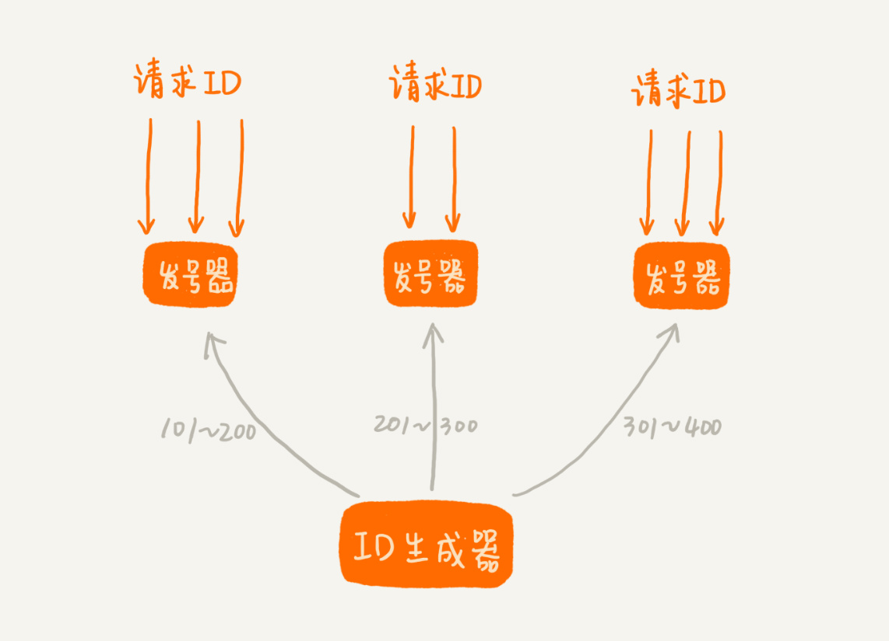
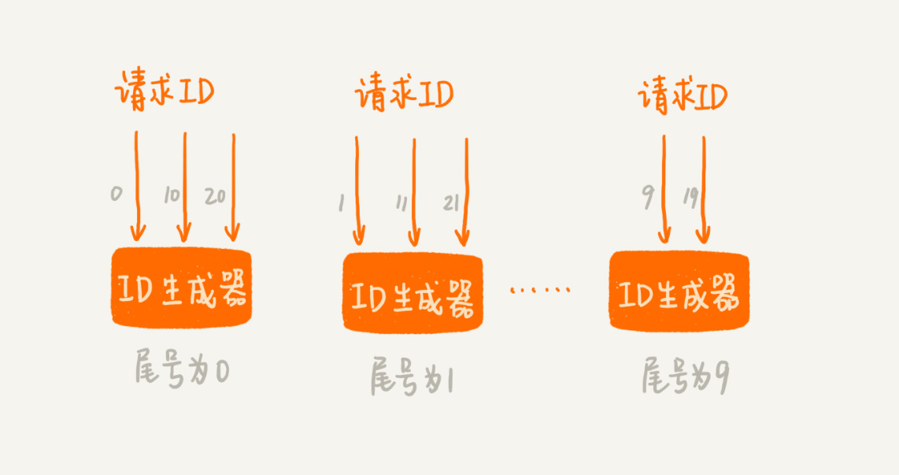

<!-- MarkdownTOC -->

- [Unique global key](#unique-global-key)
	- [Preferred characteristics](#preferred-characteristics)
	- [Use case](#use-case)
	- [Generate IDs in web application](#generate-ids-in-web-application)
		- [UUID](#uuid)
		- [Pros](#pros)
		- [Cons](#cons)
	- [Generate IDs through dedicated service](#generate-ids-through-dedicated-service)
		- [Database ticket servers](#database-ticket-servers)
			- [Pros](#pros-1)
			- [Cons](#cons-1)
	- [Redis](#redis)
		- [Twitter Snowflake](#twitter-snowflake)
			- [Pros](#pros-2)
			- [Cons](#cons-2)
			- [Deployment mode](#deployment-mode)
		- [Instagram Postgres schema](#instagram-postgres-schema)
		- [Meituan Leaf](#meituan-leaf)
		- [Wechat seqsvr](#wechat-seqsvr)
		- [Design by yourself](#design-by-yourself)
			- [Prefix](#prefix)
			- [Suffix](#suffix)

<!-- /MarkdownTOC -->

# Unique global key

## Preferred characteristics
* Generated IDs should be sortable by time (so a list of photo IDs, for example, could be sorted without fetching more information about the photos). This is because: 
	1. Save space: There are plenty of scenarios where we need to order records by time. e.g. Order user comments on a forum / order user shopping history on an ecommerce website. If primary key is not ordered in time, then another column for timestamp needs to be created, wasting much space. 
	2. Improve performance: MySQL InnoDB engine uses B+ tree to store index data and index data is stored in order. Primary key is also an index. If primary key is not ordered, then each time needs to add a record, it first needs to locate the position before insertion. 
* IDs should ideally be 64 bits (for smaller indexes, and better storage in systems like Redis)
* The system should introduce as few new ‘moving parts’ as possible — a large part of how we’ve been able to scale Instagram with very few engineers is by choosing simple, easy-to-understand solutions that we trust.
* Has business meanings: If ID has some sort of business meaning, it will be really helpful in troubleshooting problems. 

## Use case
* As primary key in sharding scenarios

## Generate IDs in web application

### UUID
* UUIDs are 128-bit hexadecimal numbers that are globally unique. The chances of the same UUID getting generated twice is negligible.

### Pros
* Self-generation uniqueness: They can be generated in isolation and still guarantee uniqueness in a distributed environment. 
* Minimize points of failure: Each application thread generates IDs independently, minimizing points of failure and contention for ID generation. 

### Cons
* Generally requires more storage space (96 bits for MongoDB Object ID / 128 bits for UUID). It takes too much space as primary key of database. 

## Generate IDs through dedicated service
### Database ticket servers
* This approach uses a centralized database server to generate unique incrementing IDs. It’s like a centralized auto-increment. All recent RDBMS provide some sort of a column data type allowing you to delegate the generation of a unique identifier to them. MongoDB provides ObjectID, MySQL, and MariaDB provide AUTO_INCREMENT, MS SQL Server provides IDENTITY, etc. This approach is used by Flickr. 

#### Pros
* DBs are well understood and have pretty predictable scaling factors

#### Cons
* The generated ID won't be known to you without a roundtrip to the database. 
* One more component in infrastructure that needs to be managed.
* If using a single DB, becomes single point of failure. If using multiple DBs, can no longer guarantee that they are sortable over time.

## Redis
* using Redis' incr instruction.
* Redis' incr / DB's auto increment need to happen on the master node, leading to low performance. 

### Twitter Snowflake 
* The IDs are made up of the following components:
	1. Epoch timestamp in millisecond precision - 41 bits (gives us 69 years with a custom epoch)
	2. Configured machine id - 10 bits (gives us up to 1024 machines)
	3. Sequence number - 12 bits (A local counter per machine that rolls over every 4096)

#### Pros
1. 64-bit unique IDs, half the size of a UUID
2. Can use time as first component and remain sortable
3. Distributed system that can survive nodes dying

#### Cons
1. Would introduce additional complexity and more ‘moving parts’ (ZooKeeper, Snowflake servers) into our architecture.
2. If local system time is not accurate, it might generate duplicated IDs. For example, when time is reset/rolled back, duplicated ids will be generated.
3. (Minor) If the QPS is not high such as 1 ID per second, then the generated ID will always end with "1" or some number, which resulting in uneven shards when used as primary key. 
	- Solutions: 1. timestamp uses ms instead of s. 2. the seed for generating unique number could be randomized.

#### Deployment mode
* Within application code
	- Pros:
		+ No extra network call when generating global unique number
	- Cons:
		+ Usually there are large number of application servers, it means we will need many bits for machine ID. In addition, to guarantee the uniqueness of machine ID when application servers scale up/down or restart, some coordinator service such as ZooKeeper will need to be imported.
* As a separate service - Unique number generation service
	- Pros:
		+ For machine ID, 
			1. If the service is deployed in a master-slave manner and there is only one generation service, then machine ID could be avoided at all. 
			2. Even if it needs to be deployed on multiple instances, the number of unique number generation service will still be limited. Machine ID could be hardcoded in the config file of unique number generation service machine. 
	- Cons:
		+ One additional network call when generating global unique number. However, the network call within intranet should still be fine. 

### Instagram Postgres schema 
* https://instagram-engineering.com/sharding-ids-at-instagram-1cf5a71e5a5c

### Meituan Leaf
* https://tech.meituan.com/2017/04/21/mt-leaf.html

### Wechat seqsvr
* https://www.infoq.cn/article/wechat-serial-number-generator-architecture/

### Design by yourself
* The IDs generated by this sequence generator are composed of -
	- Epoch timestamp in milliseconds precision - 42 bits. The maximum timestamp that can be represented using 42 bits is 242 - 1, or 4398046511103, which comes out to be Wednesday, May 15, 2109 7:35:11.103 AM. That gives us 139 years with respect to a custom epoch.
	- Node ID - 10 bits. This gives us 1024 nodes/machines. For example, you could use hash of the machine's MAC address.
	- Local counter per machine - 12 bits. The counter’s max value would be 4095.

#### Prefix

#### Suffix

* References: https://www.callicoder.com/distributed-unique-id-sequence-number-generator/
